import TabItem from "@theme/TabItem";
import Tabs from "@theme/Tabs";

<Tabs queryString="primary">
  <TabItem value="db-overview" label="Overview">
      <table class="text_vertical">
        <thead>
          <tr>
            <th>DB Type</th>
            <th>Features</th>
            <th>Use Cases</th>
          </tr>
        </thead>
        <tbody>
          <tr>
            <td><b>Columnar</b></td>
            <td>
                <ul>
                    <li>Schema Evolution</li>
                    <li>Column-Oriented Storage</li>
                    <li>Column-Level Compression</li>
                    <li>Column-Wise Indexing</li>
                    <li>Analytical Query Performance</li>
                    <li>Slice-and-Dice: efficiently analyze data by selecting columns (slice) and breaking it down further (dice), allowing complex queries and aggregations on large datasets with speed and flexibility</li>
                </ul>
            </td>
            <td>
                <ul>
                    <li>Data Warehousing</li>
                    <li>Analytics</li>
                    <li>Log Processing</li>
                </ul>
            </td>
          </tr>
          <tr>
            <td><b>Document</b></td>
            <td>
                <ul>
                    <li>Efficient Query Performance</li>
                    <li>Document Versioning</li>
                    <li>Flexible Schema</li>
                </ul>
            </td>
            <td>
                <ul>
                    <li>Content Management</li>
                    <li>IoT</li>
                </ul>
            </td>
          </tr>
          <tr>
            <td><b>Graph</b></td>
            <td>
                <ul>
                    <li>Relationship Focus</li>
                    <li>Deep Insight</li>
                </ul>
            </td>
            <td>
                <ul>
                    <li>Social Networks</li>
                    <li>Fraud Detection</li>
                    <li>LLMs</li>
                </ul>
            </td>
          </tr>
          <tr>
            <td><b>Key-Value</b></td>
            <td>
                <ul>
                    <li>Data Partitioning</li>
                    <li>Simple Data Model</li>
                    <li>High-Write & Query Performance</li>
                    <li>Developer Friendly</li>
                </ul>
            </td>
            <td>
                <ul>
                    <li>Caching</li>
                    <li>Session Store</li>
                </ul>
            </td>
          </tr>
          <tr>
            <td><b>NewSQL</b></td>
            <td>
                <ul>
                    <li>Transactions & ACID</li>
                    <li>Support SQL</li>
                </ul>
            </td>
            <td>
                <ul>
                    <li>High-Transaction</li>
                    <li>Real-time</li>
                </ul>
            </td>
          </tr>
          <tr>
            <td><b>NoSQL</b></td>
            <td>
                <ul>
                    <li>Horizontal Scalability</li>
                    <li>High Availability</li>
                    <li>Distributed Architecture</li>
                    <li>Flexible Data Model</li>
                </ul>
            </td>
            <td>
                <ul>
                    <li>Big Data</li>
                    <li>Real-time</li>
                </ul>
            </td>
          </tr>
          <tr>
            <td><b>Object-Oriented</b></td>
            <td>
                <ul>
                    <li>Complex Querying & Navigation</li>
                    <li>Complex Data Models</li>
                    <li>Object Persistence</li>
                    <li>Encapsulation & Data Abstraction</li>
                    <li>Object Versioning</li>
                    <li>Inheritance & Polymorphism</li>
                </ul>
            </td>
            <td>
                <ul>
                    <li>Object Persistence</li>
                </ul>
            </td>
          </tr>
          <tr>
            <td><b>Relational / SQL</b></td>
            <td>
                <ul>
                    <li>Indexing & Optimization</li>
                    <li>Security Features</li>
                    <li>Relationship & Referential Integrity</li>
                    <li>Structured Data</li>
                    <li>Transactions & ACID</li>
                    <li>SQL Support</li>
                </ul>
            </td>
            <td>
                <ul>
                    <li>Online Transaction Processing (OLTP)</li>
                    <li>Online Analytical Processing (OLAP)</li>
                </ul>
            </td>
          </tr>
          <tr>
            <td><b>Spatial</b></td>
            <td>
                <ul>
                    <li>Spatial Types & Indexing</li>
                    <li>Topology & Network Analysis</li>
                    <li>Geospatial Query Language</li>
                    <li>Integration with GIS</li>
                </ul>
            </td>
            <td>
                <ul>
                    <li>Geographic Information Systems (GIS)</li>
                    <li>Spatial Analysis</li>
                </ul>
            </td>
          </tr>
          <tr>
            <td><b>Time-Series</b></td>
            <td>
                <ul>
                    <li>Retention Policies</li>
                    <li>Efficient Storage</li>
                    <li>Time-Window Aggregation</li>
                    <li>High Write & Query Performance</li>
                </ul>
            </td>
            <td>
                <ul>
                    <li>Sensor Data</li>
                    <li>Financial Data</li>
                    <li>Industrial IoT</li>
                </ul>
            </td>
          </tr>
          <tr>
            <td><b>Vector DB</b></td>
            <td>
                <ul>
                    <li>High-dimensional vector storage</li>
                    <li>Similarity search</li>
                    <li>Approximate nearest neighbor (ANN) search</li>
                    <li>Scalability</li>
                    <li>Metadata management: Stores and manages additional information associated with vectors for filtering and contextualization</li>
                </ul>
            </td>
            <td>
                <ul>
                    <li>Generative AI</li>
                    <li>Natural language processing (NLP)</li>
                    <li>Recommender systems</li>
                    <li>Image and video search</li>
                    <li>Fraud detection</li>
                </ul>
            </td>
          </tr>
        </tbody>
      </table>
  </TabItem>
  <TabItem value="db-selection" label="Selection Process">
    <Tabs queryString="secondary">
        <TabItem value="process-selection" label="Selection" attributes={{className:"tabs__vertical"}}>
            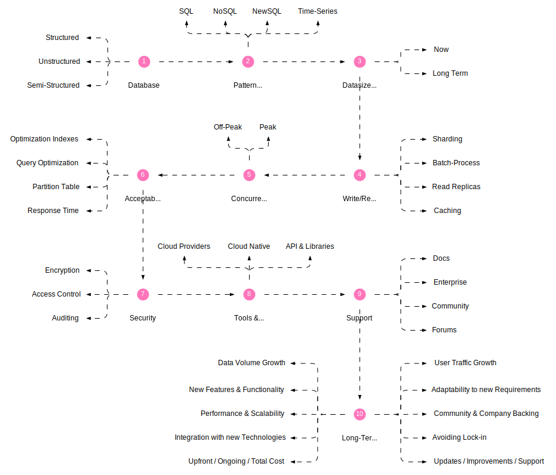
        </TabItem>
        <TabItem value="process-choice" label="Choice">
            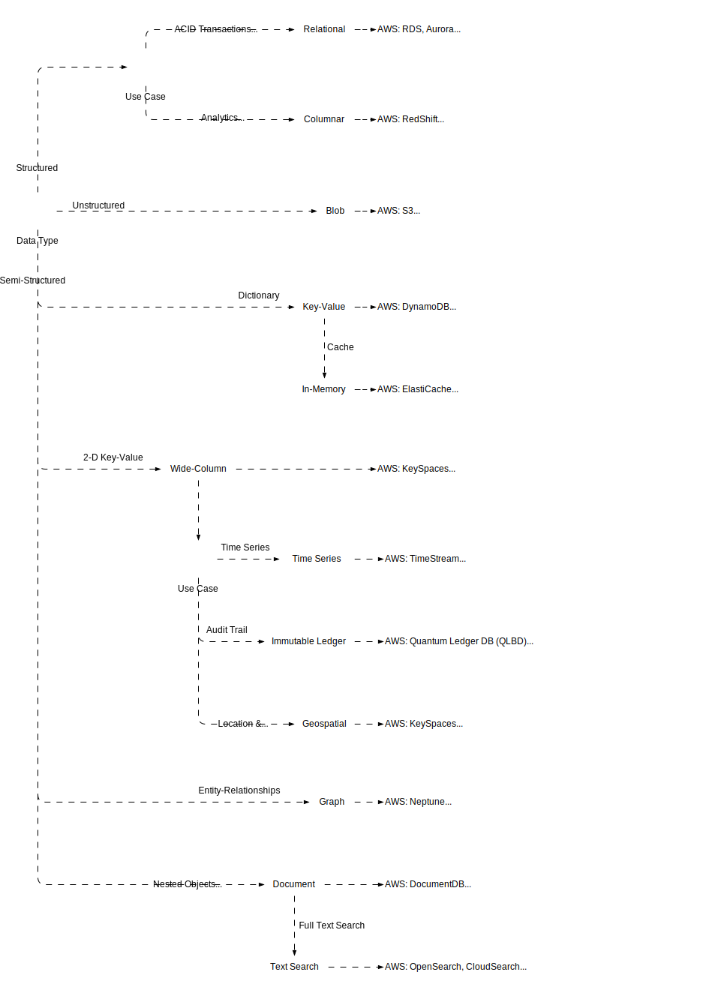
        </TabItem>
    </Tabs>
  </TabItem>
  <TabItem value="db-transactions" label="Transactions">
    <table>
        <thead>
          <tr>
            <th>Type</th>
            <th>Definition</th>
            <th>Priority</th>
            <th>Transaction Failure</th>
            <th>Data Consistency</th>
            <th>Use Cases</th>
          </tr>
        </thead>
        <tbody>
          <tr>
            <td><b>ACID</b></td>
            <td>
                <ul>
                    <li>**Atomicity**: Each transaction is completed or aborted</li>
                    <li>**Consistency**: Guarantees committed transaction state (store valid data)</li>
                    <li>**Isolation**: Transactions are independent</li>
                    <li>**Durability**: Committed data is never lost</li>
                </ul>
            </td>
            <td>Consistency</td>
            <td>Entire transaction rolls back</td>
            <td>Guaranteed immediately</td>
            <td>Financial Transactions (Banking, Stock Trading)</td>
          </tr>
          <tr>
            <td><b>BASE</b></td>
            <td>
                <ul>
                    <li>**Basically Available**: System remains available for read and write operations despite failures</li>
                    <li>**Soft state**: System may be temporarily inconsistent but eventually becomes consistent</li>
                    <li>**Eventual consistency**: Over time, all data replicas converge to the same state</li>
                </ul>
            </td>
            <td>Availability</td>
            <td>May proceed with eventual consistency</td>
            <td>Eventual, but not always immediate</td>
            <td>Social Media Platforms</td>
          </tr>
        </tbody>
    </table>
  </TabItem>
  <TabItem value="db-locking" label="Locking">
    <Tabs queryString="secondary">
      <TabItem value="locking-hierarchy" label="Locking Hierarchy" attributes={{className:"tabs__vertical"}}>
          ```mermaid
              graph LR

              db("Database<br/>Data Query: Shared Lock (S)<br/>Data Manipulation: Shared Lock (S)") e1@--> table(Table)
              table("Table<br/>Data Query: Intention Shared Lock (IS)<br/>Data Manipulation: Intention Exclusive or Intent Update") e2@--> page(Page)
              page("Page<br/>Data Query: Intention Shared Lock (IS)<br/>Data Manipulation: Intention Exclusive or Intent Update") e3@--> row("Row<br/>Data Query: Shared Lock (S)<br/>Data Manipulation: Exclusive or Update Lock")

              e1@{ animate: true }
              e2@{ animate: true }
              e3@{ animate: true }
          ```

          <table>
            <thead>
              <tr>
                <th>Aspect</th>
                <th>Intent Shared (IS)</th>
                <th>Exclusive (X)</th>
                <th>Intent Exclusive (IX)</th>
                <th>Shared with Intent Exclusive (SIX)</th>
              </tr>
            </thead>
            <tbody>
              <tr>
                <td><b>Definition</b></td>
                <td>Allows multiple readers but prevents updates. Signals intent to acquire an exclusive lock later</td>
                <td>Prevents all other users from accessing the data (reading or writing)</td>
                <td>Signals intent to acquire an exclusive lock and prevents other users from acquiring any locks (read or write)</td>
                <td>Allows multiple readers but prevents updates. Signals intent to acquire an exclusive lock and prevents other users from acquiring any locks (read or write)</td>
              </tr>
              <tr>
                <td><b>Usage</b></td>
                <td>
                  <ul>
                    <li>Initial read access before acquiring X lock</li>
                    <li>Improve concurrency for read-heavy workloads</li>
                  </ul>
                </td>
                <td>
                  <ul>
                    <li>Update operations (write, delete)</li>
                  </ul>
                </td>
                <td>
                  <ul>
                    <li>Prevent other users from acquiring any locks before acquiring X lock</li>
                    <li>Useful for long-running transactions</li>
                  </ul>
                </td>
                <td>
                  <ul>
                    <li>Similar to IS but signals future X lock acquisition</li>
                    <li>Useful for scenarios where initial read might be followed by update</li>
                  </ul>
                </td>
              </tr>
              <tr>
                <td><b>Impact on Concurrency</b></td>
                <td>Improves read concurrency</td>
                <td>Reduces write concurrency</td>
                <td>Blocks all access, impacting overall concurrency</td>
                <td>Improves read concurrency initially, reduces write concurrency later</td>
              </tr>
              <tr>
                <td><b>Scalability</b></td>
                <td>Scales well with read-heavy workloads</td>
                <td>May impact performance with high write concurrency</td>
                <td>May impact performance due to blocking all access</td>
                <td>Can provide a balance between read and write concurrency</td>
              </tr>
            </tbody>
          </table>
      </TabItem>
      <TabItem value="locking-types" label="Types">
          <table>
            <thead>
              <tr>
                <th>Feature</th>
                <th>Pessimistic Locking</th>
                <th>Optimistic Locking</th>
              </tr>
            </thead>
            <tbody>
              <tr>
                <td><b>Visualization</b></td>
                <td>
                    ```mermaid
                       sequenceDiagram
                       autonumber

                      participant User1
                      participant Database
                      participant User2

                      User1->>Database: Begin Transaction
                      User2->>Database: Begin Transaction
                      alt User1 reads record
                          Database->>User1: Return record
                          alt User2 tries to read/update same record
                              Database-->>User2: Record locked
                              User2->>Database: Rollback Transaction
                          else User2 waits
                              activate Database
                              Database->>Database: Lock record
                              User1->>Database: Update record
                              Database-->>User1: Record updated
                              Database->>User1: Commit Transaction
                              User1-->>Database: Commit acknowledged
                              Database->>Database: Release Lock record
                              deactivate Database
                          end
                      else User1 waits
                          alt User2 reads record
                              Database->>User2: Return record
                              alt User1 tries to read/update same record
                                  Database-->>User1: Record locked
                                  User1->>Database: Rollback Transaction
                              else User1 waits
                                  activate Database
                                  Database->>Database: Lock record
                                  User2->>Database: Update record
                                  Database-->>User2: Record updated
                                  Database->>User2: Commit Transaction
                                  User2-->>Database: Commit acknowledged
                                  Database->>Database: Release Lock record
                                  deactivate Database
                              end
                          else User2 waits
                              activate Database
                              Database->>Database: Lock record
                              User1->>Database: Update record
                              Database-->>User1: Record updated
                              Database->>User1: Commit Transaction
                              User1-->>Database: Commit acknowledged
                              Database->>Database: Release Lock record
                              deactivate Database
                          end
                      end
                    ```
                </td>
                <td>
                    ```mermaid
                      sequenceDiagram
                      autonumber

                      participant User1
                      participant Database
                      participant User2

                      User1->>Database: Request to read record
                      Database->>User1: Returns record
                      alt Record is not locked
                          User1->>Database: Request to update record
                          Database->>User1: Locks record for User1
                          activate Database
                          User1->>Database: Send updated record
                          Database->>User1: Updates record, unlocks it
                          deactivate Database
                          Database->>User2: Notification of record update
                      else Record is locked
                          Database->>User1: Sends lock notification
                      end

                      User2->>Database: Request to read record
                      Database->>User2: Returns record
                      alt Record is not locked
                          User2->>Database: Request to update record
                          Database->>User2: Locks record for User2
                          activate Database
                          User2->>Database: Send updated record
                          Database->>User2: Updates record, unlocks it
                          deactivate Database
                          Database->>User1: Notification of record update
                      else Record is locked
                          Database->>User2: Sends lock notification
                      end
                    ```
                </td>
              </tr>
              <tr>
                <td><b>Locking Mechanism</b></td>
                <td>Acquires locks on database records before any read/write operation</td>
                <td>No explicit locks; relies on versioning or timestamps</td>
              </tr>
              <tr>
                <td><b>Transaction Isolation</b></td>
                <td>Guarantees serializability (transactions appear to execute one after another)</td>
                <td>Relies on conflict detection during commit</td>
              </tr>
              <tr>
                <td><b>Concurrency</b></td>
                <td>Lower concurrency due to exclusive access</td>
                <td>Higher concurrency as multiple transactions can read data concurrently</td>
              </tr>
              <tr>
                <td><b>Data Integrity</b></td>
                <td>High; ensures only one transaction modifies data at a time</td>
                <td>Lower; potential for "lost updates" if conflicts occur</td>
              </tr>
              <tr>
                <td><b>Implementation</b></td>
                <td>Database-managed; different lock types (shared, exclusive) available</td>
                <td>Application-level; relies on versioning mechanisms (e.g., version numbers, timestamps) in the database</td>
              </tr>
              <tr>
                <td><b>Error Handling</b></td>
                <td>Rollback transactions that encounter locked records</td>
                <td>Retry transactions that encounter conflicts during commit</td>
              </tr>
              <tr>
                <td><b>Use Cases</b></td>
                <td>
                  <ul>
                    <li>High contention environments (frequent updates)</li>
                    <li>Critical data operations (financial transactions)</li>
                    <li>Applications requiring strict data consistency</li>
                  </ul>
                </td>
                <td>
                  <ul>
                    <li>Low contention environments (read-heavy systems)</li>
                    <li>Non-critical data updates</li>
                    <li>Short-lived transactions</li>
                  </ul>
                </td>
              </tr>
            </tbody>
          </table>
      </TabItem>
    </Tabs>

  </TabItem>
  <TabItem value="theorems" label="Theorems">
    <Tabs queryString="secondary">
      <TabItem value="cap" label="CAP" attributes={{className:"tabs__vertical"}}>
        ```mermaid
            graph TB

            c(C)
            a(A)
            p(P)

            subgraph s [Pick only 2]
              c e1@--- |CA| a e2@--- |AP| p e3@--- |CP| c
            end

            e1@{ animate: true }
            e2@{ animate: true }
            e3@{ animate: true }
        ```

        - **Consistency (C)**: Ensures that all nodes in the system have the same data at the same time
        - **Availability (A)**: Ensures that every request gets a response about whether it was successful or failed
        - **Partition Tolerance (P)**: Ensures that the system continues to operate despite network partitions or communication failures

        <table>
          <thead>
            <tr>
              <th>Aspect</th>
              <th>AP (Availability & Partition Tolerance)</th>
              <th>CA (Consistency & Availability)</th>
              <th>CP (Consistency & Partition Tolerance)</th>
            </tr>
          </thead>
          <tbody>
            <tr>
              <td><b>Visualization</b></td>
              <td>
                ```mermaid
                    graph TB

                    user1(User) e1@<--> |read/write| server1(Server)
                    user2(User) e2@<--> |read/write| server2(Server)

                    server1 e3@<--> |read/write| db1[(DB)]
                    server2 e4@<---> |read/write| db2[(DB)]

                    db1 e5@<--> |replicate| db2

                    e1@{ animate: true }
                    e2@{ animate: true }
                    e3@{ animate: true }
                    e4@{ animate: true }
                    e5@{ animate: true }
                ```
              </td>
              <td>
                ```mermaid
                    graph TB

                    user1(User) e1@<--> |read/write| server1(Server)
                    user2(User) e2@<--> |read/write| server2(Server)

                    server1 e3@<--> |read/write| db[(DB)]
                    server2 e4@<--> |read/write| db

                    e1@{ animate: true }
                    e2@{ animate: true }
                    e3@{ animate: true }
                    e4@{ animate: true }
                ```
              </td>
              <td>
                ```mermaid
                    graph TB

                    user1(User) e1@<--> |read/write| server(Server)
                    user2(User) e2@<--> |read/write| server(Server)

                    server e3@<--> |read/write| primary[(DB)]
                    primary e4@<--> |read/write| secondary[(DB)]

                    e1@{ animate: true }
                    e2@{ animate: true }
                    e3@{ animate: true }
                    e4@{ animate: true }
                ```
              </td>
            </tr>
            <tr>
              <td><b>Definition</b></td>
              <td>Some data may not be consistent</td>
              <td>Network issues might stop the system</td>
              <td>Some data might not be available when a failure happens</td>
            </tr>
            <tr>
              <td><b>Use Cases</b></td>
              <td>Social networks, real-time analytics, recommendation systems</td>
              <td>Financial applications, e-commerce</td>
              <td>Multi-datacenter deployments</td>
            </tr>
            <tr>
              <td><b>Examples</b></td>
              <td>Cassandra, DynamoDB, Riak</td>
              <td>Google Spanner, RDBMS with high availability configurations</td>
              <td>MongoDB with replica sets, BigTable</td>
            </tr>
          </tbody>
        </table>
      </TabItem>
      <TabItem value="pacelc" label="PACELC">
        ```mermaid
            graph TB

            partition(Partition)

            subgraph cap [CAP]
                direction TB

                availability(Availability)
                cap_consistency(Consistency)
            end

            subgraph elc [ELC]
                direction TB

                latency(Latency)
                elc_consistency(Consistency)
            end

            partition e1@--> |yes| cap
            partition e2@--> |no| elc

            e1@{ animate: true }
            e2@{ animate: true }
        ```

        <table>
          <thead>
            <tr>
              <th>Theorem</th>
              <th>Scope</th>
              <th>Consistency Model</th>
              <th>Latency Consideration</th>
            </tr>
          </thead>
          <tbody>
            <tr>
              <td><b>CAP</b></td>
              <td>Focuses on impact of network partitions on consistency and availability</td>
              <td>Binary choice between strong consistency and availability</td>
              <td>Doesn't explicitly consider latency</td>
            </tr>
            <tr>
              <td><b>PACELC</b></td>
              <td>Broader view, acknowledging trade-offs present even under normal operation</td>
              <td>Consistency is treated as a spectrum, offering more nuanced options</td>
              <td>Recognizes latency as a critical factor alongside consistency and availability (data replication can impact latency)</td>
            </tr>
          </tbody>
        </table>
      </TabItem>
    </Tabs>

  </TabItem>
</Tabs>

## Data Storage Solutions

<Tabs queryString="primary">
  <TabItem value="storage-solutions-overview" label="Overview">
    ### Key Points for Considerations

    - **Data Volume and Growth**: How much data do you currently store, and what's the anticipated growth rate?
    - **Performance Requirements**:  How critical is fast access and retrieval of data for your operations?
    - **Data Security and Compliance**:  What security measures are necessary to safeguard sensitive data? Are there industry regulations to adhere to?
    - **Accessibility and Sharing Needs**:  Do you require remote access to data or collaboration features?
    - **Budgetary Constraints**:  What is your allocated budget for data storage solutions?

  </TabItem>
  <TabItem value="storage-solutions-processingTypes" label="Processing Types">
    <table>
        <thead>
            <tr>
                <th>Feature</th>
                <th>Online Analytical Processing (OLAP)</th>
                <th>Online Transaction Processing (OLTP)</th>
            </tr>
        </thead>
        <tbody>
            <tr>
                <td><b>Purpose</b></td>
                <td>Analytical processing for decision-making</td>
                <td>Transaction processing for day-to-day operations</td>
            </tr>
            <tr>
                <td><b>Data Usage</b></td>
                <td>Aggregates historical data for reporting and analysis</td>
                <td>Processes real-time transactions and updates</td>
            </tr>
            <tr>
                <td><b>Data Schema</b></td>
                <td>Star or snowflake schemas, denormalized</td>
                <td>Normalized schemas, reducing redundancy</td>
            </tr>
            <tr>
                <td><b>Query Complexity</b></td>
                <td>Complex queries with aggregations and joins</td>
                <td>Simple queries with frequent read/write operations</td>
            </tr>
            <tr>
                <td><b>Data Granularity</b></td>
                <td>Summarized, aggregated data</td>
                <td>Detailed, individual transactions</td>
            </tr>
            <tr>
                <td><b>Data Size</b></td>
                <td>Huge data volumes, typically in terabytes or more</td>
                <td>Smaller data volumes, typically in gigabytes or less</td>
            </tr>
            <tr>
                <td><b>Performance</b></td>
                <td>Designed for high throughput, slower write speeds</td>
                <td>Optimized for fast write speeds and low latency reads</td>
            </tr>
            <tr>
                <td><b>Examples</b></td>
                <td>Amazon Redshift, Google BigQuery, Snowflake</td>
                <td>MySQL, PostgreSQL</td>
            </tr>
        </tbody>
    </table>
  </TabItem>
  <TabItem value="storage-solutions-processingData" label="Data Processing">
    <table>
      <thead>
        <tr>
          <th>Aspect</th>
          <th>ETL</th>
          <th>ELT</th>
        </tr>
      </thead>
      <tbody>
        <tr>
          <td><b>Visualization</b></td>
          <td>
            ```mermaid
                graph LR

                subgraph Extract
                    direction TB

                    lob[(LOB)]
                    crm[(CRM)]
                    erp[(ERP)]
                end

                subgraph Load
                    direction TB

                    warehouse[(Data Warehouse)]
                end

                Extract e1@--> transform([Transform])
                transform e2@--> Load

                e1@{ animate: true }
                e2@{ animate: true }
            ```
          </td>
          <td>
            ```mermaid
                graph LR

                subgraph Extract
                    direction TB

                    lob[(LOB)]
                    crm[(CRM)]
                    erp[(ERP)]
                end

                subgraph Load
                    direction TB

                    lake[(Data Lake)]
                end

                Extract e1@--> Load
                Load e2@--> transform([Transform])

                e1@{ animate: true }
                e2@{ animate: true }
            ```
          </td>
        </tr>
        <tr>
          <td><b>Process Flow</b></td>
          <td>Extract data first, then transform and load into the target system</td>
          <td>Extract data first, load into the target system, then transform within the target system</td>
        </tr>
        <tr>
          <td><b>Data Transformation</b></td>
          <td>Transformation occurs before loading into the target system</td>
          <td>Transformation occurs after loading into the target system</td>
        </tr>
        <tr>
          <td><b>Performance</b></td>
          <td>Typically slower due to data transformation overhead during the ETL process</td>
          <td>Generally faster because loading raw data is faster than transforming it during the ETL process</td>
        </tr>
        <tr>
          <td><b>Scalability</b></td>
          <td>Limited scalability due to the need for substantial transformation before loading data</td>
          <td>Highly scalable as it can leverage the processing power of the target system for transformations</td>
        </tr>
        <tr>
          <td><b>Storage Requirements</b></td>
          <td>Higher storage requirements as both raw and transformed data need to be stored</td>
          <td>Lower storage requirements as only raw data needs to be stored initially, and transformation occurs within the target system</td>
        </tr>
        <tr>
          <td><b>Data Integrity</b></td>
          <td>Higher data integrity as data is cleaned and transformed before loading into the target system</td>
          <td>May require additional checks and controls within the target system to ensure data integrity post-transformation</td>
        </tr>
        <tr>
          <td><b>Complexity</b></td>
          <td>Typically more complex due to the need for designing and managing transformation logic</td>
          <td>Generally less complex as it leverages the capabilities of the target system for transformations</td>
        </tr>
        <tr>
          <td><b>Flexibility</b></td>
          <td>May be less flexible as transformation logic is predefined and applied uniformly to all data</td>
          <td>More flexible as transformations can be tailored to specific use cases within the target system</td>
        </tr>
        <tr>
          <td><b>Real-time Processing</b></td>
          <td>Less suitable for real-time processing due to batch-oriented nature</td>
          <td>More suitable for real-time processing as data can be loaded into the target system immediately and transformed on-the-fly</td>
        </tr>
        <tr>
          <td><b>Examples</b></td>
          <td>Apache Spark, Apache Flink, Google Cloud Dataproc</td>
          <td>GCS → Spark jobs, Dataflow → BigQuery</td>
        </tr>
        <tr>
          <td><b>Use Cases</b></td>
          <td>For well-defined data models and reporting needs</td>
          <td>For big data, data lakes, and agile analytics environments</td>
        </tr>
      </tbody>
    </table>

  </TabItem>
  <TabItem value="storage-solutions-repositories" label="Data Repositories">
    <table>
      <thead>
        <tr>
          <th>Feature</th>
          <th>Data Mart</th>
          <th>Data Warehouse</th>
          <th>Data Lake</th>
          <th>Data Lakehouse</th>
          <th>Data Fabric</th>
          <th>Data Mesh</th>
        </tr>
      </thead>
      <tbody>
        <tr>
          <td>Visualization</td>
          <td>
            ```mermaid
                graph BT

                subgraph data[Data Sources]
                    direction TB

                    data1[( )]
                    data2[( )]
                    data3[( )]
                end

                data e1@--> staging[(Staging Area)]

                subgraph warehouse[Data Warehouse]
                    direction TB

                    warehouse1[(Metadata)]
                    warehouse2[(Raw Data)]
                    warehouse3[(Summary Data)]
                end

                subgraph marts[Data Marts]
                    direction TB

                    marts1[(Purchasing)]
                    marts2[(sales)]
                    marts3[(Inventory)]
                end

                staging e2@--> warehouse
                warehouse e3@--> marts

                marts e4@--> analytics(Analytics)
                marts e5@--> reporting(Reporting)
                marts e6@--> mining(Mining)

                e1@{ animate: true }
                e2@{ animate: true }
                e3@{ animate: true }
                e4@{ animate: true }
                e5@{ animate: true }
                e6@{ animate: true }
            ```
          </td>
          <td>
            ```mermaid
                graph BT

                subgraph data[Structured Data]
                    direction TB

                    data1[( )]
                    data2[( )]
                    data3[( )]
                end

                data e1@--> etl([ETL])

                subgraph warehouses[Data Warehouses]
                    direction TB

                    mart1[(Data Mart)]
                    mart2[(Data Mart)]
                end

                etl e2@--> warehouses

                warehouses e3@--> bi(BI)
                warehouses e4@--> reports(Reports)

                e1@{ animate: true }
                e2@{ animate: true }
                e3@{ animate: true }
                e4@{ animate: true }
            ```
          </td>
          <td>
            ```mermaid
                graph BT

                subgraph data [Structured, Unstructured, Semi-structured]
                    direction TB

                    data1[(DB)]
                    data2[(Images)]
                    data3[(Files)]
                end

                data e1@--> dataLake[[Data Lake]]

                dataLake e2@<--> etl([ETL])

                dataLake e3@--> dataPrep(Data Preparation & Validation)
                dataPrep e4@--> dataScience(Data Science)
                dataLake e5@--> machineLearning(Machine Learning)

                subgraph warehouses[Data Warehouses]
                    direction TB

                    mart1[(Data Mart)]
                    mart2[(Data Mart)]
                end

                etl e6@--> warehouses

                warehouses e7@--> bi(BI)
                warehouses e8@--> reports(Reports)
                warehouses e9@--> dataScience

                e1@{ animate: true }
                e2@{ animate: true }
                e3@{ animate: true }
                e4@{ animate: true }
                e5@{ animate: true }
                e6@{ animate: true }
                e7@{ animate: true }
                e8@{ animate: true }
                e9@{ animate: true }
            ```
          </td>
          <td>
            ```mermaid
                graph BT

                subgraph data [Structured, Unstructured, Semi-structured]
                    direction TB

                    data1[(DB)]
                    data2[(Images)]
                    data3[(Files)]
                end

                subgraph dataLake[Data Lake: Metadata & Governance Layer]
                    direction TB

                    etl([ETL])
                end

                data e1@--> dataLake

                dataLake e2@--> bi(BI)
                dataLake e3@--> reports(Reports)
                dataLake e4@--> dataScience(Data Science)
                dataLake e5@--> machineLearning(Machine Learning)

                e1@{ animate: true }
                e2@{ animate: true }
                e3@{ animate: true }
                e4@{ animate: true }
                e5@{ animate: true }
            ```
          </td>
          <td>
            ```mermaid
            graph TD
              subgraph Data Sources
                A1(Transactional DB)
                A2(APIs)
                A3(Streaming Data)
                A4(Files / Logs)
              end

              subgraph Data Ingestion
                B1(Ingestion Engine)
              end

              subgraph Data Storage
                C1(Distributed Storage Layer)
              end

              subgraph Data Processing & Orchestration
                D1(Processing Engines)
                D2(Workflow Orchestration)
              end

              subgraph Metadata & Governance
                E1(Metadata Management & Catalog)
                E2(Data Governance & Security)
                E3(Data Lineage)
              end

              subgraph Data Modeling & Access
                F1(Unified Data Access)
                F2(Data Integration & Transformation)
                F3(Semantic Data Modeling)
              end

              subgraph Data Consumers
                G1(Analytics & BI)
                G2(Applications)
                G3(Data Marketplaces)
              end

              A1 e1@--> B1
              A2 e2@--> B1
              A3 e3@--> B1
              A4 e4@--> B1

              B1 e5@--> C1
              C1 e6@--> D1
              D1 e7@--> F2
              F2 e8@--> F1
              F1 e9@--> G1
              F1 e10@--> G2
              F1 e11@--> G3

              C1 e12@--> E1
              E1 e13@--> E3
              E3 e14@--> E2
              E2 e15@--> F1

              D2 e16@--> D1
              D2 e17@--> B1
              D2 e18@--> C1

              e1@{ animate: true }
              e2@{ animate: true }
              e3@{ animate: true }
              e4@{ animate: true }
              e5@{ animate: true }
              e6@{ animate: true }
              e7@{ animate: true }
              e8@{ animate: true }
              e9@{ animate: true }
              e10@{ animate: true }
              e11@{ animate: true }
              e12@{ animate: true }
              e13@{ animate: true }
              e14@{ animate: true }
              e15@{ animate: true }
              e16@{ animate: true }
              e17@{ animate: true }
              e18@{ animate: true }
            ```
          </td>
          <td>
            ```mermaid
            flowchart TD
              subgraph Domain Teams
                direction TB
                DT1(Domain Team 1)
                DT2(Domain Team 2)
                DT3(Domain Team N)
              end

              subgraph Data Products
                direction TB
                DP1(Data Product 1)
                DP2(Data Product 2)
                DPN(Data Product N)
              end

              subgraph Self-serve Data Platform
                direction TB
                Infra(Data Infrastructure)
                DevExp(Data Product Developer Experience)
                Supervision(Data Mesh Supervision Plane)
              end

              subgraph Federated Governance
                direction TB
                Policies(Governance Policies & Standards)
                Monitoring(Monitoring & Observability)
                Access(Access Control & Security)
              end

              %% Relationships
              DT1 e1@-->|Owns & Produces| DP1
              DT2 e2@-->|Owns & Produces| DP2
              DT3 e3@-->|Owns & Produces| DPN

              DP1 e4@-->|Served via| Infra
              DP2 e5@-->|Served via| Infra
              DPN e6@-->|Served via| Infra

              Infra e7@-->|Provides| DevExp
              DevExp e8@-->|Enables| Supervision

              Supervision e9@-->|Implements| Policies
              Supervision e10@-->|Implements| Monitoring
              Supervision e11@-->|Implements| Access

              Policies e12@-->|Governs| DP1
              Policies e13@-->|Governs| DP2
              Policies e14@-->|Governs| DPN

              Monitoring e15@-->|Monitors| DP1
              Monitoring e16@-->|Monitors| DP2
              Monitoring e17@-->|Monitors| DPN

              Access e18@-->|Controls| DP1
              Access e19@-->|Controls| DP2
              Access e20@-->|Controls| DPN

              e1@{ animate: true }
              e2@{ animate: true }
              e3@{ animate: true }
              e4@{ animate: true }
              e5@{ animate: true }
              e6@{ animate: true }
              e7@{ animate: true }
              e8@{ animate: true }
              e9@{ animate: true }
              e10@{ animate: true }
              e11@{ animate: true }
              e12@{ animate: true }
              e13@{ animate: true }
              e14@{ animate: true }
              e15@{ animate: true }
              e16@{ animate: true }
              e17@{ animate: true }
              e18@{ animate: true }
              e19@{ animate: true }
              e20@{ animate: true }
            ```
          </td>
        </tr>
        <tr>
          <td>Definition</td>
          <td>Subset of a Data Warehouse containing specific data focused on a particular business function or department</td>
          <td>Central repository for structured, organized, and processed data, optimized for querying and analysis</td>
          <td>Vast repository of raw, unstructured, or semi-structured data stored in its native format</td>
          <td>Architecture combining the features of a Data Lake and a Data Warehouse, providing unified analytics on both raw and processed data</td>
          <td>Technology-centric architecture that provides a unified, automated data integration and management layer across diverse data sources. Utilizes AI/ML and metadata-driven automation to enable seamless data access, discovery, and governance across the enterprise</td>
          <td>Organizational and socio-technical approach emphasizing decentralization of data ownership to domain teams. Treats data as a product with domain-specific teams responsible for managing their data lifecycle, quality, and accessibility</td>
        </tr>
        <tr>
          <td>Data Type</td>
          <td>Structured data tailored for specific business needs</td>
          <td>Structured data, typically from operational systems</td>
          <td>Raw, unstructured, semi-structured data</td>
          <td>Raw, semi-structured, and structured data</td>
          <td>Supports diverse data types from structured, semi-structured, and unstructured sources unified through virtualization and metadata management. Data fabric abstracts underlying formats</td>
          <td>Data types depend on domain-specific needs; each domain decides appropriate data types and formats. Typically supports relational, NoSQL, real-time streams, and other domain-tailored formats</td>
        </tr>
        <tr>
          <td>Data Storage</td>
          <td>Similar to Data Warehouse, stored in relational databases or columnar stores</td>
          <td>Stored in a structured format like relational databases (e.g., SQL Server, PostgreSQL) or columnar stores (e.g., Redshift, BigQuery)</td>
          <td>Typically stored in distributed file systems like HDFS, AWS S3, or Azure Data Lake Storage</td>
          <td>Usually stored in a combination of Data Lake storage and structured data formats like Parquet, Delta Lake, or Apache Iceberg</td>
          <td>Centralized or logically unified data storage architecture employing data lakes, data warehouses, multi-cloud, and edge storage, often integrated via a virtual data layer. Focus on centralized control and unified view</td>
          <td>Decentralized data storage managed by domain teams. Storage technology choices vary per domain, including traditional databases, NoSQL, and streaming platforms. No single point of control; storage is distributed across domains</td>
        </tr>
        <tr>
          <td>Data Processing</td>
          <td>Similar to Data Warehouse, batch processing is prevalent, with ETL tools used for data transformation</td>
          <td>Primarily batch processing. Data transformation and ETL processes are well-defined and structured. Tools like Informatica, Talend, or Apache Airflow are commonly used</td>
          <td>Supports batch and real-time processing. Processing is done on raw data, often using technologies like Hadoop, Spark, or Apache Flink</td>
          <td>Combines batch and real-time processing capabilities. Data is transformed and unified using tools like Apache Spark, Databricks, or Delta Lake</td>
          <td>Centralized or federated processing combined with intelligent pipeline orchestration and automation. Supports batch and real-time analytics, ETL/ELT, machine learning workflows. AI-driven automation optimizes data processing</td>
          <td>Decentralized data processing tailored to domain-specific requirements. Domains implement their own processing pipelines using tools that fit their context (e.g., Apache Kafka, Apache Spark). Emphasis on domain autonomy and agility</td>
        </tr>
        <tr>
          <td>Use Cases</td>
          <td>Tailored for specific business functions or departments requiring localized analytics and reporting. Commonly used in finance, sales, or marketing</td>
          <td>Best suited for structured reporting, business intelligence, and historical analysis. Ideal for organizations with well-defined data requirements</td>
          <td>Suitable for exploratory analytics, machine learning, and big data processing where flexibility and scalability are critical</td>
          <td>Ideal for organizations looking to combine the benefits of Data Lakes and Data Warehouses for unified analytics on both raw and processed data</td>
          <td>Enterprises needing seamless integration and governance across disparate data sources, requiring a unified data access layer for analytics, compliance, and AI/ML applications. Suitable for organizations favoring centralized data control</td>
          <td>Large complex organizations with multiple data domains requiring domain autonomy, faster innovation, and domain-aligned data products. Ideal where decentralized management drives agility, domain ownership, and product thinking for data</td>
        </tr>
        <tr>
          <td>Examples</td>
          <td>Sales Data Mart, Finance Data Mart, HR Data Mart</td>
          <td>Amazon Redshift, Google BigQuery, Snowflake</td>
          <td>Hadoop Distributed File System (HDFS), Amazon S3, Azure Data Lake Storage</td>
          <td>Databricks Delta Lake, AWS Glue, Google BigQuery Omni</td>
          <td>Platforms and solutions leveraging metadata-driven automation and data virtualization, e.g., Informatica Intelligent Data Platform, IBM Data Fabric, TIBCO Data Fabric, HPE Ezmeral Data Fabric</td>
          <td>Organizational implementation of domain-oriented data products, e.g., Netflix's domain-driven data ownership, LinkedIn's decentralized data pipelines, and the use of tools like Apache Kafka and data catalogs supporting federated governance</td>
        </tr>
      </tbody>
    </table>

  </TabItem>
  <TabItem value="storage-solutions-file-storage" label="File Storage">
    <table>
      <thead>
        <tr>
          <th>Feature</th>
          <th>Parquet</th>
          <th>Avro</th>
        </tr>
      </thead>
      <tbody>
        <tr>
          <td><b>Data Storage</b></td>
          <td>Columnar</td>
          <td>Row-based</td>
        </tr>
        <tr>
          <td><b>Schema</b></td>
          <td>Self-describing, stored in file metadata</td>
          <td>Stored with data, language-independent</td>
        </tr>
        <tr>
          <td><b>Compression</b></td>
          <td>Highly compressed, supports multiple compression codecs (Snappy, Gzip, LZO, etc.)</td>
          <td>Compressed, supports Deflate and Snappy codecs</td>
        </tr>
        <tr>
          <td><b>Performance</b></td>
          <td>Optimized for analytical (OLAP) workloads, fast data retrieval and processing</td>
          <td>Optimized for write-intensive, big data operations, efficient for accessing all fields</td>
        </tr>
        <tr>
          <td><b>Language Support</b></td>
          <td>Language-agnostic, supported by many big data frameworks (Spark, Hive, Impala)</td>
          <td>Language-independent, can be used across different programming languages</td>
        </tr>
        <tr>
          <td><b>Advantages</b></td>
          <td>
            <ul>
              <li>Highly compressed, efficient storage</li>
              <li>Columnar format enables fast data retrieval and processing</li>
              <li>Supports schema evolution and complex data types</li>
              <li>Widely adopted and integrated with major big data frameworks</li>
            </ul>
          </td>
          <td>
            <ul>
              <li>Language-independent, can be used across different programming languages</li>
              <li>Efficient for write-intensive, big data operations</li>
              <li>Supports schema evolution and complex data types</li>
              <li>Compact binary format reduces storage requirements</li>
            </ul>
          </td>
        </tr>
        <tr>
          <td><b>Disadvantages</b></td>
          <td>
            <ul>
              <li>Not human-readable</li>
              <li>Difficulties in applying updates, requires deleting and recreating the file</li>
            </ul>
          </td>
          <td>
            <ul>
              <li>Data is not human-readable</li>
              <li>Not as widely integrated as Parquet in some big data frameworks</li>
            </ul>
          </td>
        </tr>
        <tr>
          <td><b>Use Cases</b></td>
          <td>
            <ul>
              <li>Large-scale data analytics and business intelligence</li>
              <li>Efficient storage and processing of structured, semi-structured, and unstructured data</li>
              <li>Integration with cloud-based data warehousing and processing services (AWS Athena, Amazon Redshift Spectrum)</li>
            </ul>
          </td>
          <td>
            <ul>
              <li>Efficient storage and processing of big data workloads</li>
              <li>Data exchange and serialization between different systems and applications</li>
              <li>Streaming and real-time data processing (Apache Kafka)</li>
            </ul>
          </td>
        </tr>
      </tbody>
    </table>
  </TabItem>
</Tabs>

## Database Federation

<table className="text_vertical">
  <thead>
    <tr>
      <th>Definition</th>
      <th>Visualization</th>
      <th>Features</th>
      <th>Pros</th>
      <th>Cons</th>
      <th>Use Cases</th>
      <th>Examples</th>
    </tr>
  </thead>
  <tbody>
    <tr>
      <td>
        Data Federation is a technique used to integrate data from disparate
        sources and provide a unified, coherent view of data to the user. Often
        used in enterprise applications where data is distributed across
        multiple databases or systems
      </td>
      <td style={{width: "400px"}}>
        ```mermaid
          graph LR

          user(User) e1@--> federated[[Federated Query Processor]]
          service(Service) e2@--> federated
          federated e3@--> |subquery| source1{{Data Source}}
          federated e4@--> |subquery| source2{{Data Source}}
          source1 e5@--> db1[(DB)]
          source2 e6@--> db2[(DB)]

          e1@{ animate: true }
          e2@{ animate: true }
          e3@{ animate: true }
          e4@{ animate: true }
          e5@{ animate: true }
          e6@{ animate: true }
        ```
      </td>
      <td>
        <ul>
          <li><b>Transparent</b>: Users see one database, not separate sources</li>
          <li><b>Heterogeneous</b>: Handles different data formats and systems</li>
          <li><b>Extensible</b>: Easily add new data sources as needed</li>
          <li><b>Autonomous</b>: Leaves existing databases unchanged</li>
          <li><b>Integrates data</b>: Combines data from various sources</li>
        </ul>
      </td>
      <td>
        <ul>
          <li>Flexible data sharing</li>
          <li>Autonomy among the database components</li>
          <li>Access heterogeneous data in a unified way</li>
          <li>No tight coupling of applications with legacy databases</li>
        </ul>
      </td>
      <td>
        <ul>
          <li>Adds more hardware and additional complexity</li>
          <li>Joining data from two databases is complex</li>
          <li>Data federation's strength of preserving data can be a disadvantage for companies needing regular updates as it prevents data alteration that can lead to issues with disaster recovery</li>
        </ul>
      </td>
      <td>
        <ul>
          <li>Enterprise data integration</li>
          <li>Data warehousing</li>
          <li>Business intelligence</li>
          <li>Data migration</li>
        </ul>
      </td>
      <td>
        <ul>
          <li>Google BigQuery Omni</li>
          <li>Trino</li>
          <li>StarRocks</li>
        </ul>
      </td>
    </tr>

  </tbody>
</table>

## Relational Database

<Tabs queryString="primary">
    <TabItem value="relational-db-overview" label="Overview">
        Structured Query Language (**SQL**) is a programming language used for managing and manipulating relational databases.

        ### Query Flow

        ```mermaid
            graph LR

            from(FROM + JOIN) e1@--> where(WHERE)
            where e2@--> group(GROUP)
            group e3@--> having(HAVING)
            having e4@--> select(SELECT)
            select e5@--> orderBy(ORDER BY)
            orderBy e6@--> limit(LIMIT)

            e1@{ animate: true }
            e2@{ animate: true }
            e3@{ animate: true }
            e4@{ animate: true }
            e5@{ animate: true }
            e6@{ animate: true }
        ```

        ### Key Concepts

        - **Attribute**: A property or characteristic of an entity
        - **Column**: A vertical data element in a table
        - **Constraint**: A condition that must be met for a row to be inserted into a table, such as a column being non-null or unique values (column/table constraints)
        - **Database Management System (DBMS)**:  Database Management System, the software that manages and controls access to a database
        - **Default**: Default allows to add values to the column if the value of that column is not set
        - **Primary Key**: Non-null unique identifier for a row
        - **Foreign Key**: Field or combination of fields that establishes a link between two tables. It enforces referential integrity by ensuring that values in one table's key match with values in another table's key. This relationship allows for data consistency and facilitates queries across related tables
        - **Record**: A row in a table
        - **Schema**: The structure or blueprint of the database, defining the tables, columns, and relationships
        - **Table**: A collection of related data
        - **View**: Virtual table that is made up of elements of multiple physical or "real" tables
    </TabItem>
    <TabItem value="relational-db-detailed" label="Detailed">
        <Tabs queryString="secondary">
            <TabItem value="relational-db-detailed-subsets" label="Subsets of SQL" attributes={{className:"tabs__vertical"}}>
                <table>
                  <thead>
                    <tr>
                      <th>Language</th>
                      <th>Purpose</th>
                      <th>Examples</th>
                      <th>Features</th>
                    </tr>
                  </thead>
                  <tbody>
                    <tr>
                      <td><b>DCL (Data Control Language)</b></td>
                      <td>Manages access and permissions to data</td>
                      <td>`GRANT`, `REVOKE`</td>
                      <td>Controls who can access, manipulate, or delete data</td>
                    </tr>
                    <tr>
                      <td><b>DDL (Data Definition Language)</b></td>
                      <td>Defines and manages database structure</td>
                      <td>`CREATE`, `ALTER`, `DROP`</td>
                      <td>Used to define tables, indexes, constraints, etc</td>
                    </tr>
                    <tr>
                      <td><b>DML (Data Manipulation Language)</b></td>
                      <td>Manipulates data within the database</td>
                      <td>`INSERT`, `UPDATE`, `DELETE`</td>
                      <td>Allows adding, modifying, and removing data</td>
                    </tr>
                    <tr>
                      <td><b>DQL (Data Query Language)</b></td>
                      <td>Retrieves data from the database</td>
                      <td>`SELECT`</td>
                      <td>Primarily used for querying data from tables</td>
                    </tr>
                  </tbody>
                </table>
            </TabItem>
            <TabItem value="relational-db-detailed-having" label="WHERE vs HAVING">
                <table>
                  <thead>
                    <tr>
                      <th>Aspect</th>
                      <th>WHERE Clause</th>
                      <th>HAVING Clause</th>
                    </tr>
                  </thead>
                  <tbody>
                    <tr>
                      <td><b>Purpose</b></td>
                      <td>Filters individual rows based on specific conditions</td>
                      <td>Filters groups of rows after aggregation (using `GROUP BY`)</td>
                    </tr>
                    <tr>
                      <td><b>Data Considered</b></td>
                      <td>All rows in the table</td>
                      <td>Groups created by the `GROUP BY` clause</td>
                    </tr>
                    <tr>
                      <td><b>Condition Type</b></td>
                      <td>Can use any comparison operators, logical operators</td>
                      <td>Must use aggregate functions (`SUM`, `COUNT`, `AVG`, `MIN`, `MAX`) or expressions involving them</td>
                    </tr>
                    <tr>
                      <td><b>Execution Timing</b></td>
                      <td>Applied before rows are grouped (more efficient)</td>
                      <td>Applied after rows are grouped (less efficient)</td>
                    </tr>
                    <tr>
                      <td><b>Requirement</b></td>
                      <td>Can be used with or without `GROUP BY`</td>
                      <td>Requires a `GROUP BY` clause</td>
                    </tr>
                    <tr>
                      <td><b>Compatibility</b></td>
                      <td>Can be used with `SELECT`, `UPDATE`, and `DELETE` statements</td>
                      <td>Can only be used with `SELECT` statements</td>
                    </tr>
                    <tr>
                      <td><b>Filtering Logic</b></td>
                      <td>Filters rows that meet the condition, excluding others</td>
                      <td>Filters groups that meet the condition, excluding others</td>
                    </tr>
                  </tbody>
                </table>
            </TabItem>
            <TabItem value="relational-db-detailed-truncate" label="TRUNCATE vs DELETE">
                <table>
                  <thead>
                    <tr>
                      <th>Feature</th>
                      <th>TRUNCATE</th>
                      <th>DELETE</th>
                    </tr>
                  </thead>
                  <tbody>
                    <tr>
                      <td><b>Category</b></td>
                      <td>DDL (Data Definition Language)</td>
                      <td>DML (Data Manipulation Language)</td>
                    </tr>
                    <tr>
                      <td><b>Function</b></td>
                      <td>Removes all rows from a table</td>
                      <td>Removes specific rows based on conditions (`WHERE` clause)</td>
                    </tr>
                    <tr>
                      <td><b>Filtering</b></td>
                      <td>Not possible</td>
                      <td>Possible using `WHERE` clause</td>
                    </tr>
                    <tr>
                      <td><b>Transaction</b></td>
                      <td>Cannot be used within a transaction</td>
                      <td>Can be used within a transaction</td>
                    </tr>
                    <tr>
                      <td><b>Constraints</b></td>
                      <td>Disables foreign key constraints temporarily</td>
                      <td>Triggers foreign key constraints and other constraints</td>
                    </tr>
                    <tr>
                      <td><b>Transaction Log</b></td>
                      <td>Records only deallocated data pages</td>
                      <td>Records each deleted row</td>
                    </tr>
                    <tr>
                      <td><b>Rollback</b></td>
                      <td>Not possible</td>
                      <td>Possible (if transaction is active)</td>
                    </tr>
                    <tr>
                      <td><b>Speed</b></td>
                      <td>Faster</td>
                      <td>Slower</td>
                    </tr>
                    <tr>
                      <td><b>Locking</b></td>
                      <td>Exclusive lock on the table</td>
                      <td>Locks individual rows being deleted</td>
                    </tr>
                    <tr>
                      <td><b>Identity Columns</b></td>
                      <td>Resets auto-incrementing values</td>
                      <td>Preserves existing values</td>
                    </tr>
                    <tr>
                      <td><b>Triggers</b></td>
                      <td>Does not fire triggers</td>
                      <td>May fire triggers (depending on definition)</td>
                    </tr>
                    <tr>
                      <td><b>Permissions Required</b></td>
                      <td>`ALTER` on the table</td>
                      <td>`DELETE` on the table</td>
                    </tr>
                    <tr>
                      <td><b>Use Cases</b></td>
                      <td>
                        <ul>
                          <li>Clearing temporary or staging tables</li>
                          <li>Removing all data before reloading</li>
                          <li>Fast data deletion for large tables</li>
                        </ul>
                      </td>
                      <td>
                        <ul>
                          <li>Deleting specific records based on criteria</li>
                          <li>Selective data removal with rollback possibility</li>
                          <li>Maintaining existing identity column values</li>
                        </ul>
                      </td>
                    </tr>
                  </tbody>
                </table>
            </TabItem>
            <TabItem value="relational-db-detailed-keys" label="Table Keys">
                <table>
                  <thead>
                    <tr>
                      <th>Feature</th>
                      <th>Primary Key</th>
                      <th>Unique Key</th>
                      <th>Foreign Key</th>
                    </tr>
                  </thead>
                  <tbody>
                    <tr>
                      <td><b>Purpose</b></td>
                      <td>Uniquely identifies each row</td>
                      <td>Ensures uniqueness for a set of columns</td>
                      <td>Links data between two tables</td>
                    </tr>
                    <tr>
                      <td><b>Uniqueness</b></td>
                      <td>Mandatory (one and only one)</td>
                      <td>Enforced (no duplicates)</td>
                      <td>Enforced (references unique values)</td>
                    </tr>
                    <tr>
                      <td><b>Null Values</b></td>
                      <td>Not allowed</td>
                      <td>Allowed (one per column)</td>
                      <td>Not allowed</td>
                    </tr>
                    <tr>
                      <td><b>Number per Table</b></td>
                      <td>One</td>
                      <td>Multiple</td>
                      <td>Can reference multiple tables</td>
                    </tr>
                    <tr>
                      <td><b>Indexes</b></td>
                      <td>Typically creates a clustered index</td>
                      <td>May or may not create an index</td>
                      <td>Typically does not create an index</td>
                    </tr>
                    <tr>
                      <td><b>Auto Increment</b></td>
                      <td>Supported</td>
                      <td>Not supported</td>
                      <td>Not supported</td>
                    </tr>
                    <tr>
                      <td><b>Foreign Key Reference</b></td>
                      <td>Can be referenced by foreign keys</td>
                      <td>Can be referenced by foreign keys</td>
                      <td>References a primary or unique key</td>
                    </tr>
                  </tbody>
                </table>
            </TabItem>
            <TabItem value="relational-db-detailed-sql" label="Aggregation vs Window Function">
                <table>
                  <thead>
                    <tr>
                      <th>Feature</th>
                      <th>Aggregation</th>
                      <th>Window Function</th>
                    </tr>
                  </thead>
                  <tbody>
                    <tr>
                      <td><b>Functionality</b></td>
                      <td>Applies to entire groups of data</td>
                      <td>Applies to each row within a group</td>
                    </tr>
                    <tr>
                      <td><b>Purpose</b></td>
                      <td>Summarizes data by reducing it to a single value per group</td>
                      <td>Calculates running totals, subtotals, ranking, percentiles, on a defined partition of data</td>
                    </tr>
                    <tr>
                      <td><b>Common Functions</b></td>
                      <td>`SUM`, `COUNT`, `AVG`, `MIN`, `MAX`</td>
                      <td>`CUMSUM`, `ROW_NUMBER`, `DENSE_RANK`, `PERCENT_RANK`, `LAG`, `LEAD`</td>
                    </tr>
                    <tr>
                      <td><b>Output Format</b></td>
                      <td>Reduced DataFrame with one row per group</td>
                      <td>Maintains the original DataFrame structure with the same number of rows</td>
                    </tr>
                    <tr>
                      <td><b>Example</b></td>
                      <td>`SELECT department, COUNT(*) FROM employees GROUP BY department`</td>
                      <td>`SELECT name, salary, AVG(salary) OVER (PARTITION BY department ORDER BY hire_date ROWS BETWEEN 1 PRECEDING AND 1 FOLLOWING) FROM employees`</td>
                    </tr>
                    <tr>
                      <td><b>Use Cases</b></td>
                      <td>Suitable for summarizing data across groups, such as calculating total sales per region or average order value per customer segment</td>
                      <td>Ideal for analytical tasks requiring comparisons between rows, like calculating moving averages, cumulative sums, or identifying top N values within groups</td>
                    </tr>
                  </tbody>
                </table>
            </TabItem>
            <TabItem value="relational-db-detailed-set" label="Set Theory">
                <table>
                    <thead>
                      <tr>
                        <th>Feature</th>
                        <th>UNION</th>
                        <th>UNION ALL</th>
                        <th>INTERSECT</th>
                        <th>EXCEPT</th>
                      </tr>
                    </thead>
                    <tbody>
                      <tr>
                        <td><b>Purpose</b></td>
                        <td>Combines the results of two or more sets and removes duplicates</td>
                        <td>Combines the results of two or more sets without removing duplicates</td>
                        <td>Returns elements common to both sets</td>
                        <td>Returns elements present in the first set but not in the second</td>
                      </tr>
                      <tr>
                        <td><b>Syntax</b></td>
                        <td>`SELECT id FROM A UNION SELECT id FROM B`</td>
                        <td>`SELECT id FROM A UNION ALL SELECT id FROM B`</td>
                        <td>`SELECT id FROM A INTERSECT SELECT id FROM B`</td>
                        <td>`SELECT id FROM A EXCEPT SELECT id FROM B`</td>
                      </tr>
                      <tr>
                        <td><b>Example</b></td>
                        <td>`A = {1, 2, 3}, B = {2, 4, 5}` → `{1, 2, 3, 4, 5}` (w/o duplicates)</td>
                        <td>`A = {1, 2, 3}, B = {2, 4, 5}` → `{1, 2, 2, 3, 4, 5}` (w/ duplicates)</td>
                        <td>`A = {1, 2, 3}, B = {2, 4, 5}` → `{2}` (elements common to both sets)</td>
                        <td>`A = {1, 2, 3}, B = {2, 4, 5}` → `{1, 3}` (elements in A but not B)</td>
                      </tr>
                    </tbody>
                  </table>
            </TabItem>
        </Tabs>
    </TabItem>
    <TabItem value="relational-db-structures" label="Data Structures">
      <table class="text_vertical">
        <thead>
          <tr>
            <th>Type</th>
            <th>Visualization</th>
            <th>Definition</th>
            <th>Features</th>
            <th>Use Cases</th>
          </tr>
        </thead>
        <tbody>
          <tr>
            <td><b>Skip List</b></td>
            <td>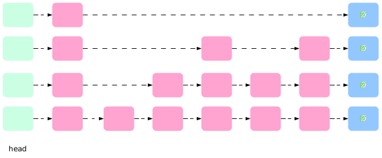</td>
            <td>Probabilistic data structure for ordered sets or maps, offering efficient search and insertion with average case complexity better than balanced trees</td>
            <td>Used in Redis</td>
            <td>In-memory</td>
          </tr>
          <tr>
            <td><b>Hash Index</b></td>
            <td>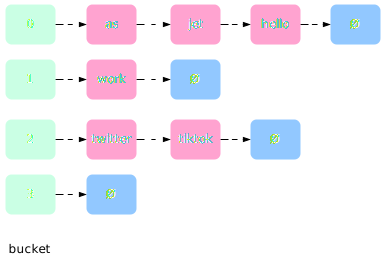</td>
            <td>Uses a hash function to quickly map data keys to their locations, ideal for fast lookups</td>
            <td>Most common in-memory index solution</td>
            <td>In-memory</td>
          </tr>
          <tr>
            <td><b>SSTable</b></td>
            <td>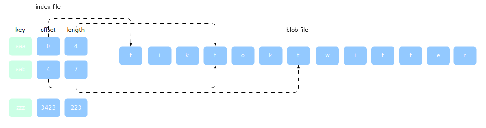</td>
            <td>File format for storing data in sorted order on disk, enabling efficient retrieval operations</td>
            <td>Immutable data structure. Seldom used alone</td>
            <td>Disk-based</td>
          </tr>
          <tr>
            <td><b>LSM Tree</b></td>
            <td></td>
            <td>Data structure that combines in-memory and disk-based storage for ordered data, optimizing write performance and later merging for efficient reads</td>
            <td>High write throughput. Disk compaction may impact performance</td>
            <td>Memory + Disk</td>
          </tr>
          <tr>
            <td><b>B-Tree</b></td>
            <td>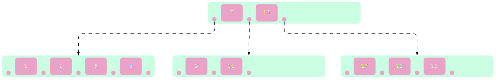</td>
            <td>Self-balancing tree data structure for sorted data, allowing efficient search, insertion, and deletion operations</td>
            <td>Most popular database index implementation</td>
            <td>Disk-based</td>
          </tr>
          <tr>
            <td><b>Inverted Index</b></td>
            <td>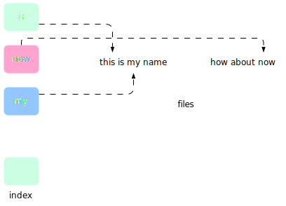</td>
            <td>Used for text retrieval, where words are mapped to documents they appear in, facilitating fast full-text searches</td>
            <td>Used in document search engine such as Lucene</td>
            <td>Search document</td>
          </tr>
          <tr>
            <td><b>Suffix Tree</b></td>
            <td>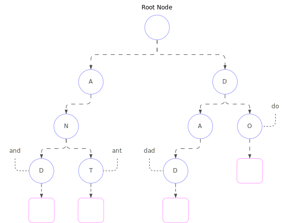</td>
            <td>Stores suffixes of words, enabling efficient searches for patterns and substrings within a text</td>
            <td>Used in string search, such as string suffix match</td>
            <td>Search string</td>
          </tr>
          <tr>
            <td><b>R-Tree</b></td>
            <td>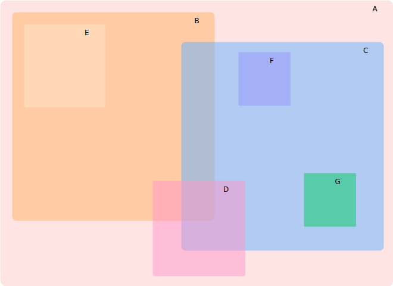</td>
            <td>Stores spatial data like points, rectangles, or polygons, allowing efficient searches for objects within a specific area</td>
            <td>Nearest neighbor</td>
            <td>Search multi-dimension shape</td>
          </tr>
        </tbody>
      </table>
    </TabItem>
    <TabItem value="relational-db-syntax" label="Syntax">
        <table>
            <thead>
                <tr>
                    <th>Type</th>
                    <th>Definition</th>
                    <th>Example</th>
                </tr>
            </thead>
            <tbody>
                <tr>
                    <td><b>SELECT</b></td>
                    <td>Retrieves data from a database</td>
                    <td>`SELECT column1, column2 FROM table_name`</td>
                </tr>
                <tr>
                    <td><b>INSERT</b></td>
                    <td>Adds new records to a table</td>
                    <td>`INSERT INTO table_name (column1, column2) VALUES (value1, value2)`</td>
                </tr>
                <tr>
                    <td><b>UPDATE</b></td>
                    <td>Modifies existing records in a table</td>
                    <td>`UPDATE table_name SET column1 = value1, column2 = value2 WHERE condition`</td>
                </tr>
                <tr>
                    <td><b>DELETE</b></td>
                    <td>Deletes records from a table</td>
                    <td>`DELETE FROM table_name WHERE condition`</td>
                </tr>
                <tr>
                    <td><b>JOIN</b></td>
                    <td>Combines rows from two or more tables based on a related column</td>
                    <td>`SELECT * FROM table1 INNER JOIN table2 ON table1.column = table2.column`</td>
                </tr>
                <tr>
                    <td><b>GROUP BY</b></td>
                    <td>Groups rows with identical values into summary rows</td>
                    <td>`SELECT column1, COUNT(*) FROM table_name GROUP BY column1`</td>
                </tr>
                <tr>
                    <td><b>HAVING</b></td>
                    <td>Filters records grouped by GROUP BY clause</td>
                    <td>`SELECT column1, COUNT(*) FROM table_name GROUP BY column1 HAVING COUNT(*) > 10`</td>
                </tr>
                <tr>
                    <td><b>ORDER BY</b></td>
                    <td>Sorts the result set in ascending or descending order</td>
                    <td>`SELECT * FROM table_name ORDER BY column1 DESC`</td>
                </tr>
                <tr>
                    <td><b>WHERE</b></td>
                    <td>Filters records based on specified conditions</td>
                    <td>`SELECT * FROM table_name WHERE condition`</td>
                </tr>
                <tr>
                    <td><b>DISTINCT</b></td>
                    <td>Returns only distinct (different) values</td>
                    <td>`SELECT DISTINCT column1 FROM table_name`</td>
                </tr>
                <tr>
                    <td><b>UNION</b></td>
                    <td>Combines the result sets of two or more SELECT statements</td>
                    <td>`SELECT column1 FROM table1 UNION SELECT column1 FROM table2`</td>
                </tr>
                <tr>
                    <td><b>TRANSACTION</b></td>
                    <td>Groups a set of SQL statements into a single unit of work</td>
                    <td>`BEGIN TRANSACTION; ... COMMIT; or ROLLBACK;`</td>
                </tr>
                <tr>
                    <td><b>INDEX</b></td>
                    <td>Creates an index on a table</td>
                    <td>`CREATE INDEX index_name ON table_name (column1)`</td>
                </tr>
                <tr>
                    <td><b>VIEW</b></td>
                    <td>Virtual table derived from one or more tables</td>
                    <td>`CREATE VIEW view_name AS SELECT column1, column2 FROM table_name WHERE condition`</td>
                </tr>
                <tr>
                    <td><b>TRIGGER</b></td>
                    <td>Executes a set of actions when a certain event occurs on a table</td>
                    <td>`CREATE TRIGGER trigger_name BEFORE INSERT ON table_name FOR EACH ROW BEGIN ... END`</td>
                </tr>
                <tr>
                    <td><b>SUBQUERY</b></td>
                    <td>Nested query inside another query</td>
                    <td>`SELECT column1 FROM table_name WHERE column1 IN (SELECT column1 FROM table2 WHERE condition)`</td>
                </tr>
                <tr>
                    <td><b>CASE</b></td>
                    <td>Provides conditional logic within a query</td>
                    <td>`SELECT column1, CASE WHEN condition THEN result1 ELSE result2 END AS result FROM table_name`</td>
                </tr>
            </tbody>
        </table>
    </TabItem>
    <TabItem value="relational-db-normalization" label="Normalization">
        Process of organizing data in a relational database to minimize redundancy and improve data integrity.

        - **Reduce data duplication**: This saves storage space and minimizes maintenance headaches
        - **Enhance data consistency**: When a piece of data changes, it only needs to be updated in one place, ensuring consistency across the database
        - **Improve data retrieval efficiency**: Normalized databases allow for faster and more efficient querying of data

        Normalization is achieved through a series of steps, each referred to as a Normal Form (**NF**) Each subsequent form builds upon the previous one, progressively reducing redundancy

        <table class="text_vertical">
            <thead>
              <tr>
                <th>Normal Form</th>
                <th>Key Points</th>
                <th>Steps</th>
                <th>Example</th>
              </tr>
            </thead>
            <tbody>
              <tr>
                <td><b>0NF</b></td>
                <td>Non-normalized data</td>
                <td></td>
                <td>
                    <table>
                        <thead>
                          <tr>
                            <th>Name</th>
                            <th>Address</th>
                            <th>Movie</th>
                            <th>Salutation</th>
                          </tr>
                        </thead>
                        <tbody>
                            <tr>
                                <td>Jane Doe</td>
                                <td>1st Street</td>
                                <td>Pirates of the Caribbean, Game of Thrones</td>
                                <td>Ms</td>
                            </tr>
                            <tr>
                                <td>Joe Doe</td>
                                <td>38 Street</td>
                                <td>Kung Fu Panda, Squid Game</td>
                                <td>Mr</td>
                            </tr>
                            <tr>
                                <td>Joe Doe</td>
                                <td>8th Ave</td>
                                <td>Game of Thrones</td>
                                <td>Mr</td>
                            </tr>
                        </tbody>
                    </table>
                </td>
              </tr>
              <tr>
                <td><b>1NF</b></td>
                <td>
                    <ul>
                        <li>Each table cell should contain a single value</li>
                        <li>Each record has to be unique</li>
                    </ul>
                </td>
                <td>
                    <ul>
                        <li>Identify repeating groups within a table</li>
                        <li>Create separate tables for these groups</li>
                        <li>Establish relationships between tables using primary and foreign keys. (A foreign key in one table references the primary key of another table, linking related data)</li>
                    </ul>
                </td>
                <td>
                    <ul>
                        <li>Flatten the table by storing in a cell a single value</li>
                        <li>
                            <table>
                                <thead>
                                  <tr>
                                    <th>Name</th>
                                    <th>Address</th>
                                    <th>Movie</th>
                                    <th>Salutation</th>
                                  </tr>
                                </thead>
                                <tbody>
                                    <tr>
                                        <td>Jane Doe</td>
                                        <td>1st Street</td>
                                        <td>Pirates of the Caribbean</td>
                                        <td>Ms</td>
                                    </tr>
                                    <tr>
                                        <td>Jane Doe</td>
                                        <td>1st Street</td>
                                        <td>Game of Thrones</td>
                                        <td>Ms</td>
                                    </tr>
                                    <tr>
                                        <td>Joe Doe</td>
                                        <td>38 Street</td>
                                        <td>Squid Game</td>
                                        <td>Mr</td>
                                    </tr>
                                    <tr>
                                        <td>Joe Doe</td>
                                        <td>38 Street</td>
                                        <td>Squid Game</td>
                                        <td>Mr</td>
                                    </tr>
                                    <tr>
                                        <td>Joe Doe</td>
                                        <td>8th Ave</td>
                                        <td>Game of Thrones</td>
                                        <td>Mr</td>
                                    </tr>
                                </tbody>
                            </table>
                        </li>
                    </ul>
                </td>
              </tr>
              <tr>
                <td><b>2NF</b></td>
                <td>
                    <ul>
                        <li>The table must already be in 1NF</li>
                        <li>Single column Primary Key that doesn't functionally dependant on any subset of candidate key relation</li>
                    </ul>
                </td>
                <td>
                    <ul>
                        <li>Identify non-key attributes that depend only on a part of the primary key</li>
                        <li>Create separate tables for these attributes, with a new primary key formed by the relevant part of the original key and any additional attributes that determine the value of the dependent attribute(s)</li>
                        <li>Establish foreign key relationships between the new table and the original table</li>
                    </ul>
                </td>
                <td>
                    <ul>
                        <li>
                            <table>
                                <thead>
                                  <tr>
                                    <th>Membership ID</th>
                                    <th>Name</th>
                                    <th>Address</th>
                                    <th>Salutation</th>
                                  </tr>
                                </thead>
                                <tbody>
                                    <tr>
                                        <td>1</td>
                                        <td>Jane Doe</td>
                                        <td>1st Street</td>
                                        <td>Ms</td>
                                    </tr>
                                    <tr>
                                        <td>2</td>
                                        <td>Joe Doe</td>
                                        <td>38 Street</td>
                                        <td>Mr</td>
                                    </tr>
                                    <tr>
                                        <td>3</td>
                                        <td>Joe Doe</td>
                                        <td>8th Ave</td>
                                        <td>Mr</td>
                                    </tr>
                                </tbody>
                            </table>
                        </li>
                        <li>
                            <table>
                                <thead>
                                  <tr>
                                    <th>Membership ID</th>
                                    <th>Movie</th>
                                  </tr>
                                </thead>
                                <tbody>
                                    <tr>
                                        <td>1</td>
                                        <td>Pirates of the Caribbean</td>
                                    </tr>
                                    <tr>
                                        <td>1</td>
                                        <td>Game of Thrones</td>
                                    </tr>
                                    <tr>
                                        <td>2</td>
                                        <td>Squid Game</td>
                                    </tr>
                                    <tr>
                                        <td>2</td>
                                        <td>Squid Game</td>
                                    </tr>
                                    <tr>
                                        <td>3</td>
                                        <td>Game of Thrones</td>
                                    </tr>
                                </tbody>
                            </table>
                        </li>
                    </ul>
                </td>
              </tr>
              <tr>
                <td><b>3NF</b></td>
                <td>
                    <ul>
                        <li>The table must already be in 2NF</li>
                        <li>
                        Has no transitive functional dependencies
                        <ul>
                            <li>If an A functionally determines B (A → B; or B is dependant on A, or B comes from an A ) and simultaneously B determines C (B → C), then A is transitively dependant on C (A → C)</li>
                            <li>birth code → name, age; name, age → address; birth code → address</li>
                        </ul>
                        </li>
                    </ul>
                </td>
                <td>
                    <ul>
                        <li>**Identify transitive dependencies**: Analyze the relationships between non-key attributes. Look for situations where one non-key attribute depends on another non-key attribute, which ultimately depends on the primary key</li>
                        <li>**Decompose the table**: If you find transitive dependencies, create a new table to isolate the dependent attribute(s) and any other attributes that determine their values</li>
                        <li>**Establish foreign key relationships**: Link the new table back to the original table using a foreign key that references the relevant determining attribute(s)</li>
                    </ul>
                </td>
                <td>
                    <ul>
                        <li>
                            <table>
                                <thead>
                                  <tr>
                                    <th>Membership ID</th>
                                    <th>Name</th>
                                    <th>Address</th>
                                    <th>Salutation ID</th>
                                  </tr>
                                </thead>
                                <tbody>
                                    <tr>
                                        <td>1</td>
                                        <td>Jane Doe</td>
                                        <td>1st Street</td>
                                        <td>2</td>
                                    </tr>
                                    <tr>
                                        <td>2</td>
                                        <td>Joe Doe</td>
                                        <td>38 Street</td>
                                        <td>1</td>
                                    </tr>
                                    <tr>
                                        <td>3</td>
                                        <td>Joe Doe</td>
                                        <td>8th Ave</td>
                                        <td>1</td>
                                    </tr>
                                </tbody>
                            </table>
                        </li>
                        <li>
                            <table>
                                <thead>
                                  <tr>
                                    <th>Membership ID</th>
                                    <th>Movie</th>
                                  </tr>
                                </thead>
                                <tbody>
                                    <tr>
                                        <td>1</td>
                                        <td>Pirates of the Caribbean</td>
                                    </tr>
                                    <tr>
                                        <td>1</td>
                                        <td>Game of Thrones</td>
                                    </tr>
                                    <tr>
                                        <td>2</td>
                                        <td>Squid Game</td>
                                    </tr>
                                    <tr>
                                        <td>2</td>
                                        <td>Squid Game</td>
                                    </tr>
                                    <tr>
                                        <td>3</td>
                                        <td>Game of Thrones</td>
                                    </tr>
                                </tbody>
                            </table>
                        </li>
                        <li>
                            <table>
                                <thead>
                                  <tr>
                                    <th>Salutation ID</th>
                                    <th>Salutation</th>
                                  </tr>
                                </thead>
                                <tbody>
                                    <tr>
                                        <td>1</td>
                                        <td>Mr</td>
                                    </tr>
                                    <tr>
                                        <td>2</td>
                                        <td>Ms</td>
                                    </tr>
                                </tbody>
                            </table>
                        </li>
                    </ul>
                </td>
              </tr>
              <tr>
                <td><b>Boyce-Codd Normal Form (BCNF)</b></td>
                <td>
                    <ul>
                        <li>The table must already be in 3NF</li>
                        <li>Decompose non-trivial functional dependencies by separating them into a new tables and link them with foreign keys (FK)</li>
                        <li>Ensure that every determinant is a candidate key</li>
                    </ul>
                </td>
                <td></td>
                <td></td>
              </tr>
              <tr>
                <td><b>4NF</b></td>
                <td>
                    <ul>
                        <li>The table must already be in BCNF</li>
                        <li>If no database table instance contains 2 or more, independent and multivalued data describing the relevant entity</li>
                    </ul>
                </td>
                <td></td>
                <td></td>
              </tr>
              <tr>
                <td><b>5NF</b></td>
                <td>
                    <ul>
                        <li>The table must already be in 4NF</li>
                        <li>Decompose join dependencies by separating them into a new tables and link them with foreign keys (FK)</li>
                    </ul>
                </td>
                <td></td>
                <td></td>
              </tr>
              <tr>
                <td><b>6NF</b></td>
                <td>
                    <ul>
                        <li>The table must already be in 5NF</li>
                        <li>Decompose temporal dependencies which involve time-varying relationships between attributes</li>
                    </ul>
                </td>
                <td></td>
                <td></td>
              </tr>
            </tbody>
        </table>
    </TabItem>
    <TabItem value="relational-db-joins" label="Joins">
        <table class="sticky column text_vertical" style={{textWrap: "nowrap"}}>
            <thead>
              <tr>
                <th>Type</th>
                <th style={{minWidth: '350px'}}>Visualization</th>
                <th>Definition</th>
                <th>Syntax</th>
                <th style={{minWidth: '350px'}}>Example</th>
              </tr>
            </thead>
            <tbody>
              <tr>
                <td><b>Left Join / Left Outer Join</b></td>
                <td>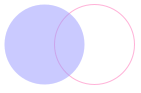</td>
                <td>Everything on the left + everything on the right that matches</td>
                <td>`SELECT * FROM table1 LEFT JOIN table2 ON table1.key = table2.key`</td>
                <td>
                    ```mermaid
                        graph TB

                        user(User) e1@--> result(Result)
                        order(Order) e2@--> result

                        user ~~~|<table><thead><tr><th>User ID</th><th>User Name</th></tr></thead><tbody><tr><td>1</td><td>John</td></tr><tr><td>2</td><td>Joe</td></tr><tr><td>3</td><td>Jane</td></tr></tbody></table>| user
                        order ~~~|<table><thead><tr><th>User ID</th><th>Order ID</th></tr></thead><tbody><tr><td>1</td><td>111</td></tr><tr><td>2</td><td>222</td></tr><tr><td>8</td><td>888</td></tr></tbody></table>| order
                        result ~~~|<table><thead><tr><th>User ID</th><th>User Name</th><th>Order ID</th></tr></thead><tbody><tr><td>1</td><td>John</td><td>111</td></tr><tr><td>2</td><td>Joe</td><td>222</td></tr><tr><td>3</td><td>Jane</td><td>NULL</td></tr></tbody></table>| result

                        e1@{ animate: true }
                        e2@{ animate: true }
                    ```
                </td>
              </tr>
              <tr>
                <td><b>Anti Left Join</b></td>
                <td>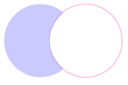</td>
                <td>Everything on the left that is NOT on the right</td>
                <td>`SELECT * FROM table1 LEFT JOIN table2 ON table1.key = table2.key WHERE table2.key IS NULL`</td>
                <td>
                    ```mermaid
                        graph TB

                        user(User) e1@--> result(Result)
                        order(Order) e2@--> result

                        user ~~~|<table><thead><tr><th>User ID</th><th>User Name</th></tr></thead><tbody><tr><td>1</td><td>John</td></tr><tr><td>2</td><td>Joe</td></tr><tr><td>3</td><td>Jane</td></tr></tbody></table>| user
                        order ~~~|<table><thead><tr><th>User ID</th><th>Order ID</th></tr></thead><tbody><tr><td>1</td><td>111</td></tr><tr><td>2</td><td>222</td></tr><tr><td>8</td><td>888</td></tr></tbody></table>| order
                        result ~~~|<table><thead><tr><th>User ID</th><th>User Name</th><th>Order ID</th></tr></thead><tbody><tr><td>3</td><td>Jane</td><td>NULL</td></tr></tbody></table>| result

                        e1@{ animate: true }
                        e2@{ animate: true }
                    ```
                </td>
              </tr>
              <tr>
                <td><b>Right Join / Right Outer Join</b></td>
                <td>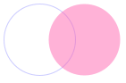</td>
                <td>Everything on the right + everything on the left that matches</td>
                <td>`SELECT * FROM table1 RIGHT JOIN table2 ON table1.key = table2.key`</td>
                <td>
                    ```mermaid
                        graph TB

                        user(User) e1@--> result(Result)
                        order(Order) e2@--> result

                        user ~~~|<table><thead><tr><th>User ID</th><th>User Name</th></tr></thead><tbody><tr><td>1</td><td>John</td></tr><tr><td>2</td><td>Joe</td></tr><tr><td>3</td><td>Jane</td></tr></tbody></table>| user
                        order ~~~|<table><thead><tr><th>User ID</th><th>Order ID</th></tr></thead><tbody><tr><td>1</td><td>111</td></tr><tr><td>2</td><td>222</td></tr><tr><td>8</td><td>888</td></tr></tbody></table>| order
                        result ~~~|<table><thead><tr><th>User ID</th><th>User Name</th><th>Order ID</th></tr></thead><tbody><tr><td>1</td><td>John</td><td>111</td></tr><tr><td>2</td><td>Joe</td><td>222</td></tr><tr><td>8</td><td>NULL</td><td>888</td></tr></tbody></table>| result

                        e1@{ animate: true }
                        e2@{ animate: true }
                    ```
                </td>
              </tr>
              <tr>
                <td><b>Anti Right Join</b></td>
                <td>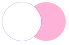</td>
                <td>Everything on the right that is NOT on the left</td>
                <td>`SELECT * FROM table1 RIGHT JOIN table2 ON table1.key = table2.key WHERE table1.key IS NULL`</td>
                <td>
                    ```mermaid
                        graph TB

                        user(User) e1@--> result(Result)
                        order(Order) e2@--> result

                        user ~~~|<table><thead><tr><th>User ID</th><th>User Name</th></tr></thead><tbody><tr><td>1</td><td>John</td></tr><tr><td>2</td><td>Joe</td></tr><tr><td>3</td><td>Jane</td></tr></tbody></table>| user
                        order ~~~|<table><thead><tr><th>User ID</th><th>Order ID</th></tr></thead><tbody><tr><td>1</td><td>111</td></tr><tr><td>2</td><td>222</td></tr><tr><td>8</td><td>888</td></tr></tbody></table>| order
                        result ~~~|<table><thead><tr><th>User ID</th><th>User Name</th><th>Order ID</th></tr></thead><tbody><tr><td>NULL</td><td>NULL</td><td>888</td></tr></tbody></table>| result

                        e1@{ animate: true }
                        e2@{ animate: true }
                    ```
                </td>
              </tr>
              <tr>
                <td><b>Full Outer Join</b></td>
                <td>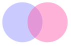</td>
                <td>Everything on the left + everything on the right</td>
                <td>`SELECT * FROM table1 FULL OUTER JOIN table2 ON table1.key = table2.key`</td>
                <td>
                    ```mermaid
                        graph TB

                        user(User) e1@--> result(Result)
                        order(Order) e2@--> result

                        user ~~~|<table><thead><tr><th>User ID</th><th>User Name</th></tr></thead><tbody><tr><td>1</td><td>John</td></tr><tr><td>2</td><td>Joe</td></tr><tr><td>3</td><td>Jane</td></tr></tbody></table>| user
                        order ~~~|<table><thead><tr><th>User ID</th><th>Order ID</th></tr></thead><tbody><tr><td>1</td><td>111</td></tr><tr><td>2</td><td>222</td></tr><tr><td>8</td><td>888</td></tr></tbody></table>| order
                        result ~~~|<table><thead><tr><th>User ID</th><th>User Name</th><th>Order ID</th></tr></thead><tbody><tr><td>1</td><td>John</td><td>111</td></tr><tr><td>2</td><td>Joe</td><td>222</td></tr><tr><td>3</td><td>Jane</td><td>NULL</td></tr><tr><td>8</td><td>NULL</td><td>888</td></tr></tbody></table>| result

                        e1@{ animate: true }
                        e2@{ animate: true }
                    ```
                </td>
              </tr>
              <tr>
                <td><b>Anti Outer Join</b></td>
                <td></td>
                <td>Everything on the left and right that is unique to each other</td>
                <td>`SELECT * FROM table1 FULL OUTER JOIN table2 ON table1.key = table2.key WHERE table1.key IS NULL OR table2.key IS NULL`</td>
                <td>
                    ```mermaid
                        graph TB

                        user(User) e1@--> result(Result)
                        order(Order) e2@--> result

                        user ~~~|<table><thead><tr><th>User ID</th><th>User Name</th></tr></thead><tbody><tr><td>1</td><td>John</td></tr><tr><td>2</td><td>Joe</td></tr><tr><td>3</td><td>Jane</td></tr></tbody></table>| user
                        order ~~~|<table><thead><tr><th>User ID</th><th>Order ID</th></tr></thead><tbody><tr><td>1</td><td>111</td></tr><tr><td>2</td><td>222</td></tr><tr><td>8</td><td>888</td></tr></tbody></table>| order
                        result ~~~|<table><thead><tr><th>User ID</th><th>User Name</th><th>Order ID</th></tr></thead><tbody><tr><td>NULL</td><td>NULL</td><td>888</td></tr></tbody></table>| result

                        e1@{ animate: true }
                        e2@{ animate: true }
                    ```
                </td>
              </tr>
              <tr>
                <td><b>Join / Inner Join</b></td>
                <td>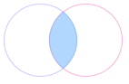</td>
                <td>Only the things that are common</td>
                <td>`SELECT * FROM table1 INNER JOIN table2 ON table1.key = table2.key`</td>
                <td>
                    ```mermaid
                        graph TB

                        user(User) e1@--> result(Result)
                        order(Order) e2@--> result

                        user ~~~|<table><thead><tr><th>User ID</th><th>User Name</th></tr></thead><tbody><tr><td>1</td><td>John</td></tr><tr><td>2</td><td>Joe</td></tr><tr><td>3</td><td>Jane</td></tr></tbody></table>| user
                        order ~~~|<table><thead><tr><th>User ID</th><th>Order ID</th></tr></thead><tbody><tr><td>1</td><td>111</td></tr><tr><td>1</td><td>222</td></tr><tr><td>5</td><td>1</td></tr></tbody></table>| order
                        result ~~~|<table><thead><tr><th>User ID</th><th>User Name</th><th>Order ID</th></tr></thead><tbody><tr><td>1</td><td>John</td><td>111</td></tr><tr><td>1</td><td>John</td><td>222</td></tr></tbody></table>| result

                        e1@{ animate: true }
                        e2@{ animate: true }
                    ```
                </td>
              </tr>
              <tr>
                <td><b>Cross Join</b></td>
                <td></td>
                <td>All combinations of rows from both tables (Cartesian Product)</td>
                <td>`SELECT * FROM table1 CROSS JOIN table2`</td>
                <td>
                    ```mermaid
                        graph TB

                        user(User) e1@--> result(Result)
                        order(Order) e2@--> result

                        user ~~~|<table><thead><tr><th>User ID</th><th>User Name</th></tr></thead><tbody><tr><td>1</td><td>John</td></tr><tr><td>2</td><td>Joe</td></tr><tr><td>3</td><td>Jane</td></tr></tbody></table>| user
                        order ~~~|<table><thead><tr><th>User ID</th><th>Order ID</th></tr></thead><tbody><tr><td>1</td><td>111</td></tr><tr><td>2</td><td>222</td></tr><tr><td>8</td><td>888</td></tr></tbody></table>| order
                        result ~~~|<table><thead><tr><th>User ID</th><th>User Name</th><th>Order ID</th></tr></thead><tbody><tr><td>1</td><td>John</td><td>111</td></tr><tr><td>1</td><td>John</td><td>222</td></tr><tr><td>1</td><td>John</td><td>888</td></tr><tr><td>2</td><td>Joe</td><td>111</td></tr><tr><td>2</td><td>Joe</td><td>222</td></tr><tr><td>2</td><td>Joe</td><td>888</td></tr><tr><td>3</td><td>Jane</td><td>111</td></tr><tr><td>3</td><td>Jane</td><td>222</td></tr><tr><td>3</td><td>Jane</td><td>888</td></tr></tbody></table>| result

                        e1@{ animate: true }
                        e2@{ animate: true }
                    ```
                </td>
              </tr>
              <tr>
                <td><b>Self Join</b></td>
                <td>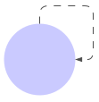</td>
                <td>The table is joined with itself</td>
                <td>`SELECT * FROM table1 AS t1 INNER JOIN table1 AS t2 ON t1.key = t2.key`</td>
                <td>
                    ```mermaid
                        graph TB

                        user1(User) e1@--> result(Result)
                        user2(User) e2@--> result

                        user1 ~~~|<table><thead><tr><th>User ID</th><th>User Name</th></tr></thead><tbody><tr><td>1</td><td>John</td></tr><tr><td>2</td><td>Joe</td></tr><tr><td>3</td><td>Jane</td></tr></tbody></table>| user1
                        user2 ~~~|<table><thead><tr><th>User ID</th><th>User Name</th></tr></thead><tbody><tr><td>1</td><td>John</td></tr><tr><td>2</td><td>Joe</td></tr><tr><td>3</td><td>Jane</td></tr></tbody></table>| user2
                        result ~~~|"<table><thead><tr><th>User ID (User1)</th><th>User Name (User1)</th><th>User ID (User2)</th><th>User Name (User2)</th></tr></thead><tbody><tr><td>1</td><td>John</td><td>1</td><td>John</td></tr><tr><td>1</td><td>John</td><td>2</td><td>Joe</td></tr><tr><td>1</td><td>John</td><td>3</td><td>Jane</td></tr><tr><td>2</td><td>Joe</td><td>1</td><td>John</td></tr><tr><td>2</td><td>Joe</td><td>2</td><td>Joe</td></tr><tr><td>2</td><td>Joe</td><td>3</td><td>Jane</td></tr><tr><td>3</td><td>Jane</td><td>1</td><td>John</td></tr><tr><td>3</td><td>Jane</td><td>2</td><td>Joe</td></tr><tr><td>3</td><td>Jane</td><td>3</td><td>Jane</td></tr></tbody></table>"| result

                        e1@{ animate: true }
                        e2@{ animate: true }
                    ```
                </td>
              </tr>
            </tbody>
        </table>
    </TabItem>
    <TabItem value="relational-db-relations" label="Relations">
        <table>
            <thead>
                <tr>
                    <th>Feature</th>
                    <th>One-to-One</th>
                    <th>One-to-Many</th>
                    <th>Many-to-Many</th>
                </tr>
            </thead>
            <tbody>
                <tr>
                    <td><b>Visualization</b></td>
                    <td>
                      ```mermaid
                      erDiagram
                          Person ||--o| Passport : "1..0-1"
                      ```
                    </td>
                    <td>
                      ```mermaid
                      erDiagram
                          DepartmentsA ||--|{ EmployeeA : "1..1-*"
                      ```
                    </td>
                    <td>
                      ```mermaid
                      erDiagram
                          Students o|--|{ Students-Courses : "0-1..1-*"
                          Courses ||--o{ Students-Courses : "1..0-*"
                      ```
                    </td>
                </tr>
                <tr>
                    <td><b>Definition</b></td>
                    <td>Each record in one table is associated with exactly one record in another</td>
                    <td>Each record in one table can be associated with one or more records in another</td>
                    <td>Records in both tables can be associated with multiple records in the other</td>
                </tr>
                <tr>
                    <td><b>Example</b></td>
                    <td>Person → Passport</td>
                    <td>Department → Employee</td>
                    <td>Student → Course</td>
                </tr>
            </tbody>
        </table>
    </TabItem>
    <TabItem value="relational-db-common-issues" label="Common Issues">
      <table class="text_vertical">
        <thead>
          <tr>
            <th>Issue</th>
            <th>Definition</th>
            <th>Impact</th>
            <th>Solutions</th>
          </tr>
        </thead>
        <tbody>
          <tr>
            <td><b>Cartesian Products</b></td>
            <td>Occurs when 2 or more tables are joined without a proper `WHERE` clause, resulting in huge datasets</td>
            <td>
              <ul>
                <li>High resource consumption</li>
                <li>Slow query performance</li>
                <li>Database server overload</li>
              </ul>
            </td>
            <td>
              <ul>
                <li>Ensure `WHERE` clause in `JOIN` queries</li>
                <li>Optimize query design and indexing</li>
                <li>Limit result set size</li>
              </ul>
            </td>
          </tr>
          <tr>
            <td><b>Connections overhead</b></td>
            <td>Establishing multiple connections to the same database</td>
            <td>
              <ul>
                <li>Resource wastage</li>
                <li>Decreased performance due to connection establishment overhead</li>
                <li>Scalability issues</li>
              </ul>
            </td>
            <td>
              <ul>
                <li>Implement connection pooling mechanism</li>
                <li>Tune connection timeout settings</li>
              </ul>
            </td>
          </tr>
          <tr>
            <td><b>Data Inconsistency</b></td>
            <td>Same data exists in different forms across the database</td>
            <td>
              <ul>
                <li>Incorrect query results</li>
                <li>Application errors</li>
                <li>Data corruption</li>
              </ul>
            </td>
            <td>
              <ul>
                <li>Use transactions and locking mechanisms</li>
                <li>Implement referential integrity constraints</li>
                <li>Regular data validation and cleansing</li>
              </ul>
            </td>
          </tr>
          <tr>
            <td><b>Deadlocks</b></td>
            <td>2 or more transactions are waiting for each other to release locks</td>
            <td>
              <ul>
                <li>Transaction failure</li>
                <li>Resource wastage</li>
                <li>System deadlock</li>
              </ul>
            </td>
            <td>
              <ul>
                <li>Analyze and optimize transaction isolation levels</li>
                <li>Minimize transaction duration</li>
              </ul>
            </td>
          </tr>
          <tr>
            <td><b>Full Table Scans</b></td>
            <td>Scanning the entire table to satisfy a query instead of using indexes</td>
            <td>
              <ul>
                <li>Slow query performance</li>
                <li>High I/O load</li>
              </ul>
            </td>
            <td>
              <ul>
                <li>Create appropriate indexes</li>
                <li>Tune SQL queries to leverage existing indexes</li>
                <li>Partition large tables for better performance</li>
              </ul>
            </td>
          </tr>
          <tr>
            <td><b>Missing Indexes</b></td>
            <td>Indexes that are required to satisfy a query are missing</td>
            <td>
              <ul>
                <li>Slow query performance</li>
                <li>High CPU and I/O utilization</li>
              </ul>
            </td>
            <td>
              <ul>
                <li>Analyze query execution plans</li>
                <li>Create indexes based on query patterns and workload characteristics</li>
              </ul>
            </td>
          </tr>
          <tr>
            <td><b>N+1</b></td>
            <td>Initial query fetches N rows, and then N additional queries are executed to fetch related data for each row</td>
            <td>
              <ul>
                <li>Increased number of queries</li>
                <li>Poor performance</li>
                <li>High resource consumption</li>
              </ul>
            </td>
            <td>
              <ul>
                <li>Use eager loading or batch loading in ORMs</li>
                <li>Optimize data access patterns</li>
                <li>Implement custom data retrieval methods</li>
              </ul>
            </td>
          </tr>
          <tr>
            <td><b>Over/Under fetching</b></td>
            <td>Overfetching occurs when unnecessary data is fetched from the database, while underfetching occurs when necessary data is not fetched</td>
            <td>
              <ul>
                <li>Wastage of network bandwidth and server resources</li>
                <li>Reduced application responsiveness</li>
                <li>Increased latency</li>
              </ul>
            </td>
            <td>
              <ul>
                <li>Optimize SQL queries to fetch only required data</li>
                <li>Use pagination and filtering to limit result set size</li>
                <li>Normalize data to reduce redundancy and improve query efficiency</li>
              </ul>
            </td>
          </tr>
          <tr>
            <td><b>Poorly Designed Schema</b></td>
            <td>Lacks normalization, proper data types, and relationships, leading to inefficient data access</td>
            <td>
              <ul>
                <li>Data redundancy</li>
                <li>Update anomalies</li>
                <li>Inefficient queries and joins</li>
              </ul>
            </td>
            <td>
              <ul>
                <li>Normalize the database schema</li>
                <li>Choose appropriate data types</li>
                <li>Define relationships and constraints</li>
                <li>Analyze and refactor existing schema structures</li>
              </ul>
            </td>
          </tr>
          <tr>
            <td><b>Subquery Inefficiency</b></td>
            <td>Subqueries are used inefficiently, resulting in poor query performance</td>
            <td>
              <ul>
                <li>Slow query execution</li>
                <li>Resource contention</li>
              </ul>
            </td>
            <td>
              <ul>
                <li>Rewrite subqueries as joins where possible</li>
                <li>Use correlated subqueries judiciously</li>
                <li>Ensure subquery optimization through proper indexing and query tuning</li>
              </ul>
            </td>
          </tr>
        </tbody>
      </table>
    </TabItem>

</Tabs>

## Data Engineering

<Tabs queryString="primary">
  <TabItem value="de-lifecycle" label="DE Lifecycle">
    DE Lifecycle describes the stages involved in taking raw data from its origin to a usable format for analytics, reporting, and machine learning. The typical stages are **Generation**, where data is created; **Storage**, where it's held; **Ingestion**, where it's brought into a system; **Transformation**, where it's cleaned and processed; and **Serving**, where it's made available to users and applications. This structured process ensures the consistent delivery of high-quality data products and helps data engineers build reliable data pipelines.

    ```mermaid
    flowchart LR
      subgraph Generation
        direction LR

        A[Data Sources] e1@-->|APIs| B[Applications]
        A e2@-->|Sensors| C[IoT Devices]
        A e3@-->|Queries| D[Databases]
        A e4@-->|Files| E[File Systems]
        A e5@-->|Web Scraping| F[Web Services]
      end

      B e6@--> DP
      C e7@--> DP
      D e8@--> DP
      E e9@--> DP
      F e10@--> DP

      subgraph DP ["Data Platform"]
        direction LR
        subgraph " "
          direction LR
          ingest["Ingestion"]:::ingest e11@--> transform["Transformation"]:::transform e12@--> serve["Serving"]:::serve
        end
        storage["Storage"]:::storage
        ingest e13@--> storage
        transform e14@--> storage
        serve e15@--> storage
      end

      DP e16@--> analytics["Analytics"]:::output
      DP e17@--> ml["Machine Learning"]:::output
      DP e18@--> rETL["Reverse ETL"]:::output

      subgraph Undercurrents
        direction TB
        sec["Security"]:::uc_sec
        dm["Data management"]:::uc_dm
        dops["DataOps"]:::uc_dops
        darch["Data architecture"]:::uc_darch
        orch["Orchestration"]:::uc_orch
        se["Software engineering"]:::uc_se
      end

      classDef gen fill:#f7c6c6,stroke:#333,stroke-width:1px;
      classDef ingest fill:#1fbf90,stroke:#0f5a3f,stroke-width:1px,color:#fff;
      classDef transform fill:#b56ce6,stroke:#5a2e6a,stroke-width:1px,color:#fff;
      classDef serve fill:#2f86d6,stroke:#113f6c,stroke-width:1px,color:#fff;
      classDef storage fill:#d9d9d9,stroke:#8c8c8c,stroke-width:1px;
      classDef output fill:#f6df6b,stroke:#8f7a2a,stroke-width:1px;
      classDef uc_sec fill:#e7c8f4,stroke:#9b6aa5,stroke-width:1px;
      classDef uc_dm fill:#d8eef8,stroke:#6fa6bf,stroke-width:1px;
      classDef uc_dops fill:#f6f1d8,stroke:#a58f56,stroke-width:1px;
      classDef uc_darch fill:#c8efd8,stroke:#4f9a6e,stroke-width:1px;
      classDef uc_orch fill:#f7d0d0,stroke:#9b5a5a,stroke-width:1px;
      classDef uc_se fill:#f5ead4,stroke:#9b8f6a,stroke-width:1px;

      e1@{ animate: true }
      e2@{ animate: true }
      e3@{ animate: true }
      e4@{ animate: true }
      e5@{ animate: true }
      e6@{ animate: true }
      e7@{ animate: true }
      e8@{ animate: true }
      e9@{ animate: true }
      e10@{ animate: true }
      e11@{ animate: true }
      e12@{ animate: true }
      e13@{ animate: true }
      e14@{ animate: true }
      e15@{ animate: true }
      e16@{ animate: true }
      e17@{ animate: true }
      e18@{ animate: true }
    ```

    ## Stages

    <table className="text_vertical">
      <thead>
        <tr>
          <th>Stage</th>
          <th>Description</th>
          <th>Key Activities</th>
        </tr>
      </thead>
      <tbody>
        <tr>
          <td><b>Generation</b></td>
          <td>Data originates from source systems like databases, apps, IoT devices, APIs, files, and web services. Data engineers must understand their formats, generation velocity, and integration protocols</td>
          <td>Understanding data formats, generation velocity, integration protocols, schema analysis, connectivity, and business logic</td>
        </tr>
        <tr>
          <td><b>Evaluating Source Systems</b></td>
          <td>Data engineer must understand how source systems generate data, including their quirks, behaviors, and limitations to design effective ingestion pipelines</td>
          <td>Managing schemas, handling inconsistencies, and ensuring reliable data extraction</td>
        </tr>
        <tr>
          <td><b>Ingestion</b></td>
          <td>Ingestion refers to the process of moving data from generating sources into a centralized processing system (data lake, warehouse, stream processor), either in batch or real-time (streaming) modes. Source systems and ingestion are critical chokepoints - a single data hiccup can disrupt the entire pipeline, breaking downstream processes and creating ripple effects</td>
          <td>Selecting ingestion patterns (batch vs. streaming), validating and monitoring pipeline flows, handling schema drift, initial data quality checks</td>
        </tr>
        <tr>
          <td><b>Data Storage</b></td>
          <td>Data at every stage - raw, cleaned, modeled - may be persistently stored for reliability, auditability, and downstream processing. Storage architectures include data lakes (raw staging), data warehouses (structured, analytics-ready), and hybrid lakehouse solutions</td>
          <td>Choosing storage types, optimizing for scalability and cost, enforcing security and backup protocols, supporting data versioning and lineage</td>
        </tr>
        <tr>
          <td><b>Transformation</b></td>
          <td>Converts raw ingested data into cleaned, standardized, enriched formats suitable for analytics and ML. Transformations can be orchestrated via ETL/ELT tools, SQL scripts, or data workflow managers. The Medallion Architecture often structures this into Bronze (raw), Silver (cleaned), and Gold (aggregated) layers</td>
          <td>Cleansing, data normalization and format conversion, business logic and enrichment, aggregations, modeling, statistical summarization, validation and data quality testing</td>
        </tr>
        <tr>
          <td><b>Serving</b></td>
          <td>Transformed data must be delivered to stakeholders or applications for actual use. This can involve feeding BI dashboards, analytics platforms, ML models, or external systems via APIs or reverse ETL for operational analytics</td>
          <td>Providing data to BI dashboards, analytics platforms, or reporting tools; feeding machine learning models; supplying external systems via APIs or reverse ETL; ensuring reliability, freshness, and security for all consumers</td>
        </tr>
        <tr>
          <td><b>Undercurrents</b></td>
          <td>Several critical themes run through all stages of the data engineering lifecycle, including security, data management, DataOps, data architecture, orchestration, and software engineering best practices</td>
          <td>
            <ul>
              <li><b>Security</b>: Implementing robust access controls, encryption, and compliance measures</li>
              <li><b>Data Management</b>:Establishing governance frameworks, metadata management, and data cataloging</li>
              <li><b>DataOps</b>:Adopting DevOps principles for data workflows</li>
              <li><b>Data Architecture</b>: Designing scalable architectures</li>
              <li><b>Orchestration</b>: Coordinating complex workflows</li>
              <li><b>Software Engineering</b>: Applying best practices in coding, version control, and documentation</li>
            </ul>
          </td>
        </tr>
      </tbody>
    </table>

  </TabItem>
<TabItem value="data-access" label="Data Access">
    ### Access Frequency

    <table>
        <thead>
            <tr>
                <th>Aspect</th>
                <th>Hot Data</th>
                <th>Lukewarm (Warm) Data</th>
                <th>Cold Data</th>
            </tr>
        </thead>
        <tbody>
            <tr>
                <td>Definition</td>
                <td>Frequently accessed, high-value, real-time or near-real-time data</td>
                <td>Moderately accessed, regularly needed but not instant</td>
                <td>Infrequently accessed, usually retained for archival purposes</td>
            </tr>
            <tr>
                <td>Access Frequency</td>
                <td>Constant, immediate, sub-second or millisecond response</td>
                <td>Scheduled, hours to days, moderate latency</td>
                <td>Rare, weeks to years, high latency</td>
            </tr>
            <tr>
                <td>Access Latency</td>
                <td>Sub-second or millisecond</td>
                <td>Seconds to minutes</td>
                <td>Minutes to hours</td>
            </tr>
            <tr>
                <td>Storage Media</td>
                <td>RAM, in-memory database, SSDs, high-performance NAS</td>
                <td>Mid-tier SSDs, high-speed HDDs, cloud object storage</td>
                <td>Low-cost HDDs, archival cloud storage</td>
            </tr>
            <tr>
                <td>Retention Policy</td>
                <td>Short-term, transactional</td>
                <td>Weeks to months, operational</td>
                <td>Long-term, years (or indefinitely for compliance)</td>
            </tr>
            <tr>
                <td>Data Volume</td>
                <td>Typically smaller, volume managed for speed</td>
                <td>Medium</td>
                <td>Very large, bulk data</td>
            </tr>
            <tr>
                <td>Data Value</td>
                <td>Immediate, high business impact</td>
                <td>Useful, moderate business impact</td>
                <td>Historical, regulatory, analytical</td>
            </tr>
            <tr>
                <td>Security Requirements</td>
                <td>Highest, critical for business operations</td>
                <td>Moderate, standard access protection</td>
                <td>Encryption, integrity, regulatory compliance</td>
            </tr>
            <tr>
                <td>Scalability</td>
                <td>Vertical scaling for speed</td>
                <td>Horizontal scaling, cost-performance balance</td>
                <td>Massive horizontal scaling, low access needs</td>
            </tr>
            <tr>
                <td>Challenges</td>
                <td>High cost, data lifecycle, scalability</td>
                <td>Balancing cost and access</td>
                <td>Retrieval speed, data integrity, long-term maintenance</td>
            </tr>
            <tr>
                <td>Use Cases</td>
                <td>Fraud detection, real-time stock trading, network monitoring</td>
                <td>Monthly business reporting, operational data</td>
                <td>Legal audits, disaster recovery, regulatory reporting</td>
            </tr>
        </tbody>
    </table>

  </TabItem>
  <TabItem value="data-transformation" label="Data Transformation">
    ### ETL/ELT vs. Medallion Architecture

    <table>
      <thead>
        <tr>
          <th>Aspect</th>
          <th>ETL</th>
          <th>ELT</th>
          <th>Medallion Architecture</th>
        </tr>
      </thead>
      <tbody>
        <tr>
          <td>Process Flow</td>
          <td>Extract → Transform → Load</td>
          <td>Extract → Load → Transform</td>
          <td>Extract → Load (Bronze) → Transform (Silver, Gold)</td>
        </tr>
        <tr>
          <td>Transformation Timing</td>
          <td>Prior to loading</td>
          <td>Within target system</td>
          <td>Incremental through layers</td>
        </tr>
        <tr>
          <td>Data Flexibility</td>
          <td>Less flexible, upfront transform</td>
          <td>Flexible, transform inside system</td>
          <td>Highly modular and incremental</td>
        </tr>
        <tr>
          <td>Focus</td>
          <td>Data movement and transformation</td>
          <td>Leveraging scalable warehouse compute</td>
          <td>Layered refinement with data quality focus</td>
        </tr>
        <tr>
          <td>Data Types</td>
          <td>Mainly structured</td>
          <td>Structured and semi/unstructured</td>
          <td>Structured, semi/unstructured, unstructured</td>
        </tr>
        <tr>
          <td>Use Cases</td>
          <td>Traditional BI, reporting</td>
          <td>Large data volumes, cloud warehouses</td>
          <td>Lakehouse strategy, ML, advanced analytics</td>
        </tr>
      </tbody>
    </table>

    ### Medallion Architecture

    <table>
      <thead>
        <tr>
          <th>Aspect</th>
          <th>Bronze Layer</th>
          <th>Silver Layer</th>
          <th>Gold Layer</th>
          <th>Platinum Layer (Optional)</th>
        </tr>
      </thead>
      <tbody>
        <tr>
          <td><b>Purpose</b></td>
          <td>Raw data ingestion and storage</td>
          <td>Cleaned, validated, and conformed data</td>
          <td>Business-level aggregated and curated data</td>
          <td>Advanced business KPIs, machine learning-ready refined data</td>
        </tr>
        <tr>
          <td><b>Data Quality</b></td>
          <td>Contains raw, unprocessed, high-fidelity data</td>
          <td>Cleansed, deduplicated, and schema-applied data</td>
          <td>Highly curated, denormalized, and enriched data</td>
          <td>Highly refined, integrated, and often aggregated data for analytics or ML</td>
        </tr>
        <tr>
          <td><b>Processing</b></td>
          <td>Minimal or no transformation; just ingestion</td>
          <td>Data cleaning, validation, schema evolution, basic transformation</td>
          <td>Business logic, aggregation, denormalization</td>
          <td>Advanced transformations, integration, optimization</td>
        </tr>
        <tr>
          <td><b>Typical Data Types</b></td>
          <td>Raw logs, sensor data, third-party sources, transactional data as-is</td>
          <td>Structured and semi-structured data with errors removed and schema applied</td>
          <td>Aggregates, summaries, reports, business metrics datasets</td>
          <td>Project-specific or organizational-wide refined datasets usable across teams</td>
        </tr>
        <tr>
          <td><b>Storage</b></td>
          <td>Immutable raw storage, often in data lake/file system (e.g., AWS S3, Azure ADLS, GCS)</td>
          <td>Cleansed data layer usually on managed tables in lakehouse or data warehouse</td>
          <td>Highly accessible curated datasets in optimized formats</td>
          <td>Special schemas or databases optimized for fast access and analytics</td>
        </tr>
        <tr>
          <td><b>Schema</b></td>
          <td>Schema-on-read or no schema (raw, semi-structured or unstructured)</td>
          <td>Schema-on-write with enforcement, evolving schema</td>
          <td>Fixed, optimized schema for analytics and reporting</td>
          <td>Optimized and standardized schema for comprehensive analytics solutions</td>
        </tr>
        <tr>
          <td><b>Governance & Ownership</b></td>
          <td>Typically ingestion teams or raw data owners</td>
          <td>Data engineers and data analysts for quality and consistency</td>
          <td>Business analysts and data consumers for performance and insights</td>
          <td>Cross-functional governance, compliance, and enterprise data teams</td>
        </tr>
        <tr>
          <td><b>Latency</b></td>
          <td>High latency acceptable</td>
          <td>Lower latency, often near-real-time or batch processed</td>
          <td>Low-latency, ready for fast analytics</td>
          <td>Typically lowest latency, optimized for real-time or near real-time use cases</td>
        </tr>
        <tr>
          <td><b>Examples of Activities</b></td>
          <td>Collect raw events, incremental loads, ingest logs or source dumps</td>
          <td>Remove duplicates, correct errors, unify formats, join related datasets</td>
          <td>Build customer 360 views, sales summaries, financial aggregations</td>
          <td>Train ML models, deliver business-wide dashboards, advanced metrics</td>
        </tr>
        <tr>
          <td><b>Use Cases</b></td>
          <td>Historical archive, full fidelity backups, source of truth for raw data</td>
          <td>Basis for BI reporting, data science experiments, downstream transformations</td>
          <td>End-user business analytics, dashboards, operational reporting</td>
          <td>Cross-functional analytics, ML feature stores, enterprise-wide KPIs</td>
        </tr>
      </tbody>
    </table>

  </TabItem>
  <TabItem value="data-storage" label="Data Storage">
    <Tabs queryString="secondary">
      <TabItem value="data-collection" label="Data Collection" attributes={{className: 'tabs__vertical'}}>
        ## Bounded vs. Unbounded Data

        <table>
          <thead>
            <tr>
              <th>Aspect</th>
              <th>Bounded Data</th>
              <th>Unbounded Data</th>
            </tr>
          </thead>
          <tbody>
            <tr>
              <td>Definition</td>
              <td>Finite data set with a known start and end point</td>
              <td>Infinite or continuously growing data with no predefined end</td>
            </tr>
            <tr>
              <td>Data Characteristics</td>
              <td>Fixed size, complete, and unchanging once fully collected</td>
              <td>Potentially infinite, dynamic, and continuously generated</td>
            </tr>
            <tr>
              <td>Examples</td>
              <td>Historical sales data, completed dataset for a specific period (e.g., last quarter sales)</td>
              <td>Streaming logs, real-time sensor data, social media feeds</td>
            </tr>
            <tr>
              <td>Processing Model</td>
              <td>Batch processing  -  data processed as a whole after collection</td>
              <td>Stream processing  -  data processed incrementally as it arrives</td>
            </tr>
            <tr>
              <td>Data Ordering</td>
              <td>Typically sequential and complete, allowing deterministic processing</td>
              <td>May be out-of-order, delayed, or non-sequential due to latency and distributed sources</td>
            </tr>
            <tr>
              <td>Timing</td>
              <td>Processed after data collection, often with latency (days, hours)</td>
              <td>Processed in real-time or near real-time with minimal delay</td>
            </tr>
            <tr>
              <td>System Architectures</td>
              <td>Traditional Data Warehouses, ETL pipelines, batch-oriented systems</td>
              <td>Streaming platforms like Apache Kafka, Apache Flink, Apache Beam, Spark Streaming</td>
            </tr>
            <tr>
              <td>Storage Requirements</td>
              <td>Larger storage upfront for entire dataset storage</td>
              <td>Continuous storage needs with potential for state management or windowing to handle data volume</td>
            </tr>
            <tr>
              <td>Computation Model</td>
              <td>Deterministic and re-runnable computations on fixed data sets</td>
              <td>Incremental, stateful computations with approximate processing or windowing to manage infinite data</td>
            </tr>
            <tr>
              <td>System Complexity</td>
              <td>Lower complexity in handling data consistency and completeness</td>
              <td>Higher complexity to handle out-of-order events, late data, and exactly-once processing guarantees</td>
            </tr>
            <tr>
              <td>Error Handling</td>
              <td>Errors can be corrected in batch runs before analysis</td>
              <td>Needs continuous monitoring and corrective mechanisms to handle anomalies in a live stream</td>
            </tr>
            <tr>
              <td>Scalability Challenges</td>
              <td>Scalability mainly in storage and batch job execution</td>
              <td>Requires scalable infrastructure to handle continuous high-throughput data ingestion and processing</td>
            </tr>
            <tr>
              <td>Latency</td>
              <td>Higher latency acceptable due to batch processing nature</td>
              <td>Low latency required to provide timely insights or actions</td>
            </tr>
            <tr>
              <td>Architectural Patterns</td>
              <td>ETL, Lambda Architecture (batch layer dominant)</td>
              <td>Kappa Architecture, unified stream processing approach combining batch and stream</td>
            </tr>
            <tr>
              <td>Data Completeness</td>
              <td>Complete view of the dataset after processing</td>
              <td>Incomplete snapshots at any point, with evolving data as stream progresses</td>
            </tr>
            <tr>
              <td>Examples from Real World</td>
              <td>Financial reports for closed fiscal year; archived web logs</td>
              <td>Network packet captures; social media mentions; real-time transaction feeds</td>
            </tr>
            <tr>
              <td>Use Cases</td>
              <td>Historical analytics, reporting, compliance auditing</td>
              <td>Real-time analytics, alerting, fraud detection, IoT monitoring</td>
            </tr>
          </tbody>
        </table>

        ## Batch vs. Micro-Batch vs. Real-Time Processing

        <table>
          <thead>
            <tr>
              <th>Aspect</th>
              <th>Batch Processing</th>
              <th>Micro-Batch Processing</th>
              <th>Real-Time Processing</th>
            </tr>
          </thead>
          <tbody>
            <tr>
              <td><b>Definition</b></td>
              <td>Collects and stores data over a period, processing all at once</td>
              <td>Processes data in small batches at short, regular intervals</td>
              <td>Processes data immediately as it arrives, near-instantaneous</td>
            </tr>
            <tr>
              <td><b>Frequency</b></td>
              <td>Low frequency (e.g., hourly, daily, monthly)</td>
              <td>Medium frequency (seconds to minutes intervals)</td>
              <td>High frequency (sub-second to real-time continuous)</td>
            </tr>
            <tr>
              <td><b>Latency</b></td>
              <td>High latency due to waiting for batch completion</td>
              <td>Moderate latency, quicker than batch but not instantaneous</td>
              <td>Very low latency, near-instant results</td>
            </tr>
            <tr>
              <td><b>Data Volume</b></td>
              <td>Large volumes of accumulated data</td>
              <td>Smaller chunks of data per batch</td>
              <td>Continuous streams of individual events</td>
            </tr>
            <tr>
              <td><b>Complexity</b></td>
              <td>Simple to implement and manage</td>
              <td>Moderate complexity, combines batch and streaming elements</td>
              <td>High complexity requiring advanced architecture and tooling</td>
            </tr>
            <tr>
              <td><b>Resource Utilization</b></td>
              <td>Efficient resource use, runs during off-peak times</td>
              <td>More frequent resource use than batch, less than streaming</td>
              <td>Resource-intensive, requires horizontal scaling</td>
            </tr>
            <tr>
              <td><b>Processing Model</b></td>
              <td>Triggered by schedule (time or data volume)</td>
              <td>Triggered by time interval or data size threshold</td>
              <td>Constant event-driven processing</td>
            </tr>
            <tr>
              <td><b>Stateful Processing Support</b></td>
              <td>Yes, often requires stateful operations</td>
              <td>Supports small state, similar to batch</td>
              <td>Usually stateless or manages small state due to speed demand</td>
            </tr>
            <tr>
              <td><b>Data Freshness</b></td>
              <td>Lower data freshness, data available after processing batch</td>
              <td>Near real-time freshness, data is updated every few minutes</td>
              <td>Highest data freshness, updates data as it arrives</td>
            </tr>
            <tr>
              <td><b>Fault Tolerance</b></td>
              <td>Easier to handle failures with retries during next batch</td>
              <td>Moderate fault tolerance</td>
              <td>Requires robust fault tolerance mechanisms, checkpointing</td>
            </tr>
            <tr>
              <td><b>Typical Technologies</b></td>
              <td>Apache Spark batch jobs, Hadoop MapReduce</td>
              <td>Apache Spark Streaming, Fluentd, Logstash</td>
              <td>Apache Kafka, Apache Flink, Apache Pulsar</td>
            </tr>
            <tr>
              <td><b>Cost</b></td>
              <td>Lower operational cost due to infrequency</td>
              <td>Moderate operational costs</td>
              <td>Higher cost due to continuous processing and infrastructure</td>
            </tr>
            <tr>
              <td><b>Use Cases</b></td>
              <td>End-of-day reports, billing, historical analytics</td>
              <td>Incremental dashboard updates, near real-time user behavior</td>
              <td>Fraud detection, monitoring, live analytics</td>
            </tr>
          </tbody>
        </table>

        ## Pull vs. Push

        <table>
            <thead>
                <tr>
                    <th>Aspect</th>
                    <th>Pull</th>
                    <th>Push</th>
                </tr>
            </thead>
            <tbody>
                <tr>
                    <td>Initiation</td>
                    <td>Data target pulls data from the source by requesting it explicitly, as needed or at scheduled intervals</td>
                    <td>Data source initiates and sends data to the target automatically when data is available</td>
                </tr>
                <tr>
                    <td>Control of Flow</td>
                    <td>Target controls when and how much data to ingest (e.g., batch size, frequency)</td>
                    <td>Source controls the data flow; target has little control over rate or timing</td>
                </tr>
                <tr>
                    <td>Real-time Capability</td>
                    <td>Can be near-real-time but often involves periodic polling. Typically higher latency than push</td>
                    <td>Immediate; real-time delivery as soon as new data is generated</td>
                </tr>
                <tr>
                    <td>Scalability</td>
                    <td>Highly scalable; multiple consumers can independently fetch data at their own pace, easier replication, supports distributed scaling</td>
                    <td>May overwhelm consumers if the source produces more data than the targets can handle; hard to optimize for multiple consumers</td>
                </tr>
                <tr>
                    <td>Replayability/Recovery</td>
                    <td>Easier to recover or reprocess missed data, as the consumer can retry requests or fetch from specific offsets</td>
                    <td>Replay is challenging - if a consumer misses data, it's hard to get the missing pieces back unless a buffer or queue is used</td>
                </tr>
                <tr>
                    <td>Latency</td>
                    <td>May introduce latency depending on polling frequency and network delays</td>
                    <td>Low latency; pushes changes to consumers as soon as available</td>
                </tr>
                <tr>
                    <td>Efficiency</td>
                    <td>May require more bandwidth for frequent polling; less efficient for frequent changes unless optimized</td>
                    <td>Efficient for sources with frequent changes or high update rates - useful for event-driven architectures</td>
                </tr>
                <tr>
                    <td>Security</td>
                    <td>Target must connect to source, requiring bidirectional communication and b security layers on the source</td>
                    <td>More secure for sources; the source doesn't listen for network connections, reducing attack surfaces</td>
                </tr>
                <tr>
                    <td>Operational Complexity</td>
                    <td>Source must allow for external requests, potentially more firewall and authentication setup; simpler consumer-side error handling and scaling</td>
                    <td>Potentially less operational overhead if rate limiting and buffering are handled; but flow control and backpressure management are harder</td>
                </tr>
                <tr>
                    <td>Data Ownership</td>
                    <td>Consumer chooses what, when, and how much to ingest, offering flexibility for diverse requirements</td>
                    <td>Source knows and manages its own data, ensuring accurate and robust delivery</td>
                </tr>
                <tr>
                    <td>Implementation Details</td>
                    <td>Requires periodic scheduler or polling mechanism; easier integration with existing APIs and systems</td>
                    <td>Requires consumers to implement logic for handling unsolicited data, queuing, or buffering; flow and rate limiting complex</td>
                </tr>
                <tr>
                    <td>Hybrid Patterns</td>
                    <td>Hybrid approaches leverage strengths of both, such as push for immediate updates and pull for detailed/batch data</td>
                    <td>Often combined - e.g., system pushes notifications but clients pull detailed data as needed</td>
                </tr>
                <tr>
                    <td>Consistency Guarantees</td>
                    <td>Easier to achieve exactly-once or at-least-once semantics with systems like Kafka</td>
                    <td>Needs careful orchestration for b consistency, especially in distributed setups</td>
                </tr>
                <tr>
                    <td>Common Technologies</td>
                    <td>REST APIs, scheduled ETL, database dumps, Kafka Connect, batch queries, polling</td>
                    <td>Webhooks, real-time streaming (e.g., MQTT), proprietary push APIs, some ETL tools</td>
                </tr>
                <tr>
                    <td>Use Cases</td>
                    <td>Reporting, batch processing, periodic data sync, data lakes, less time-sensitive operations</td>
                    <td>Time-sensitive, high-frequency events, IoT devices, notification systems, or real-time analytics</td>
                </tr>
            </tbody>
        </table>
      </TabItem>
      <TabItem value="data-modeling" label="Data Modeling">
        <table className="text_vertical">
          <thead>
            <tr>
              <th>Data Modeling Technique</th>
              <th>Definition</th>
              <th>Characteristics</th>
              <th>Advantages</th>
              <th>Disadvantages</th>
              <th>Use Cases</th>
              <th>Examples</th>
            </tr>
          </thead>
          <tbody>
            <tr>
              <td>Conceptual Data Modeling</td>
              <td>High-level, abstract model focusing on business entities and relationships without technical detail</td>
              <td>Entities and relationships shown typically via ER diagrams or UML class diagrams</td>
              <td>Platform-neutral, easy communication with business stakeholders</td>
              <td>Lacks technical detail for implementation</td>
              <td>Business planning, stakeholder alignment, early project stages</td>
              <td>ER Diagrams, UML</td>
            </tr>
            <tr>
              <td>Logical Data Modeling</td>
              <td>Detailed model defining data elements, attributes, relationships, keys, and rules without platform dependency</td>
              <td>Normalized tables, keys, constraints, and relationships; focus on data integrity and structure</td>
              <td>Provides clean, normalized design; aids data quality and governance</td>
              <td>Does not address physical storage, indexing, or performance optimization</td>
              <td>Schema design, data governance, preparing for physical modeling</td>
              <td>3NF, Data Vault modeling (hubs-links-satellites)</td>
            </tr>
            <tr>
              <td>Physical Data Modeling</td>
              <td>Model optimized for database implementation specifying tables, columns, indexes, partitions, etc</td>
              <td>Denormalized/normalized tables, platform-specific constructs like indexes, partitions, cluster keys</td>
              <td>Optimizes storage, retrieval, and query performance</td>
              <td>Tightly coupled to specific technologies, less flexible</td>
              <td>Performance tuning and optimization for specific DB engines</td>
              <td>Star schema, Snowflake schema, Anchor Modeling</td>
            </tr>
            <tr>
              <td>Dimensional Modeling</td>
              <td>Simplifies data structures for analytical queries grouping data into facts and dimensions</td>
              <td>Fact tables (numeric measures) linked to dimension tables (contextual descriptors) like star or snowflake schema</td>
              <td>Intuitive for analysts, improves query speed for OLAP workloads</td>
              <td>Less suitable for transactional systems, more redundancy</td>
              <td>BI, data warehouses, dashboards, self-service analytics</td>
              <td>Star Schema, Snowflake Schema, Slowly Changing Dimensions (SCDs)</td>
            </tr>
            <tr>
              <td>Relational Data Modeling</td>
              <td>Organizes data in normalized tables ensuring minimal redundancy and data consistency</td>
              <td>Tables with rows and columns, defined primary and foreign keys, normalized forms</td>
              <td>Strong data integrity, widely supported, good for complex relationships</td>
              <td>Can be complex to query for analytical workloads, performance overhead for joins</td>
              <td>OLTP systems, master data management, transactional apps</td>
              <td>2NF, 3NF, Boyce-Codd Normal Form (BCNF), ER diagrams</td>
            </tr>
            <tr>
              <td>Entity-Relationship (ER) Model</td>
              <td>Represents entities, attributes, and their relationships for database design</td>
              <td>Entities represented as objects/tables; attributes as columns; relationships with cardinality and optionality</td>
              <td>Clear visualization of data relationships, promotes normalization</td>
              <td>May become complex for large systems, design only</td>
              <td>Database design, relational databases</td>
              <td>Chen ER Model, Crow's Foot notation</td>
            </tr>
            <tr>
              <td>Object-Oriented Data Modeling</td>
              <td>Combines data with behavior, encapsulates data and operations together representing objects</td>
              <td>Objects with attributes and methods; supports inheritance, classes, and polymorphism</td>
              <td>Closer to real-world modeling, reusable components</td>
              <td>Complexity, less common in traditional DBs</td>
              <td>Object databases, applications using OOP principles</td>
              <td>Classes, inheritance hierarchies</td>
            </tr>
            <tr>
              <td>Hierarchical Data Modeling</td>
              <td>Organizes data in tree-like parent-child relationships</td>
              <td>Strict one-to-many parent-child relationships; records organized in a hierarchy</td>
              <td>Simple and fast navigation in one-to-many data</td>
              <td>Inflexible with many-to-many or complex relationships</td>
              <td>Legacy systems, XML/JSON document stores, file systems</td>
              <td>IMS database, XML schemas</td>
            </tr>
            <tr>
              <td>Network Data Modeling</td>
              <td>Extends hierarchical to allow many-to-many relationships</td>
              <td>Graph-like structures, records with multiple owners or parents</td>
              <td>More flexible than hierarchical, models complex relationships</td>
              <td>More complex design and management than relational</td>
              <td>Complex interconnected data like telecommunications, logistics</td>
              <td>CODASYL, Graph databases (Neo4j, Amazon Neptune)</td>
            </tr>
            <tr>
              <td>Temporal/Historical Modeling</td>
              <td>Tracks data changes over time for auditing, historical analysis</td>
              <td>Stores multiple data versions with timestamps for valid and transaction time</td>
              <td>Supports full data history and versioning, improves auditability</td>
              <td>Increases data storage and complexity</td>
              <td>Compliance, time-series, audit trails, customer lifecycle</td>
              <td>Bitemporal modeling, Slowly Changing Dimensions (SCDs), Anchor modeling</td>
            </tr>
            <tr>
              <td>Agile Data Modeling</td>
              <td>Enables iterative and flexible modeling adapting to evolving business needs</td>
              <td>Combines techniques, emphasizes collaboration and incremental updates</td>
              <td>Highly adaptable, incorporates feedback quickly</td>
              <td>Can lack initial rigor, may lead to inconsistent models</td>
              <td>Rapid development environments, evolving business domains</td>
              <td>Often combined with other models in Agile projects</td>
            </tr>
            <tr>
              <td>Big Data Modeling</td>
              <td>Tailored to handle volume, velocity, and variety of big data</td>
              <td>May use NoSQL schema-on-read, data lakes, schemas for semi-structured data</td>
              <td>Scales for huge data volumes, flexible schema</td>
              <td>Less mature standards, potential for data inconsistency</td>
              <td>Big data platforms, streaming analytics</td>
              <td>Schema-on-read, Hadoop, NoSQL, Data lakehouse</td>
            </tr>
          </tbody>
        </table>
      </TabItem>
      <TabItem value="slowly-changing-dimension" label="Slowly Changing Dimension">
        Slowly Changing Dimensions (SCDs) are dimension tables in data warehouses where attribute values change slowly over time. Unlike frequently changing fact data, dimension data (e.g., customer details, product attributes) requires historical tracking for accurate reporting. SCDs manage these changes in various ways to meet different business and analysis needs.

        <table className="text_vertical">
          <thead>
              <tr>
                  <th>Aspect</th>
                  <th>Type 0: Retain Original</th>
                  <th>Type 1: Overwrite</th>
                  <th>Type 2: Add New Row</th>
                  <th>Type 3: Add New Attribute</th>
                  <th>Type 4: Add History Table</th>
                  <th>Type 5: Add Mini-Dimension</th>
                  <th>Type 6: Combined Approach</th>
                  <th>Type 7: Hybrid Approach</th>
              </tr>
          </thead>
          <tbody>
              <tr>
                  <td>Description</td>
                  <td>Attribute never changes; always original value</td>
                  <td>Overwrite old data; no history kept</td>
                  <td>Insert new row for each change; full history tracked</td>
                  <td>Add new column(s) to track limited previous value</td>
                  <td>Store historical data in separate history table</td>
                  <td>Create a mini-dimension for frequently changing attributes</td>
                  <td>Combines Types 1, 2, 3 in one model (overwrite, add row, add attribute)</td>
                  <td>Combines various SCD techniques beyond Type 6 for adaptive needs</td>
              </tr>
              <tr>
                  <td>Visualization</td>
                  <td>
                    The attribute never changes, so the entity design simply holds the original column with no alteration

                    ```mermaid
                    erDiagram
                      CUSTOMER {
                          int id
                          string name
                          date date_of_birth  "Type 0: Never changes"
                      }
                    ```
                  </td>
                  <td>
                    Changes overwrite old values, and there is no history kept

                    ```mermaid
                    erDiagram
                        CUSTOMER {
                            int id
                            string name
                            string email "Type 1: Always latest value"
                        }
                    ```
                  </td>
                  <td>
                    New row is added for each change, keeping full history. Start and end dates track consistency

                    ```mermaid
                    erDiagram
                        CUSTOMER {
                            int surrogate_key
                            int customer_id
                            string name
                            string address
                            date valid_from
                            date valid_to
                            bool is_current
                        }
                    ```
                  </td>
                  <td>
                    One or more additional columns retain limited history (e.g., previous value)

                    ```mermaid
                    erDiagram
                        CUSTOMER {
                            int id
                            string name
                            string current_address "Type 3: current"
                            string previous_address "Type 3: previous"
                        }
                    ```
                  </td>
                  <td>
                    Separate history table is created to maintain full change history, keeping the current state in the main dimension

                    ```mermaid
                    erDiagram
                        CUSTOMER {
                            int id
                            string name
                            string current_address
                        }
                        CUSTOMER_HISTORY {
                            int history_id
                            int customer_id
                            string name
                            string address
                            date changed_on
                        }
                        CUSTOMER ||--o{ CUSTOMER_HISTORY : tracks
                    ```
                  </td>
                  <td>
                    Mini-dimension stores rapidly changing attributes separately, referenced by the main dimension

                    ```mermaid
                    erDiagram
                        CUSTOMER {
                            int id
                            string name
                            int mini_dim_id
                        }
                        MINI_DIM {
                            int mini_dim_id
                            string preference
                            string status
                        }
                        CUSTOMER }o--|| MINI_DIM : references
                    ```
                  </td>
                  <td>
                    Combines Types 1, 2, and 3. Maintains both current values (Type 1) and full history (Type 2) and a previous attribute (Type 3)

                    ```mermaid
                    erDiagram
                        CUSTOMER {
                            int surrogate_key
                            int customer_id
                            string name
                            string address_current "Type 1 (latest)"
                            string address_previous "Type 3 (previous)"
                            date valid_from
                            date valid_to
                            bool is_current
                        }
                    ```
                  </td>
                  <td>
                    Flexible hybrid approach, often combining multiple SCD strategies for different columns depending on business requirements

                    ```mermaid
                    erDiagram
                        CUSTOMER {
                            int surrogate_key "For Type 2 tracking"
                            int customer_id
                            string name
                            string address "Type 1 or Type 2 as needed"
                            string status_code "Could be Type 1 or 3"
                            int mini_dim_id "For Type 5 links"
                            date valid_from
                            date valid_to
                            bool is_current
                        }
                        MINI_DIM {
                            int mini_dim_id
                            string attr1
                            string attr2
                        }
                        CUSTOMER }o--|| MINI_DIM : mini_dimension
                    ```
                  </td>
              </tr>
              <tr>
                  <td>Change Handling Method</td>
                  <td>No update</td>
                  <td>Overwrite existing values</td>
                  <td>Add new record per change</td>
                  <td>Add new column to track previous value</td>
                  <td>Use separate history table for old data</td>
                  <td>Extract frequently changing attributes into separate mini-dim table</td>
                  <td>Current and historical columns plus version column</td>
                  <td>Flexible, combines multiple change management techniques</td>
              </tr>
              <tr>
                  <td>Historical Data Tracking</td>
                  <td>No</td>
                  <td>No</td>
                  <td>Yes</td>
                  <td>Limited (only one previous value)</td>
                  <td>Yes</td>
                  <td>Partial history through mini-dims</td>
                  <td>Yes</td>
                  <td>Yes</td>
              </tr>
              <tr>
                  <td>Storage Impact</td>
                  <td>Minimal</td>
                  <td>Minimal</td>
                  <td>High (multiple rows per entity)</td>
                  <td>Moderate (additional columns)</td>
                  <td>Moderate to High (two tables)</td>
                  <td>Moderate (extra mini-dim tables)</td>
                  <td>High (due to multiple approaches combined)</td>
                  <td>Variable, depends on component types used</td>
              </tr>
              <tr>
                  <td>Query Complexity</td>
                  <td>Very simple</td>
                  <td>Simple</td>
                  <td>More complex due to multiple rows</td>
                  <td>Simple for limited history</td>
                  <td>Moderate due to joins with history table</td>
                  <td>Moderate (joins with mini-dim)</td>
                  <td>Moderate to complex</td>
                  <td>Complex, depending on combination used</td>
              </tr>
              <tr>
                  <td>Pros</td>
                  <td>Simple; fast queries</td>
                  <td>Easy implementation, fast update</td>
                  <td>Full historical data tracking</td>
                  <td>Easy access to current and prior value</td>
                  <td>Clear separation of current and historical data</td>
                  <td>Improves query performance for frequent small changes</td>
                  <td>Flexible; combines best of types 1, 2, 3</td>
                  <td>Highly adaptable to complex scenarios</td>
              </tr>
              <tr>
                  <td>Cons</td>
                  <td>No history, no ability to analyze change</td>
                  <td>History lost</td>
                  <td>Adds storage; may impact performance</td>
                  <td>Only tracks limited history, not scalable</td>
                  <td>Extra complexity with multiple tables</td>
                  <td>Additional ETL and dimensional complexity</td>
                  <td>Complexity; maintenance overhead</td>
                  <td>High complexity; requires sophisticated design</td>
              </tr>
              <tr>
                  <td>Implementation Complexity</td>
                  <td>Low</td>
                  <td>Low</td>
                  <td>Moderate to high</td>
                  <td>Low to moderate</td>
                  <td>Moderate to high</td>
                  <td>Moderate to high</td>
                  <td>High</td>
                  <td>Very high</td>
              </tr>
              <tr>
                  <td>Impact on Performance</td>
                  <td>Minimal</td>
                  <td>Minimal</td>
                  <td>Can degrade with large historical data</td>
                  <td>Moderate</td>
                  <td>Moderate</td>
                  <td>Moderate</td>
                  <td>Can be performance intensive</td>
                  <td>Depends on implemented hybrid techniques</td>
              </tr>
              <tr>
                  <td>Dimension Table Action</td>
                  <td>No change to attribute value</td>
                  <td>Overwrite attribute value</td>
                  <td>Add new dimension row for profile with new attribute value</td>
                  <td>Add new column to preserve attribute's current and prior values</td>
                  <td>Add mini-dimension table containing rapidly changing attributes</td>
                  <td>Add type 4 mini-dimension, along with overwritten type 1 mini-dimension key in base dimension</td>
                  <td>Add type 1 overwritten attributes to type 2 dimension row, and overwrite all prior dimension rows</td>
                  <td>Add type 2 dimension row with new attribute value, plus view limited to current rows and/or attribute values</td>
              </tr>
              <tr>
                  <td>Impact on Fact Analysis</td>
                  <td>Facts associated with attribute's original value</td>
                  <td>Facts associated with attribute's current value</td>
                  <td>Facts associated with attribute value in effect when fact occurred</td>
                  <td>Facts associated with both current and prior attribute alternative values</td>
                  <td>Facts associated with rapidly changing attributes in effect when fact occurred</td>
                  <td>Facts associated with rapidly changing attributes in effect when fact occurred, plus current rapidly changing attribute values</td>
                  <td>Facts associated with attribute value in effect when fact occurred, plus current values</td>
                  <td>Facts associated with attribute value in effect when fact occurred, plus current values</td>
              </tr>
              <tr>
                  <td>Use Cases</td>
                  <td>Static attributes like SSN, zip codes</td>
                  <td>Correcting typos, non-critical updates e.g. email, phone</td>
                  <td>Track full history of customer address, employee job changes</td>
                  <td>Track current and previous salary, status</td>
                  <td>Maintain full historical pricing, employment data</td>
                  <td>Track attributes like customer segmentation that change frequently</td>
                  <td>Employee role and department tracking with full change history</td>
                  <td>Complex enterprise needs, combining multiple SCD styles</td>
              </tr>
          </tbody>
        </table>
      </TabItem>
      <TabItem value="schemas" label="Schemas">

      ## Schema Types

      <table>
        <thead>
          <tr>
            <th>Aspect</th>
            <th>Physical Schema</th>
            <th>Logical Schema</th>
            <th>Evolving Schema</th>
            <th>Contractual Schema (API)</th>
            <th>Metadata Schema</th>
          </tr>
        </thead>
        <tbody>
          <tr>
            <td>Definition</td>
            <td>Describes how data is physically stored and arranged (files, indices, partitions) on storage media or DBMS</td>
            <td>Defines the logical (human-readable) structure: tables, fields, relationships, constraints</td>
            <td>Captures the actual schema changes (add/remove fields) over time, typically in dynamic or pipeline-driven systems</td>
            <td>Schema defining fields and their validation between systems via an API contract (e.g., JSON, GraphQL)</td>
            <td>Schema that describes the data about data, such as lineage, column descriptions, and governance</td>
          </tr>
          <tr>
            <td>Level of Abstraction</td>
            <td>Lowest: hardware, file system, storage block level</td>
            <td>Higher: data model, independent of storage</td>
            <td>Variable: follows either physical or logical but adapts to change</td>
            <td>Variable: can be logical or physical depending on API implementation</td>
            <td>Varies: may refer to logical, physical, or conceptual layers</td>
          </tr>
          <tr>
            <td>Focus</td>
            <td>Performance, storage efficiency, physical locations</td>
            <td>Data organization, integrity, relationships, constraints</td>
            <td>Handling schema drift, flexibility for changes</td>
            <td>Interface definition, data validation, compatibility</td>
            <td>Data governance, lineage, quality, observability</td>
          </tr>
          <tr>
            <td>Typical Stakeholders</td>
            <td>DBAs, infrastructure engineers</td>
            <td>Data modelers, analysts, architects</td>
            <td>Data engineers, analytics teams</td>
            <td>Backend engineers, API consumers/producers</td>
            <td>Data governance, compliance, data stewards</td>
          </tr>
          <tr>
            <td>Benefits</td>
            <td>Maximizes storage & query performance; supports tuning, scaling</td>
            <td>Ensures consistency, maintainability, integrity of business logic</td>
            <td>Enables rapid evolution, tracks change, minimizes disruption</td>
            <td>Allows machine interoperability, enforces standards, prevents breakage</td>
            <td>Aids data discovery, quality, lineage, and regulatory compliance</td>
          </tr>
          <tr>
            <td>Limitations</td>
            <td>Complex to change, tightly-coupled to hardware/DBMS</td>
            <td>May hide physical inefficiencies, less relevant for storage choices</td>
            <td>Risk of data loss or incompatibility if not managed well</td>
            <td>Tight coupling can hinder API flexibility, requires documentation</td>
            <td>Can become outdated or incomplete without good processes</td>
          </tr>
          <tr>
            <td>Use Cases</td>
            <td>DBMS optimization, partitions, indexes, backup/recovery strategies</td>
            <td>ER diagrams, database normalization, data modeling</td>
            <td>ELT pipelines, analytics, SaaS product changes</td>
            <td>API design, system integration, microservices communication</td>
            <td>Data catalogs, pipeline documentation, lineage tracking</td>
          </tr>
          <tr>
            <td>Examples</td>
            <td>Parquet files with partitioning; index files for tables; disk layouts</td>
            <td>Star schema; ERD; relational database definitions</td>
            <td>Adding new analytics events; updating field names in ELT</td>
            <td>REST/GraphQL/OpenAPI schema definitions; JSON schema</td>
            <td>dbt sources.yml; OpenMetadata; catalog records; lineage graphs</td>
          </tr>
        </tbody>
      </table>

      ## Star vs. Snowflake Schema

      <table>
          <thead>
              <tr>
                  <th>Aspect</th>
                  <th>Star Schema</th>
                  <th>Snowflake Schema</th>
              </tr>
          </thead>
          <tbody>
              <tr>
                  <td>Structure</td>
                  <td>Central fact table linked to denormalized dimension tables</td>
                  <td>Fact table linked to normalized dimension tables, split hierarchically</td>
              </tr>
              <tr>
                  <td>Visualization</td>
                  <td>
                    ```mermaid
                    erDiagram
                        FACT_SALES ||--o{ DIM_CUSTOMER : "belongs to"
                        FACT_SALES ||--o{ DIM_PRODUCT : "contains"
                        FACT_SALES ||--o{ DIM_DATE : "occurs on"
                        FACT_SALES ||--o{ DIM_STORE : "happens at"

                        FACT_SALES {
                            int sale_id
                            int customer_id
                            int product_id
                            int date_id
                            int store_id
                            float sale_amount
                            int quantity
                        }
                        DIM_CUSTOMER {
                            int customer_id
                            string customer_name
                            string gender
                            string address
                        }
                        DIM_PRODUCT {
                            int product_id
                            string product_name
                            string category
                            string brand
                        }
                        DIM_DATE {
                            int date_id
                            date full_date
                            string day_of_week
                            int month
                            int year
                        }
                        DIM_STORE {
                            int store_id
                            string store_name
                            string city
                            string state
                        }
                    ```
                  </td>
                  <td>
                    ```mermaid
                    erDiagram
                        FACT_SALES ||--o{ DIM_CUSTOMER : "belongs to"
                        FACT_SALES ||--o{ DIM_PRODUCT : "contains"
                        FACT_SALES ||--o{ DIM_DATE : "occurs on"
                        FACT_SALES ||--o{ DIM_STORE : "happens at"

                        DIM_CUSTOMER ||--o{ DIM_GEOGRAPHY : "lives in"
                        DIM_PRODUCT ||--o{ DIM_CATEGORY : "categorized as"
                        DIM_PRODUCT ||--o{ DIM_BRAND : "manufactured by"
                        DIM_STORE ||--o{ DIM_CITY : "located in"
                        DIM_CITY ||--o{ DIM_STATE : "part of"

                        FACT_SALES {
                            int sale_id
                            int customer_id
                            int product_id
                            int date_id
                            int store_id
                            float sale_amount
                            int quantity
                        }
                        DIM_CUSTOMER {
                            int customer_id
                            string customer_name
                            string gender
                            int geography_id
                        }
                        DIM_GEOGRAPHY {
                            int geography_id
                            string country
                            string region
                        }
                        DIM_PRODUCT {
                            int product_id
                            string product_name
                            int category_id
                            int brand_id
                        }
                        DIM_CATEGORY {
                            int category_id
                            string category_name
                        }
                        DIM_BRAND {
                            int brand_id
                            string brand_name
                        }
                        DIM_DATE {
                            int date_id
                            date full_date
                            string day_of_week
                            int month
                            int year
                        }
                        DIM_STORE {
                            int store_id
                            string store_name
                            int city_id
                        }
                        DIM_CITY {
                            int city_id
                            string city_name
                            int state_id
                        }
                        DIM_STATE {
                            int state_id
                            string state_name
                        }
                    ```
                  </td>
              </tr>
              <tr>
                  <td>Data Normalization</td>
                  <td>Dimension tables are denormalized (flat structure, redundancy present)</td>
                  <td>Dimension tables are normalized (data split into sub-tables, minimal redundancy)</td>
              </tr>
              <tr>
                  <td>Query Performance</td>
                  <td>Faster query execution due to fewer joins</td>
                  <td>Slower query execution due to multiple joins required</td>
              </tr>
              <tr>
                  <td>Query Complexity</td>
                  <td>Simpler queries, fewer joins, easy to write and understand</td>
                  <td>More complex queries, requires deeper understanding and multiple joins</td>
              </tr>
              <tr>
                  <td>Storage Requirements</td>
                  <td>Higher storage use due to redundant and denormalized data</td>
                  <td>More storage efficient; reduced duplication through normalization</td>
              </tr>
              <tr>
                  <td>Data Redundancy</td>
                  <td>Higher - dimensions repeat attribute values in multiple rows</td>
                  <td>Lower - most redundant data is eliminated</td>
              </tr>
              <tr>
                  <td>Space Usage</td>
                  <td>More storage space required for large datasets</td>
                  <td>Less storage space through normalization</td>
              </tr>
              <tr>
                  <td>Foreign Keys</td>
                  <td>Fewer foreign keys (simple design)</td>
                  <td>More foreign keys due to multiple related tables</td>
              </tr>
              <tr>
                  <td>Data Integrity</td>
                  <td>Lower: Denormalization risks inconsistency due to data being updated in many places</td>
                  <td>Higher: Normalization enforces referential integrity and consistency</td>
              </tr>
              <tr>
                  <td>Updates and Modifications</td>
                  <td>Harder to update - redundant data increases risk of inconsistent modifications</td>
                  <td>Easier for updates - changes in an attribute only affect one table</td>
              </tr>
              <tr>
                  <td>Dimension Table Structure</td>
                  <td>Flat structure - each dimension is a single table, no sub-tables</td>
                  <td>Multi-layered - each dimension may be decomposed into sub-dimensions</td>
              </tr>
              <tr>
                  <td>BI & Reporting Suitability</td>
                  <td>Best for BI tools, dashboards, and quick ad hoc queries</td>
                  <td>Better for complex analytical queries, detailed reporting, and multidimensional analysis</td>
              </tr>
              <tr>
                  <td>Maintainability</td>
                  <td>Easier to maintain, intuitive design</td>
                  <td>More difficult to maintain, complex design</td>
              </tr>
              <tr>
                  <td>Design Complexity</td>
                  <td>Easier and faster to design and implement</td>
                  <td>Requires careful design due to hierarchical splitting</td>
              </tr>
              <tr>
                  <td>Scalability</td>
                  <td>Scalable for typical analytic workloads, though can suffer performance issues at extreme scale due to redundancy</td>
                  <td>Good scalability, especially for complex and large-scale data with multiple hierarchies</td>
              </tr>
              <tr>
                  <td>Learning Curve</td>
                  <td>Easier to learn and implement - well-suited for teams new to data warehousing</td>
                  <td>More challenging to learn - the normalized structure may be less accessible to business users</td>
              </tr>
              <tr>
                  <td>ETL/ELT Complexity</td>
                  <td>Simpler ETL/ELT pipelines - fewer tables to populate and maintain</td>
                  <td>More complex ETL/ELT - hierarchical normalization requires careful loading and management</td>
              </tr>
              <tr>
                  <td>Drawbacks</td>
                  <td>Data redundancy, storage waste, potential for inconsistencies, not suited for high-cardinality or complex hierarchies</td>
                  <td>Query slowness for basic analytics, complexity in query construction and ETL, harder for non-technical users to understand and navigate</td>
              </tr>
              <tr>
                  <td>Use Cases</td>
                  <td>Retail sales analysis with simple product/geography/time/customer dimensions</td>
                  <td>Data warehouses with complex product/customer/location hierarchies, and systems requiring fine-grained data integrity</td>
              </tr>
          </tbody>
      </table>
      </TabItem>
    </Tabs>

  </TabItem>
  <TabItem value="testing" label="Testing">
    <table className="text_vertical">
      <thead>
        <tr>
          <th>Type</th>
          <th>Purpose</th>
          <th>Scope</th>
          <th>When Performed</th>
          <th>Key Techniques</th>
          <th>Considerations</th>
          <th>Relevance</th>
          <th>Quality Checks</th>
        </tr>
      </thead>
      <tbody>
        <tr>
          <td>Data Quality Testing</td>
          <td>Validate accuracy, completeness, consistency, validity, timeliness, and uniqueness of data</td>
          <td>Data at rest (tables, datasets) and in-motion (streams)</td>
          <td>Often ongoing, triggered by data load or refresh</td>
          <td>Profiling, validation rules, anomaly detection, null checks, deduplication</td>
          <td>Identifying subtle quality issues, evolving data schemas</td>
          <td>Crucial for trustworthy analytics; foundation to all downstream processes</td>
          <td>
            <ul>
              <li><b>Descriptive Checks:</b> Validating data entries represent real-world values (e.g., valid email format, phone numbers)</li>
              <li><b>Structural Checks:</b> Ensuring data conforms to schema (all required fields present, data types correct)</li>
              <li><b>Integrity Checks:</b> Validating relationships between datasets (e.g., foreign keys match primary keys)</li>
              <li><b>Accuracy Checks:</b> Comparing data against trusted source systems</li>
              <li><b>Timeliness Checks:</b> Confirming data freshness and updates within defined periods</li>
              <li><b>Null or Missing Values:</b> Identifying nulls where data is mandatory</li>
              <li><b>Duplicate Data:</b> Detecting duplicated records that could cause inconsistencies</li>
              <li><b>Range and Distribution Checks:</b> Confirming numeric data falls within expected ranges or distributions</li>
              <li><b>Consistency Checks:</b> Ensuring data consistency across systems and datasets</li>
              <li><b>Format Validation:</b> Checking that data values meet predefined formats or patterns</li>
            </ul>
          </td>
        </tr>
        <tr>
          <td>Data Integrity Testing</td>
          <td>Ensure accuracy, completeness, retrievable, verifiable, truthfulness, consistency, and reliability of data throughout its lifecycle</td>
          <td>Data storage, processing, transmission, and updates</td>
          <td>Routine and triggered by data changes, migrations</td>
          <td>Validation rules, checksums, version control, continuous monitoring, domain and entity integrity tests</td>
          <td>Managing volume & complexity, real-time validation, compliance, security</td>
          <td>Critical to maintain trustworthiness of data; prevents corruption and errors across all data states and systems</td>
          <td>
            <ul>
              <li><b>Accuracy:</b> Data matches real-world truth</li>
              <li><b>Reliability:</b> Repeatable results in different conditions</li>
              <li><b>Completeness:</b> No missing data required to maintain integrity</li>
              <li><b>Referential Integrity:</b> Relationships between tables/systems hold true (e.g., foreign keys)</li>
              <li><b>Repeatability:</b> Consistent test outcomes over time</li>
              <li><b>Scalability:</b> Tests effective under large datasets</li>
              <li><b>Validation Against Requirements:</b> Checking adherence to data constraints, ranges, and allowed values</li>
              <li>Automated anomaly detection to spot unusual data patterns</li>
              <li>Testing in isolated, production-like environments to avoid disruption</li>
              <li>Monitoring error resolution and anomaly frequency metrics</li>
            </ul>
          </td>
        </tr>
        <tr>
          <td>Integration Testing</td>
          <td>Verify interactions and data flow between integrated components or systems</td>
          <td>Endpoints, APIs, data sources, ETL components</td>
          <td>After component/unit testing, pre-system integration</td>
          <td>API calls, contract validation, mock testing</td>
          <td>Managing dependencies, environment setup, flaky tests</td>
          <td>Ensure data flows cleanly between systems without loss or corruption</td>
          <td>
            <ul>
              <li>Testing interactions between microservices, databases, and APIs</li>
              <li>Verifying data formats and response correctness during data exchanges</li>
              <li>Using mocks/stubs to simulate unavailable services</li>
              <li>Automated API testing with tools like REST-assured or Postman</li>
              <li>Continuous integration (CI) pipeline integration to run tests upon changes</li>
              <li>Validation of data transformations during integration</li>
              <li>Monitoring logs and failures with detailed reporting</li>
              <li>Ensuring correct error handling in data communication</li>
              <li>Approaches include top-down, bottom-up, and big-bang integration testing</li>
            </ul>
          </td>
        </tr>
        <tr>
          <td>Performance Testing</td>
          <td>Assess system responsiveness, throughput, stability under load</td>
          <td>Entire pipeline throughput, resource usage, latency</td>
          <td>Pre-release or after significant changes</td>
          <td>Load testing, stress testing, volume testing</td>
          <td>Simulating realistic load, environment parity</td>
          <td>Essential to meet SLAs for batch and streaming jobs, avoid bottlenecks</td>
          <td>
            <ul>
              <li><b>Load Testing:</b> Measuring system behavior under expected data volumes</li>
              <li><b>Stress Testing:</b> Testing beyond normal capacity limits</li>
              <li><b>Soak Testing:</b> Running systems under load over extended time to find memory leaks</li>
              <li><b>Spike Testing:</b> Sudden large surges of data volume</li>
              <li>Measuring response times, throughput, latency, and resource utilization</li>
              <li>Validating batch and streaming pipeline processing times</li>
              <li>Ensuring system remains responsive with increasing data sizes</li>
              <li>Starting performance tests early in development to catch issues quickly</li>
              <li>Time frames vary: from minutes for load/stress/spike tests, hours for soak tests</li>
            </ul>
          </td>
        </tr>
        <tr>
          <td>Regression Testing</td>
          <td>Ensure new code/changes do not break existing data workflows or features</td>
          <td>Entire data pipeline or specific modules</td>
          <td>After any change or update</td>
          <td>Automated retesting, test case prioritization</td>
          <td>Test suite maintenance, execution time</td>
          <td>Maintain pipeline stability; detect silent errors after changes</td>
          <td>
            <ul>
              <li>Re-running previously passed tests on updated data pipelines/systems</li>
              <li>Validating functional and non-functional features remain stable</li>
              <li>Automated re-execution of test scripts upon schema or code changes</li>
              <li>Checking data accuracy, completeness, and transformations remain correct</li>
              <li>Detecting "immutable changes" where data changes should not occur</li>
              <li>Maintaining a regression test suite for quick verification with new code deploys</li>
            </ul>
          </td>
        </tr>
        <tr>
          <td>End-to-End Testing</td>
          <td>Validate complete workflows from ingestion through transformations to consumption</td>
          <td>Across all pipeline stages and downstream applications</td>
          <td>Before major releases or deployment</td>
          <td>Full process simulation, real user scenario emulation</td>
          <td>High complexity, environment parity</td>
          <td>Confirm entire data lifecycle works as expected from source to consumer</td>
          <td>
            <ul>
              <li>Verifying data ingestion, processing, storage, and output in one flow</li>
              <li>Testing from data source event to final display or report generation</li>
              <li>Ensuring downstream integrations (notification, payments, reports) work</li>
              <li>Covering functional and non-functional aspects like usability and security</li>
              <li>Performing both automated and manual E2E tests on realistic data</li>
              <li>Monitoring for broken workflows or data errors affecting user journeys</li>
              <li>Employing tools like Cypress, Selenium, Playwright for automation</li>
            </ul>
          </td>
        </tr>
        <tr>
          <td>Functional Testing</td>
          <td>Validates specific functions or business rules within data transformations</td>
          <td>Specific ETL jobs, SQL functions, or data logic blocks</td>
          <td>During development and after changes</td>
          <td>Unit tests, SQL assertions, black-box testing</td>
          <td>Test data setup, mock dependencies</td>
          <td>Validate correctness of data transformations and business logic</td>
          <td>
            <ul>
              <li>Testing data processing logic against defined specifications</li>
              <li>Validating outputs based on expected input data</li>
              <li>Checking edge cases and error handling paths</li>
              <li>Verifying correctness of data transformations</li>
              <li>Focus on "what" the system does, not "how" internally</li>
              <li>Manual and automated tests to validate individual features</li>
            </ul>
          </td>
        </tr>
        <tr>
          <td>Compliance Testing</td>
          <td>Verify data adherence to legal, regulatory, and internal policies</td>
          <td>Data privacy, retention, access controls, audit trails</td>
          <td>Scheduled or triggered by regulation changes</td>
          <td>Policy validation, audit log review</td>
          <td>Dynamic rules, audits, cross-system consistency</td>
          <td>Ensure data governance and regulatory compliance requirements are met</td>
          <td>
            <ul>
              <li>Validating data privacy laws adherence (e.g., GDPR, HIPAA)</li>
              <li>Checking data encryption is applied where required</li>
              <li>Ensuring retention and deletion policies are enforced</li>
              <li>Auditing data access controls and audit trails</li>
              <li>Verifying reporting meets regulatory requirements</li>
              <li>Penetration testing and security compliance checks often integrated</li>
              <li>Documenting compliance evidence and configurations</li>
            </ul>
          </td>
        </tr>
        <tr>
          <td>Contract Testing</td>
          <td>Verify that communication contracts/interfaces between services remain consistent</td>
          <td>API schemas, data contracts, message formats</td>
          <td>Before and during integration releases</td>
          <td>Schema validation, consumer-driven contract testing</td>
          <td>Coordinating consumer/provider contracts</td>
          <td>Prevent integration breakage due to incompatible schema changes</td>
          <td>
            <ul>
              <li>Checking APIs adhere to agreed contracts (request and response formats)</li>
              <li>Verification of data types, mandatory fields, and error codes</li>
              <li>Ensuring backward compatibility of APIs</li>
              <li>Using consumer-driven contract testing frameworks</li>
              <li>Automated tests executed in CI pipelines</li>
              <li>Preventing integration failures due to contract violations</li>
            </ul>
          </td>
        </tr>
        <tr>
          <td>Data Processes Testing</td>
          <td>Validate ETL/ELT logic, correctness of data transformation and processing</td>
          <td>Extract, Transform, Load stages individually and combined</td>
          <td>During development, scheduled after pipeline changes</td>
          <td>Unit tests, integration tests, system-wide data validation</td>
          <td>Complex dependencies, state handling</td>
          <td>Ensure processing steps handle data correctly and produce expected results</td>
          <td>
            <ul>
              <li>Validating ETL/ELT logic correctness</li>
              <li>Ensuring data filtering, mapping, aggregation perform as expected</li>
              <li>Checking handling of nulls, missing data</li>
              <li>Verifying business rules implementations</li>
              <li>Testing intermediate outputs for correctness</li>
              <li>Automating process-level unit tests and scenario tests</li>
            </ul>
          </td>
        </tr>
        <tr>
          <td>Pipeline Testing</td>
          <td>End-to-end and targeted tests validating pipeline orchestration, error handling, and data flow</td>
          <td>Orchestrator workflows, triggers, retries, alerts</td>
          <td>Continuous, after pipeline deployments or fixes</td>
          <td>Workflow simulations, failure scenario testing</td>
          <td>Environment parity, handling intermittent failures</td>
          <td>Verify pipeline robustness, alerting, and data delivery completeness</td>
          <td>
            <ul>
              <li>Testing pipeline orchestration logic and scheduling</li>
              <li>Validation of data flow correctness through all stages</li>
              <li>End-to-end latency and throughput monitoring</li>
              <li>Fault tolerance and error recovery testing</li>
              <li>Automated tests triggered by pipeline runs</li>
              <li>Integration with monitoring/alerting systems</li>
              <li>Versioning and rollback testing for pipelines</li>
            </ul>
          </td>
        </tr>
      </tbody>
    </table>
  </TabItem>
  <TabItem value="infrastructure-as-code" label="Infrastructure as Code">
    <Tabs queryString="secondary">
      <TabItem value="imperative-declarative" label="Imperative/Declarative" attributes={{className:"tabs__vertical"}}>
        Infrastructure as Code (IaC) provisions and manages computing infrastructure using code instead of manual processes. It reduces time-consuming errors, especially at scale, by defining desired states and automating deployment. This frees developers to focus on applications, while organizations gain cost control, risk reduction, and faster responses to opportunities.

        <table>
          <thead>
            <tr>
              <th>Aspect</th>
              <th>Imperative Programming</th>
              <th>Declarative Programming</th>
            </tr>
          </thead>
          <tbody>
            <tr>
              <td><b>Definition</b></td>
              <td>Specifies <em>how</em> to perform tasks step-by-step through explicit instructions</td>
              <td>Specifies <em>what</em> the desired outcome or goal is, without detailing how to achieve it</td>
            </tr>
            <tr>
              <td><b>Programming Approach</b></td>
              <td>The developer writes detailed instructions explicitly controlling each step to change the program state</td>
              <td>Describes the desired end state; the system figures out the instructions to reach that state automatically</td>
            </tr>
            <tr>
              <td><b>Control Flow</b></td>
              <td>Explicit; the developer manages the exact order of operations and flow</td>
              <td>Implicit; controlled by the system or runtime</td>
            </tr>
            <tr>
              <td><b>State Management</b></td>
              <td>Explicit and manual; the developer must maintain and update system state</td>
              <td>Abstracted away and handled automatically by the system</td>
            </tr>
            <tr>
              <td><b>Level of Abstraction</b></td>
              <td>Lower-level, deals with detailed procedural steps and direct system operations</td>
              <td>Higher-level, more abstract, focuses on logic and outcomes</td>
            </tr>
            <tr>
              <td><b>Error Handling</b></td>
              <td>Must be explicitly handled by the programmer; easier to introduce state inconsistency or errors</td>
              <td>Often more robust due to abstraction; the system validates state before applying changes</td>
            </tr>
            <tr>
              <td><b>Flexibility/Control</b></td>
              <td>More control over performance and optimization by managing each operation exactly</td>
              <td>Less fine-grained control over execution details, focus is on describing end results</td>
            </tr>
            <tr>
              <td><b>Maintainability</b></td>
              <td>Can become complex and harder to maintain with scaling due to detailed step management</td>
              <td>Typically easier to maintain and extend as logic is expressed declaratively</td>
            </tr>
            <tr>
              <td><b>Adaptability to State</b></td>
              <td>Rigid; instructions may fail if the initial state differs from assumptions</td>
              <td>Adaptive; compares current state with desired state and adjusts actions dynamically</td>
            </tr>
            <tr>
              <td><b>Performance</b></td>
              <td>Potentially faster for low-level tasks when optimized by expert programmers</td>
              <td>May add overhead from abstraction or compilation; optimized by underlying engine</td>
            </tr>
            <tr>
              <td><b>Error-Prone</b></td>
              <td>More prone to errors due to manual state & control flow management</td>
              <td>Generally less error-prone since system manages steps and state consistency</td>
            </tr>
            <tr>
              <td><b>Debugging</b></td>
              <td>Easier for step-by-step tracing but can get complicated in large codebases</td>
              <td>Debugging declarative code may be harder due to abstraction, requires understanding system internals</td>
            </tr>
            <tr>
              <td><b>Tools</b></td>
              <td>`Chef` and `Puppet`</td>
              <td>`Terraform`</td>
            </tr>
            <tr>
              <td><b>Use Cases</b></td>
              <td>Writing detailed data processing pipelines, manual orchestration of ETL steps, data cleaning scripts</td>
              <td>Defining database schemas, data transformations (`dbt` models), infrastructure as code (`Terraform`), SQL queries</td>
            </tr>
            <tr>
              <td><b>Example: Creating Table (SQL)</b></td>
              <td>Write explicit commands to create table, add columns, alter structure; may fail if structure exists</td>
              <td>Define the desired table structure and let the system handle creation or alteration dynamically</td>
            </tr>
            <tr>
              <td><b>Example Analogy</b></td>
              <td>Giving step-by-step instructions on how to make the sandwich starting from scratch</td>
              <td>Showing a picture of the final sandwich and having a competent chef make it</td>
            </tr>
          </tbody>
        </table>
      </TabItem>
      <TabItem value="idempotency" label="Idempotency">
        Idempotency means an operation can be applied multiple times without changing the result beyond the initial application.

        ### Importance

        - Prevents duplicate data processing and corruption during retries
        - Simplifies error handling by making retries safe
        - Ensures consistent and deterministic pipeline outputs
        - Enables scalable, concurrent processing without complex locking
        - Facilitates easier debugging and auditing
        - Meets strict regulatory compliance for transactional data

        ### Guidelines

        - **Use Idempotency Keys**:
          - Assign unique identifiers to each operation or data item
          - Use composite keys (e.g., source + timestamp) to detect duplicates
          - Store these keys to recognize repeated operation attempts and avoid reprocessing
        - **Employ Atomic Transactions**:
          - Group operations into atomic units that either complete fully or rollback entirely
          - Use transactional ACID-compliant storage systems where possible
        - **Deduplication Techniques**:
          - Implement deduplication at multiple levels (data ingestion, processing, storage)
          - Utilize probabilistic data structures (Bloom filters) and sliding window algorithms for efficient duplicate detection
        - **Checkpointing and State Management**:
          - Maintain and persist checkpoints/states for recovery and partial processing resumption
          - Enable pipeline to restart safely from the last consistent state after failures
        - **Use Contextual Uniqueness**:
          - Incorporate business logic attributes in idempotency checks to catch logical duplicates
        - **Concurrency Control**:
          - Design systems that handle concurrent writes gracefully using idempotency
          - Leverage modern concurrency control patterns like non-blocking concurrency
        - **Choose Idempotent Storage Backends**:
          - Leverage storage systems that support conditional updates or compare-and-swap semantics (e.g., Delta Lake, Apache Hudi, distributed NoSQL with ACID features)

        ### Testing and Validation

        ### Validation Techniques

        - **Testing Methodologies**
          - **Repeated Execution Testing**: Re-run operations multiple times and verify the same state
          - **Fault Injection Testing**: Simulate failures (network, crashes) to observe idempotent behavior
          - **Concurrent Operation Testing**: Run identical operations simultaneously to test race conditions
          - **State Transition Validation**: Confirm system transitions remain consistent regardless of operation frequency
          - **Time-Window Testing**: Retry operations across time spans to ensure idempotency holds over time
        - **Validation Techniques**
          - **Range Checking**: Validate data values fall within acceptable limits
          - **Type Checking**: Verify data types conform to expectations
          - **Format Checking**: Ensure compliance with required data formats (e.g., emails, phone numbers)
          - **Consistency Checks**: Confirm relational integrity across fields and datasets
        - **Automated Testing**
          - Property-based testing to generate varied and edge-case scenarios
          - Chaos engineering tools to introduce faults in production-like environments
          - Integration and regression tests to maintain idempotency guarantees as systems evolve
          - Performance monitoring to assess idempotency overhead
      </TabItem>
    </Tabs>

  </TabItem>
  <TabItem value="security" label="Security">
    <Tabs queryString="secondary">
      <TabItem value="security-overview" label="Overview" attributes={{className: 'tabs__vertical'}}>
        <table>
          <thead>
            <tr>
              <th>Aspect</th>
              <th>Authentication</th>
              <th>Authorization</th>
              <th>Encryption</th>
              <th>Tokenization</th>
              <th>Data Masking</th>
              <th>Data Obfuscation</th>
            </tr>
          </thead>
          <tbody>
            <tr>
              <td>Definition</td>
              <td>Verifying identity of a user or system</td>
              <td>Granting or denying access rights to resources</td>
              <td>Transforming data into unreadable format to protect it</td>
              <td>Replacing sensitive data with non-sensitive tokens</td>
              <td>Replacing sensitive data with fictitious but realistic data</td>
              <td>Hiding data through transformation to prevent understanding</td>
            </tr>
            <tr>
              <td>Purpose</td>
              <td>Confirming who is accessing the system</td>
              <td>Controlling what authenticated users can do/access</td>
              <td>Protecting data confidentiality during storage/transit</td>
              <td>Safeguarding sensitive data by replacing it with tokens</td>
              <td>Protecting sensitive info while keeping data useful</td>
              <td>Preventing data exposure while often preserving format</td>
            </tr>
            <tr>
              <td>Scope</td>
              <td>Identity level (user, device, service)</td>
              <td>Permission level (file, operation, service)</td>
              <td>Data at rest, in transit</td>
              <td>Specific sensitive data fields/elements</td>
              <td>Databases, tables, fields, datasets for testing/sharing</td>
              <td>Various data forms, often to resist reverse engineering</td>
            </tr>
            <tr>
              <td>Reversibility</td>
              <td>N/A (identity verification)</td>
              <td>N/A (access control)</td>
              <td>Reversible if decryption key is held</td>
              <td>Usually reversible via token vault, some are irreversible</td>
              <td>Usually irreversible; aim is to prevent data recovery</td>
              <td>Usually irreversible or complex to reverse</td>
            </tr>
            <tr>
              <td>Security Focus</td>
              <td>Identity assurance</td>
              <td>Access control enforcement</td>
              <td>Confidentiality, data leakage prevention</td>
              <td>Strong data security with minimal data exposure</td>
              <td>Privacy compliance, risk reduction</td>
              <td>Anti-reverse engineering, protecting intellectual property</td>
            </tr>
            <tr>
              <td>Data Format Preservation</td>
              <td>N/A</td>
              <td>N/A</td>
              <td>Does not preserve original data format visibly</td>
              <td>Can preserve format (format-preserving tokenization)</td>
              <td>Preserves data usability and format</td>
              <td>Often preserves structure/format for usability</td>
            </tr>
            <tr>
              <td>Performance Impact</td>
              <td>Low to medium, depends on method</td>
              <td>Low to medium, depends on complexity of policies</td>
              <td>Can be high, especially with strong encryption and large data</td>
              <td>Medium, due to token vault and lookups</td>
              <td>Low to medium, depending on masking method (static/dynamic)</td>
              <td>Low to medium, depends on obfuscation technique</td>
            </tr>
            <tr>
              <td>Complexity</td>
              <td>Can be complex (multi-factor, adaptive)</td>
              <td>Can be complex with fine-grained policies and delegation</td>
              <td>Complex key management and cryptographic implementation</td>
              <td>Complex token vault/database management</td>
              <td>Intermediate; requires design of masking policies</td>
              <td>Intermediate; requires custom transformation/logics</td>
            </tr>
            <tr>
              <td>Regulatory Compliance</td>
              <td>Supports compliance by preventing unauthorized access</td>
              <td>Supports compliance by enforcing access control</td>
              <td>Strong support for data privacy and protection laws</td>
              <td>Helps meet PCI DSS, GDPR by masking real data</td>
              <td>Ensures compliance with GDPR, HIPAA, CCPA in testing/sharing</td>
              <td>Assists compliance by protecting sensitive info exposure</td>
            </tr>
            <tr>
              <td>Key Limitation</td>
              <td>Doesn't control resource access beyond identity verification</td>
              <td>Authz policies can be bypassed if authN is weak</td>
              <td>Key management critical; if keys lost, data unrecoverable</td>
              <td>Reliance on token vault security; complexity</td>
              <td>May reduce realism or break referential integrity</td>
              <td>Can be reverse-engineered if weak transformations used</td>
            </tr>
            <tr>
              <td>Use Cases</td>
              <td>Logins, multi-factor auth, biometric verification</td>
              <td>Role-based access control, attribute-based access control</td>
              <td>Securing emails, files, network traffic, databases</td>
              <td>Payment card processing, PII protection, API token usage</td>
              <td>Test/dev environments, analytics with safe data, compliance</td>
              <td>Protecting source code, data export, secure telemetry</td>
            </tr>
            <tr>
              <td>Example Techniques</td>
              <td>Passwords, biometrics, OTP, SSO</td>
              <td>RBAC, ABAC, ACLs, policy engines</td>
              <td>AES, RSA, TLS/SSL, hashing</td>
              <td>Format-preserving tokenization, stateless/stateful tokens</td>
              <td>Substitution, shuffling, scrambling, nulling, encryption-based masking</td>
              <td>Character substitution, ciphering, noise addition</td>
            </tr>
          </tbody>
        </table>
      </TabItem>
      <TabItem value="authentication" label="Authentication">

        ## Evolution of Authentication Methods

        ```mermaid
            graph TB

            subgraph auth [WWW-Authentication]
              direction LR

              authUser(User) e1@--> |username + password| authServer(Server)
            end

            auth e2@--> |inability to control the login lifecycle| session

            subgraph session [Session-Cookie]
              direction LR

              sessionUser(User) e3@--> |cookie| sessionServer(Server)
              sessionServer e4@--> sessionDb[(DB)]
              sessionDb e5@--> |session ID| sessionUser
            end

            session e6@--> |no mobile support| token

            subgraph token [Token-Based]
              direction LR

              tokenUser(User) e7@--> |token| tokenServer(Server)
              tokenServer e8@--> |validate token| tokenValidator(Token Validation Service)
            end

            token e9@--> |reduce token validation| jwt

            subgraph jwt [JWT]
              direction LR

              jwtToken(Token: header.payload.signature)
            end

            jwt e10@--> |cross-site login| sso

            subgraph sso [SSO]
              direction LR

              ssoUser(User) e11@--> ssoDomain1(a.com)
              ssoUser e12@--> ssoDomain2(b.com)
              ssoUser e13@--> ssoDomain3(c.com<br/>CAS - Central Authentication Service)
              ssoDomain1 e14@--> ssoDomain3
              ssoDomain2 e15@--> ssoDomain3
            end

            sso e16@--> |3rd party access| oauth

            subgraph oauth [OAuth 2.0]
                direction LR

                oauthUser(OAuth 2.0) e17@--> |browser & server| code(Authentication Code)
                oauthUser e18@--> |server only| credentials(User Credentials)
                oauthUser e19@--> |implicit grant| native(Native App)
            end

            e1@{ animate: true }
            e2@{ animate: true }
            e3@{ animate: true }
            e4@{ animate: true }
            e5@{ animate: true }
            e6@{ animate: true }
            e7@{ animate: true }
            e8@{ animate: true }
            e9@{ animate: true }
            e10@{ animate: true }
            e11@{ animate: true }
            e12@{ animate: true }
            e13@{ animate: true }
            e14@{ animate: true }
            e15@{ animate: true }
            e16@{ animate: true }
            e17@{ animate: true }
            e18@{ animate: true }
            e19@{ animate: true }
        ```

        ## Credentials (Base64)

        ```mermaid
          sequenceDiagram
          autonumber

          participant Client
          box Server
            participant Server
            participant Database
          end

          note left of Client: Form with username and password

          Client->>Server: HTTPS Connection <br/> Credentials Encryption with SSL
          Server->>Server: Decrypts with SSL cert private key
          Server->>Database: Username lookup & hashed password verification
          Database->>Server: User record with hashed password
          Server->>Client: Authentication Status
        ```

        ## JSON Web Token (JWT)

        <table>
            <thead>
                <tr>
                    <th style={{width: '70%'}}>Visualization</th>
                    <th>Specs</th>
                </tr>
            </thead>
            <tbody>
                <tr>
                    <td>
                        ```mermaid
                            sequenceDiagram
                            autonumber

                            participant User
                            participant Server

                            box Signing Algorithm
                                participant JWT Provider
                                participant JWT Consumer
                            end

                            User->>Server: Login <br/> username & password
                            Server->>Server: Validate credentials
                            Server->>JWT Provider: Create & Sign JWT with secret

                            alt Public Key
                                JWT Provider->>JWT Provider: Sign JWT with private key
                                JWT Provider->>JWT Consumer: Signed JWT + Public Key
                                JWT Consumer->>JWT Consumer: Verify with public key (RS256, ES256)
                            end

                            alt Symmetric Key
                                JWT Provider->>JWT Provider: Sign JWT with public key
                                JWT Provider->>JWT Consumer: Signed JWT
                                JWT Provider-->JWT Consumer: Shared public key
                                JWT Consumer->>JWT Consumer: Verify with public key (HS256, HMAC)
                            end

                            JWT Provider->>Server: Signed JWT
                            Server->>User: Authorization Bearer JWT Token
                            User->>User: Store JWT locally
                            User->>Server: /resource/book<br/>Authorization Bearer JWT Token
                            Server->>Server: Validate signature
                            Server->>User: OK - access granted
                        ```
                    </td>
                    <td>
                        <ul>
                            <li>
                                <b>JWT Structure</b>
                                <ul>
                                    <li>
                                    Content
                                        <ul>
                                            <li>
                                            Header

                                            ```json
                                            {
                                                "alg": "HS256",
                                                "type": "JWT"
                                            }
                                            ```
                                            </li>
                                            <li>
                                                Data

                                                ```json
                                                {
                                                    "user_id": 1234,
                                                }
                                                ```
                                            </li>
                                            <li>Signature: `HMACSHA256("base64(header).base64(data)", secret)`</li>
                                        </ul>
                                    </li>
                                    <li>Encode each part using Base64: `base64(header)`, `base64(data)`, `base64(signature)`</li>
                                    <li>Concatenate each part using dot (`.`): `base64(header).base64(data).base64(signature)`</li>
                                </ul>
                            </li>
                        </ul>
                    </td>
                </tr>
            </tbody>
        </table>

        ## Oauth 2.0

        <table>
          <thead>
            <tr>
              <th style={{width: '70%'}}>Visualization</th>
              <th>Specs</th>
            </tr>
          </thead>
          <tbody>
            <tr>
              <td>
                ```mermaid
                  sequenceDiagram
                  autonumber

                  participant User
                  participant Web App
                  participant Auth0 Tenant (Identity Provider)
                  participant Server

                  User->>Web App: Click login link
                  Web App->>Auth0 Tenant (Identity Provider): Authorization Code Request to `/authorize`
                  Auth0 Tenant (Identity Provider)->>Web App: Redirect to `login/authorization` prompt
                  User->>Auth0 Tenant (Identity Provider): Authenticate & Consent
                  Auth0 Tenant (Identity Provider)->>Web App: Authorization Code
                  Web App->>Auth0 Tenant (Identity Provider): Authorization Code for Application Credentials
                  Auth0 Tenant (Identity Provider)->>Auth0 Tenant (Identity Provider): Validate Authorization Code & Application Credentials
                  Auth0 Tenant (Identity Provider)->>Web App: ID Token & Access Token
                  Web App->>Server: Request user data with Access Token
                  Server->>Web App: Response
                ```
              </td>
              <td>
                <ul>
                    <li>
                        <b>Open Authorization (OAuth)</b>: Protocol for sharing user Authorization across systems
                        <ul>
                            <li><b>OAuth 1.0</b>: Protocol designed only for web browser only</li>
                            <li><b>OAuth 2.0</b>: Protocol for cross-platform use (web, mobile, desktop, API)</li>
                        </ul>
                    </li>
                    <li>
                        <b>Involved Parties</b>
                        <ul>
                          <li><b>User (Resource Owner)</b>: Authorizes flows across systems</li>
                          <li><b>Identity Provider (IdP)</b>: Stores user identity, validates credentials, and shares authorization with other services</li>
                          <li><b>Server</b>: Service user accesses for authorization</li>
                        </ul>
                    </li>
                    <li>
                        <b>Flow Types</b>
                        <ul>
                          <li><b>Authorization code</b>: Client gets a code from server, exchanges for access token</li>
                          <li><b>Client credentials</b>: Client directly authenticates for access to its resources</li>
                          <li><b>Implicit code</b>: Deprecated due to security risks</li>
                          <li><b>Resource owner password</b>: User's credentials exchanged for access token, not recommended for security reasons</li>
                        </ul>
                    </li>
                </ul>
              </td>
            </tr>
          </tbody>
        </table>

        ## SSH Keys

        ```mermaid
          sequenceDiagram
          autonumber

          participant Client
          participant Server

          note left of Client: Host key: public/private userkey
          Client->>Server: Authenticator userkey <br/> public key
          note right of Server: Public userkey & client host keys

          note right of Server: Host key: public/private userkey
          Server->>Client: Authenticator hostkey <br/> server authentication
          note left of Client: Public host keys
        ```

        ## SSL Certificates

        ```mermaid
          sequenceDiagram
          autonumber

          participant Client
          participant Server

          Client->>Server: https://google.com
          Server->>Client: SSL Certificate

          Client->>Client: Validity Expiry Check
          Client->>Client: Issue Authority (CA) Check
          Client->>Client: Domain Name Match Check

          Client->>Server: Random Encrypted Key
          Server->>Server: Decrypts with SSL cert private key

          Server->>Client: Secured Connection
        ```

        ## 2FA (Two-Factor Authentication)

        <table>
            <thead>
                <tr>
                    <th style={{width: '80%'}}>Visualization</th>
                    <th>Specs</th>
                </tr>
            </thead>
            <tbody>
                <tr>
                    <td>
                        ```mermaid
                          sequenceDiagram
                          autonumber

                          participant User
                          participant Authentication Service
                          participant Database
                          participant Authenticator Client

                          alt Stage 1: User enables 2SA Service
                            User->>Authentication Service: Request a secret key
                            Authentication Service->>Authentication Service: Generate secret key
                            Authentication Service->>Database: Store secret key
                            Authentication Service->>User: URI in a form of a QR code<br/>otpauth://topt/issuer:user?secret=secretkey<br/>⇣<br/>otpauth://topt/google:Joe?secret=E884S34
                            User->>Authenticator Client: Scan QR code
                            User->>User: Store secret key in Authenticator
                          end

                          alt Stage 2: User uses 2SA Service for authentication
                          Authenticator Client->>Authenticator Client: every 30 seconds refreshes secret key (6-digit number)<br/>using TOPT (Time-based One-Time Password) algorithm<br/>⇣<br/>secret key + timestamp = 6-digit number
                          Authenticator Client->>User: Enter generated password
                          User->>Authentication Service: Send password to server
                          Authentication Service->>User: Comparison result of client-side password and server-side password
                          Authentication Service->>Database: Read secret key<br/>generates password using the same TOTP algorithm<br/>as authenticator client<br/>⇣<br/>secret key + timestamp = 6-digit number
                          end
                        ```
                    </td>
                    <td>
                        <ul>
                            <li>
                                <b>Safety</b>
                                <ul>
                                    <li>Secret key transmission via `HTTPS`</li>
                                    <li>Encryption of secret keys in client and database</li>
                                </ul>
                            </li>
                            <li>
                                <b>Security</b>
                                <ul>
                                    <li>Password (6-digit number) has 1 million combinations</li>
                                    <li>Changes every 30 seconds, making it hard to guess</li>
                                </ul>
                            </li>
                            <li>
                                <b>2FA Code Types</b>
                                <ul>
                                    <li>SMS code, scratch card, mobile app</li>
                                    <li>Hardware token: U2F FIDO key, MFA token, digital ID</li>
                                    <li>Biometric system: finger/hand print, iris scan, behavior/movement tracking</li>
                                </ul>
                            </li>
                        </ul>
                    </td>
                </tr>
            </tbody>
        </table>

        ## 2SA (Two-Step Authentication)

        ```mermaid
              sequenceDiagram
              autonumber

              participant User
              participant Server
              participant Access Granted

              User->>Server: username,password &<br/>2SV (Step Verification) token/cookie

              alt Validate username & password
                Server->>User: no - auth failed
                Server->>Server: yes
              end

              alt 2SV Valid
                Server->>Access Granted: yes
                Server->>Server: no
              end

              Server->>Server: Prompt for OTP (One-Time Password)
              alt OTP
                note over Server: Single Factor, 2SV<br/>SMS, email
                note over Server: Two Factor, 2SV<br/>Google Auth, SmartCard
              end

              alt 2SV code valid
                Server->>User: no - password compromised
                Server->>Server: yes
              end

              alt User trust this device
                Server->>User: yes - store 2SV cookie
                Server->>Access Granted: no
              end
        ```
      </TabItem>
      <TabItem value="authorization" label="Authorization">
        <table>
          <thead>
            <tr>
              <th>Aspect</th>
              <th>Role-Based Access Control (RBAC)</th>
              <th>Attribute-Based Access Control (ABAC)</th>
              <th>Access Control List (ACL)</th>
            </tr>
          </thead>
          <tbody>
            <tr>
              <td>Concept</td>
              <td>Assigns permissions to users based on their roles within an organization</td>
              <td>Grants access based on attributes of the user, resource, environment, and context</td>
              <td>A list of specific rules defining who can access an object and what actions allowed</td>
            </tr>
            <tr>
              <td>Main Focus</td>
              <td>Roles and their associated permissions</td>
              <td>Attributes and policies combining them</td>
              <td>Explicit rules tied to individual resources</td>
            </tr>
            <tr>
              <td>Key Components</td>
              <td>Users, Roles, Permissions, Sessions</td>
              <td>Subjects (users), Objects (resources), Actions, Environment, Policies</td>
              <td>Resources, Access Control Entries (ACEs) specifying users/groups and their permissions</td>
            </tr>
            <tr>
              <td>Visualization</td>
              <td>
                ```mermaid
                flowchart TD
                    subgraph User Authorization Request
                        A(User Requests Access) e1@--> B(User Identity Verified)
                        B e2@--> C(Retrieve User Roles)
                    end

                    subgraph RBAC System
                        C e3@--> D(Check Roles Assigned to User)
                        D e4@--> E(Retrieve Permissions for Roles)
                        E e5@--> F{Action Permitted}
                    end

                    subgraph Resource Access
                        F e6@-->|Grant| G(Grant Access to Resource)
                        F e7@-->|Deny| H(Deny Access)
                    end

                    e1@{ animate: true }
                    e2@{ animate: true }
                    e3@{ animate: true }
                    e4@{ animate: true }
                    e5@{ animate: true }
                    e6@{ animate: true }
                    e7@{ animate: true }
                ```
              </td>
              <td>
                ```mermaid
                flowchart TD
                    subgraph User Request
                        A(User Requests Access) e1@--> B(User Identity Verified)
                        B e2@--> C(Attributes Collected from Subject, Object, Action, Environment)
                    end

                    subgraph Policy Evaluation
                        C e3@--> D("Send Attributes to Policy Decision Point (PDP)")
                        D e4@--> E(Evaluate Policies Using Attributes)
                        E e5@--> F{Policy Decision}
                    end

                    subgraph Enforcement
                        F e6@-->|Grant| G("Policy Enforcement Point (PEP) Grants Access")
                        F e7@-->|Deny| H(PEP Denies Access)
                    end

                    e1@{ animate: true }
                    e2@{ animate: true }
                    e3@{ animate: true }
                    e4@{ animate: true }
                    e5@{ animate: true }
                    e6@{ animate: true }
                    e7@{ animate: true }
                ```
              </td>
              <td>
                ```mermaid
                flowchart TD
                    subgraph User Request
                        A(User Requests Access to Resource) e1@--> B(Verify User Identity)
                    end

                    subgraph Access Control List Check
                        B e2@--> C(Retrieve ACL for Requested Resource)
                        C e3@--> D(Check if User is in ACL)
                        D e4@--> E{Access Allowed}
                    end

                    subgraph Enforcement
                        E e5@-->|Grant| F(Grant Access to Resource)
                        E e6@-->|Deny| G(Deny Access)
                    end

                    e1@{ animate: true }
                    e2@{ animate: true }
                    e3@{ animate: true }
                    e4@{ animate: true }
                    e5@{ animate: true }
                    e6@{ animate: true }
                ```
              </td>
            </tr>
            <tr>
              <td>Access Control Model</td>
              <td>Role-centric, static binding of permissions</td>
              <td>Policy-centric, dynamic evaluation of attributes at request time</td>
              <td>Rule-centric, access defined by explicit rules for users or groups per resource</td>
            </tr>
            <tr>
              <td>Flexibility</td>
              <td>Moderate. Roles predefined; less adaptable to context changes</td>
              <td>High. Can consider dynamic and contextual information (time, location, device, etc.)</td>
              <td>Low to moderate. Rules usually static and manually maintained</td>
            </tr>
            <tr>
              <td>Granularity</td>
              <td>Coarse to moderate, depends on number and granularity of roles</td>
              <td>Fine-grained; policies can combine multiple attributes for precise decisions</td>
              <td>Fine-grained at resource level, specifying detailed permissions per user/object</td>
            </tr>
            <tr>
              <td>Scalability</td>
              <td>Scales well with a manageable number of roles; risk of role explosion if too many roles created</td>
              <td>Can become complex and computationally heavy with many attributes and policies</td>
              <td>Can be complex to manage at scale if many resources and users require rules</td>
            </tr>
            <tr>
              <td>Administration</td>
              <td>Centralized administration through role assignments; easier for compliance audits</td>
              <td>Complex policy administration requiring careful attribute and policy design</td>
              <td>Decentralized - resource owners or admins define ACLs; can be cumbersome</td>
            </tr>
            <tr>
              <td>Policy Evaluation</td>
              <td>At user-login or session creation, roles assigned then used throughout session</td>
              <td>Real-time evaluation of attributes at each access request</td>
              <td>Each access request evaluated against ordered ACL rules sequentially</td>
            </tr>
            <tr>
              <td>Security Strength</td>
              <td>Good for static deterministic control but vulnerable if roles have excessive privileges</td>
              <td>Potentially stronger due to fine-grained, context-aware policies</td>
              <td>Strong when rules are well managed; can be prone to errors if rules overlap</td>
            </tr>
            <tr>
              <td>Policy Complexity</td>
              <td>Simpler conceptually and easier to implement for basic needs</td>
              <td>More complex, requiring detailed attribute and policy management</td>
              <td>Simple for small sets of resources but can become complex</td>
            </tr>
            <tr>
              <td>Typical Policy Components</td>
              <td>Roles, permissions, users, sessions</td>
              <td>Attributes (user, resource, environment), policies, rules combining attributes</td>
              <td>Access Control Entries (ACEs) specifying users/groups and their permissions</td>
            </tr>
            <tr>
              <td>Errors and Conflicts</td>
              <td>Role explosion can create overlap or excessive permissions</td>
              <td>Policy conflicts can be complex to detect and resolve</td>
              <td>Rule ordering is critical; earlier rules take precedence, leading to conflicts if mismanaged</td>
            </tr>
            <tr>
              <td>Management Overhead</td>
              <td>Moderate; fewer roles means simpler management but can grow with complexity of roles</td>
              <td>Higher due to attribute and policy complexity</td>
              <td>High if many resources/users require individualized ACLs</td>
            </tr>
            <tr>
              <td>User Control</td>
              <td>No direct control by end users; all managed by administrators</td>
              <td>No direct user control; policy-driven access</td>
              <td>Owners may control ACLs on their resources (discretionary control)</td>
            </tr>
            <tr>
              <td>Compliance and Auditing</td>
              <td>Easier to audit due to defined roles and permissions</td>
              <td>More complex auditing due to dynamic policies but more precise logging possible</td>
              <td>Auditable if ACLs are properly logged and maintained</td>
            </tr>
            <tr>
              <td>Hybrid Use</td>
              <td>Often combined with ABAC for context-aware refinements</td>
              <td>Can include role as an attribute or integrate with RBAC</td>
              <td>ACLs often used alongside RBAC or ABAC for network or low-level access control layers</td>
            </tr>
            <tr>
              <td>Example Permissions</td>
              <td>"HR Manager" role can approve leave requests and view payroll data</td>
              <td>User accessing resource only during business hours and from corporate device</td>
              <td>IP-based allow/deny rules on network devices or file read/write permissions per user</td>
            </tr>
            <tr>
              <td>Use Cases</td>
              <td>Enterprises with clearly defined job functions and structured hierarchies</td>
              <td>Environments needing fine-grained, dynamic, context-aware access decisions</td>
              <td>Network devices (routers, firewalls), file systems, and simple resource-based control</td>
            </tr>
            <tr>
              <td>Common Implementations</td>
              <td>Microsoft Active Directory, Oracle RBAC, databases, enterprise IT systems</td>
              <td>Healthcare, finance, government systems with strict compliance needs</td>
              <td>Router/firewall rules, Windows/Linux file system permissions, some databases</td>
            </tr>
          </tbody>
        </table>
      </TabItem>
    </Tabs>

  </TabItem>
  <TabItem value="data-mesh" label="Data Mesh">
    <Tabs queryString="secondary">
      <TabItem value="overview" label="Overview" attributes={{ className: 'tabs__vertical' }}>
        Data mesh is a decentralized data architecture where teams own and manage their data. It assigns ownership to business domains (e.g., finance, marketing, sales), providing a self-serve platform and federated governance. This enables autonomous development of tailored data services while ensuring a unified data experience across the organization.

        <table>
          <thead>
            <tr>
              <th>Aspect</th>
              <th>Domain Ownership</th>
              <th>Data as a Product</th>
              <th>Self-Serve Data Platform</th>
              <th>Federated Governance</th>
            </tr>
          </thead>
          <tbody>
            <tr>
              <td>Strategic Domain Driven Design</td>
              <td>Domain Bounded Context</td>
              <td>Product Thinking</td>
              <td>Domain-Agnostic</td>
              <td>Context-Mapping</td>
            </tr>
            <tr>
              <td>Socio-technical Perspective</td>
              <td>Domain Teams</td>
              <td>Data Product by Domain Team</td>
              <td>Data Platform Team</td>
              <td>Guild</td>
            </tr>
            <tr>
              <td>Technology</td>
              <td>Operational & Analytical Data</td>
              <td>Interoperability Interfaces</td>
              <td>Self-Serve Data Platform</td>
              <td>Data Governance & Automation</td>
            </tr>
          </tbody>
        </table>

        ## Core Principles

        - **Domain-oriented** decentralized ownership: Business domains (e.g., customer service, marketing) own and manage their analytical and operational data services, tailoring data models to their needs
        - **Data as a product**: domain teams treat other domains as consumers, providing high-quality, secure, and up-to-date data
        - **Self-service data infrastructure as a platform**: dedicated team provides tools for domains to autonomously consume, develop, deploy, and manage interoperable data products
        - **Federated computational governance**: centralized governance authority with embedded governance in each domain's processes, enabling autonomy while ensuring compliance

        ## Data Mesh Architecture

        ```mermaid
        flowchart LR
          subgraph FederatedGovernnce [Federated Governance]
            direction TB
            interoperability(Interoperability Policy)
            documentation(Documentation Policy)
            security(Security Policy)
            privacy(Privacy Policy)
            compliance(Compliance Policy)
          end

          governanceGroup[[Governance Group]] e1@-->|supports| FederatedGovernnce

          subgraph selfServeDataPlatform [Self-Serve Data Platform]
            direction TB
            storageAndQueryEngine(Storage & Query Engine)
            dataProductCatalog(Data Product Catalog)
            dataContractManagement(Data Contract Management)
            monitoring(Monitoring)
            policyAutomation(Policy Automation)
          end

          dataPlatformTeam[[Data Platform Team]] e2@-->|supports| selfServeDataPlatform

          subgraph training [Training]
            direction TB
            consulting(Consulting)
            examples(Examples)
            bestPractices(Best Practices)
          end

          enablingTeam1[[Enabling Team]] e3@-->|supports| training

          subgraph domain1
          end

          subgraph domain2
            direction LR
            dataContract2(Data Contract)
            dataProduct2(Data Product)
            analytics2(Analytics)
            operationalData2(Operational Data)

            analytics2 e4@-->|analyze| dataProduct2
            operationalData2 e5@-->|ingest| dataProduct2
            dataProduct2 e6@-->|publish| dataContract2
          end

          domain1 e7@-->|use| dataContract2

          domainTeam2[[Domain Team 2]] e8@---->|supports| domain2
          dataProduct2 e9@--->|use| dataProduct3

          subgraph domain3
            direction TB
            dataProduct3(Data Product)
          end

          e1@{ animate: true }
          e2@{ animate: true }
          e3@{ animate: true }
          e4@{ animate: true }
          e5@{ animate: true }
          e6@{ animate: true }
          e7@{ animate: true }
          e8@{ animate: true }
          e9@{ animate: true }
        ```

        ## Data Product

        ```mermaid
        flowchart TB
          subgraph DataProduct [Data Product]
            direction TB
            ownership(Ownership & Lifecycle)
            transformation(Transformation Code)
            tests(Tests)
            documentation(Documentation)
            dataStorage[(Data Storage)]
            costManagement(Cost Management)
            policies(Policies as Code)
            cicd(CI/CD Pipeline)
            observability(Observability)
          end

          discoveryPort(Discovery Port<br/>Metadata) e1@--> DataProduct

          inputPortOps(Input Port<br/>Operational Systems) e2@--> DataProduct
          inputPortData(Input Port<br/>Other Data Products over Data Contract) e3@--> DataProduct

          DataProduct e4@--> outputPort1(Output Port<br/>Data Model & Technology)
          DataProduct e5@--> outputPort2(Output Port<br/>Data Model & Technology)

          e1@{ animate: true }
          e2@{ animate: true }
          e3@{ animate: true }
          e4@{ animate: true }
          e5@{ animate: true }
        ```

        ## Example

        
      </TabItem>
      <TabItem value="governance-topologies" label="Governance Topologies">
        <table className="text_vertical">
          <thead>
            <tr>
              <th>Aspect</th>
              <th>Fine-grained Fully Federated Mesh</th>
              <th>Fine-grained Fully and Fully Governed Mesh</th>
              <th>Hybrid Federated Mesh</th>
              <th>Value Chain-Aligned Mesh</th>
              <th>Coarse-grained Aligned Mesh</th>
              <th>Coarse-grained and Governed Mesh</th>
            </tr>
          </thead>
          <tbody>
            <tr>
              <td><b>Description</b></td>
              <td>Pure data mesh model with many small, independent deployable components, peer-to-peer data distribution, logically centralized governance metadata</td>
              <td>Adds a central data distribution layer to fine-grained federated mesh for stronger governance and centralized data distribution</td>
              <td>Combines federation and centralization. Central platform hosts/maintains data products; domain autonomy mainly in data consumption</td>
              <td>Domains aligned along business value chains, working in close groups with autonomy but sharing central standards for cross-domain data</td>
              <td>Large, coarse-grained domains, often as a result of mergers; domains contain many applications, organic growth leads to complexity</td>
              <td>Similar to coarse-grained aligned mesh but with stronger governance features like addressing time-variant and non-volatile data concerns</td>
            </tr>
            <tr>
              <td><b>Visualization</b></td>
              <td></td>
              <td></td>
              <td></td>
              <td></td>
              <td></td>
              <td></td>
            </tr>
            <tr>
              <td><b>Granularity</b></td>
              <td>Fine-grained data products, many small independent units</td>
              <td>Fine-grained data products with centralized distribution layer</td>
              <td>Hybrid: fine to moderate granularity; central platform more involved</td>
              <td>Fine to moderate granularity aligned by value chains</td>
              <td>Coarse-grained domains containing many applications</td>
              <td>Coarse-grained domains with governed attributes</td>
            </tr>
            <tr>
              <td><b>Governance Approach</b></td>
              <td>Federated with logically centralized metadata governance but mostly domain autonomy</td>
              <td>Fully governed with central control over distribution and conformance</td>
              <td>Governed but with domain autonomy in consumption; central platform manages creation/maintenance</td>
              <td>Central standards for cross-domain data; requires architectural guidance</td>
              <td>Strong governance policies necessary due to complexity</td>
              <td>Fully governed with relaxed controls in large domains</td>
            </tr>
            <tr>
              <td><b>Data Distribution</b></td>
              <td>Peer-to-peer between domains; domains share data directly</td>
              <td>Centralized data distribution via shared storage layer (domain-specific containers)</td>
              <td>Domains create/manage data via central platform; consumes data autonomously</td>
              <td>Aligned along value chains; domains share as needed with governance</td>
              <td>Centralized/shared to manage complexity across coarse domains</td>
              <td>Centralized/shared with governance controls for data quality</td>
            </tr>
            <tr>
              <td><b>Ownership</b></td>
              <td>Domain owns, manages, shares data independently</td>
              <td>Clear boundaries with domain ownership but central distribution</td>
              <td>Domain teams or platform team may own/manage data products depending on capability</td>
              <td>Domains collaborate with autonomy within their value chain</td>
              <td>Domain ownership but domains large and complex</td>
              <td>Domains own data but comply with governance for consistency</td>
            </tr>
            <tr>
              <td><b>Complexity / Management</b></td>
              <td>High complexity managing many small data products; needs conformance agreement across domains</td>
              <td>Higher complexity with governance and central controls; may slow time-to-market</td>
              <td>Moderate complexity; need supporting platform and governance team to manage hybrid roles</td>
              <td>Requires architectural coordination to define boundaries and standards clearly</td>
              <td>High complexity due to coarse domains and multiple applications</td>
              <td>High complexity with additional governance overhead</td>
            </tr>
            <tr>
              <td><b>Scalability</b></td>
              <td>Scales well horizontally but can be costly and resource-intensive due to duplication</td>
              <td>Scales with strong conformance but may have coupling delays and cost overheads centralized</td>
              <td>Scales with centralized platform efficiency and local domain agility</td>
              <td>Scales by value chains enabling domain group specialization</td>
              <td>Suited to large enterprises with many legacy systems and apps</td>
              <td>Similar to coarse-grained aligned but with governance improves scale consistency</td>
            </tr>
            <tr>
              <td><b>Network / Infrastructure Impact</b></td>
              <td>Potential for heavy network utilization and infrastructure duplication</td>
              <td>More efficient central infrastructure with shared storage and compute pools</td>
              <td>Some reduction in duplication with central platform; moderate overhead</td>
              <td>Balanced infrastructure demands due to group alignment</td>
              <td>Infrastructure complexity due to large domain size and app count</td>
              <td>Higher infrastructure cost but managed for compliance and quality</td>
            </tr>
            <tr>
              <td><b>Challenges & Risks</b></td>
              <td>Requires consensus on standards; potential data gravity vs decentralization conflict; costly infrastructure</td>
              <td>Longer time to market, potential domain coupling; challenge in multi-cloud seamless governance</td>
              <td>Management overhead with mixed governance; complex rules for data distribution</td>
              <td>Need strong architectural guidance; boundaries may be fluid and require attention</td>
              <td>Data alignment issues with domain boundaries; capability duplication</td>
              <td>Balancing autonomy with strong governance may slow flexibility</td>
            </tr>
            <tr>
              <td><b>Governed Data Characteristics</b></td>
              <td>Metadata governance centralized, data governance mostly at domain level</td>
              <td>Stronger data quality, compliance, and governance enforced centrally</td>
              <td>Governance mixed: central for product creation, federated for consumption</td>
              <td>Governance focuses on cross-domain data product standards</td>
              <td>Governance policies critical due to scale and complexity</td>
              <td>Governance addresses time-variant, compliance, and quality controls</td>
            </tr>
            <tr>
              <td><b>Use Cases</b></td>
              <td>Cloud-native, multi-cloud companies with many skilled engineers and high autonomy</td>
              <td>Financial institutions, governments valuing compliance over agility</td>
              <td>Organizations with legacy systems or lacking fully skilled teams; partial mesh</td>
              <td>Organizations needing stream-alignment or hyper-specialized domain cooperation (e.g., supply chain)</td>
              <td>Large enterprises with complex merged systems & applications</td>
              <td>Large enterprises needing governance and compliance in complex domains</td>
            </tr>
          </tbody>
        </table>
      </TabItem>
    </Tabs>

  </TabItem>
</Tabs>
