import TabItem from "@theme/TabItem";
import Tabs from "@theme/Tabs";

<Tabs queryString="primary">
  <TabItem value="de-lifecycle" label="DE Lifecycle">
    DE Lifecycle describes the stages involved in taking raw data from its origin to a usable format for analytics, reporting, and machine learning. The typical stages are **Generation**, where data is created; **Storage**, where it's held; **Ingestion**, where it's brought into a system; **Transformation**, where it's cleaned and processed; and **Serving**, where it's made available to users and applications. This structured process ensures the consistent delivery of high-quality data products and helps data engineers build reliable data pipelines.

    ```mermaid
    flowchart LR
      subgraph Generation
        direction LR

        A[Data Sources] e1@-->|APIs| B[Applications]
        A e2@-->|Sensors| C[IoT Devices]
        A e3@-->|Queries| D[Databases]
        A e4@-->|Files| E[File Systems]
        A e5@-->|Web Scraping| F[Web Services]
      end

      B e6@--> DP
      C e7@--> DP
      D e8@--> DP
      E e9@--> DP
      F e10@--> DP

      subgraph DP ["Data Platform"]
        direction LR
        subgraph " "
          direction LR
          ingest["Ingestion"]:::ingest e11@--> transform["Transformation"]:::transform e12@--> serve["Serving"]:::serve
        end
        storage["Storage"]:::storage
        ingest e13@--> storage
        transform e14@--> storage
        serve e15@--> storage
      end

      DP e16@--> analytics["Analytics"]:::output
      DP e17@--> ml["Machine Learning"]:::output
      DP e18@--> rETL["Reverse ETL"]:::output

      subgraph Undercurrents
        direction TB
        sec["Security"]:::uc_sec
        dm["Data management"]:::uc_dm
        dops["DataOps"]:::uc_dops
        darch["Data architecture"]:::uc_darch
        orch["Orchestration"]:::uc_orch
        se["Software engineering"]:::uc_se
      end

      classDef gen fill:#f7c6c6,stroke:#333,stroke-width:1px;
      classDef ingest fill:#1fbf90,stroke:#0f5a3f,stroke-width:1px,color:#fff;
      classDef transform fill:#b56ce6,stroke:#5a2e6a,stroke-width:1px,color:#fff;
      classDef serve fill:#2f86d6,stroke:#113f6c,stroke-width:1px,color:#fff;
      classDef storage fill:#d9d9d9,stroke:#8c8c8c,stroke-width:1px;
      classDef output fill:#f6df6b,stroke:#8f7a2a,stroke-width:1px;
      classDef uc_sec fill:#e7c8f4,stroke:#9b6aa5,stroke-width:1px;
      classDef uc_dm fill:#d8eef8,stroke:#6fa6bf,stroke-width:1px;
      classDef uc_dops fill:#f6f1d8,stroke:#a58f56,stroke-width:1px;
      classDef uc_darch fill:#c8efd8,stroke:#4f9a6e,stroke-width:1px;
      classDef uc_orch fill:#f7d0d0,stroke:#9b5a5a,stroke-width:1px;
      classDef uc_se fill:#f5ead4,stroke:#9b8f6a,stroke-width:1px;

      e1@{ animate: true }
      e2@{ animate: true }
      e3@{ animate: true }
      e4@{ animate: true }
      e5@{ animate: true }
      e6@{ animate: true }
      e7@{ animate: true }
      e8@{ animate: true }
      e9@{ animate: true }
      e10@{ animate: true }
      e11@{ animate: true }
      e12@{ animate: true }
      e13@{ animate: true }
      e14@{ animate: true }
      e15@{ animate: true }
      e16@{ animate: true }
      e17@{ animate: true }
      e18@{ animate: true }
    ```

    ## Stages

    ### Generation
**Description**

Data originates from source systems like databases, apps, IoT devices, APIs, files, and web services. Data engineers must understand their formats, generation velocity, and integration protocols

**Key Activities**

Understanding data formats, generation velocity, integration protocols, schema analysis, connectivity, and business logic

### Evaluating Source Systems
**Description**

Data engineer must understand how source systems generate data, including their quirks, behaviors, and limitations to design effective ingestion pipelines

**Key Activities**

Managing schemas, handling inconsistencies, and ensuring reliable data extraction

### Ingestion
**Description**

Ingestion refers to the process of moving data from generating sources into a centralized processing system (data lake, warehouse, stream processor), either in batch or real-time (streaming) modes. Source systems and ingestion are critical chokepoints - a single data hiccup can disrupt the entire pipeline, breaking downstream processes and creating ripple effects

**Key Activities**

Selecting ingestion patterns (batch vs. streaming), validating and monitoring pipeline flows, handling schema drift, initial data quality checks

### Data Storage
**Description**

Data at every stage - raw, cleaned, modeled - may be persistently stored for reliability, auditability, and downstream processing. Storage architectures include data lakes (raw staging), data warehouses (structured, analytics-ready), and hybrid lakehouse solutions

**Key Activities**

Choosing storage types, optimizing for scalability and cost, enforcing security and backup protocols, supporting data versioning and lineage

### Transformation
**Description**

Converts raw ingested data into cleaned, standardized, enriched formats suitable for analytics and ML. Transformations can be orchestrated via ETL/ELT tools, SQL scripts, or data workflow managers. The Medallion Architecture often structures this into Bronze (raw), Silver (cleaned), and Gold (aggregated) layers

**Key Activities**

Cleansing, data normalization and format conversion, business logic and enrichment, aggregations, modeling, statistical summarization, validation and data quality testing

### Serving
**Description**

Transformed data must be delivered to stakeholders or applications for actual use. This can involve feeding BI dashboards, analytics platforms, ML models, or external systems via APIs or reverse ETL for operational analytics

**Key Activities**

Providing data to BI dashboards, analytics platforms, or reporting tools; feeding machine learning models; supplying external systems via APIs or reverse ETL; ensuring reliability, freshness, and security for all consumers

### Undercurrents
**Description**

Several critical themes run through all stages of the data engineering lifecycle, including security, data management, DataOps, data architecture, orchestration, and software engineering best practices

**Key Activities**

- **Security**: Implementing robust access controls, encryption, and compliance measures
- **Data Management**:Establishing governance frameworks, metadata management, and data cataloging
- **DataOps**:Adopting DevOps principles for data workflows
- **Data Architecture**: Designing scalable architectures
- **Orchestration**: Coordinating complex workflows
- **Software Engineering**: Applying best practices in coding, version control, and documentation

  </TabItem>
  <TabItem value="data-access" label="Data Access">
    <Tabs queryString="secondary">
      <TabItem value="data-access-frequency" label="Access Frequency" attributes={{ className: "tabs_vertical" }}>
        | Aspect | Hot Data | Lukewarm (Warm) Data | Cold Data |
| --- | --- | --- | --- |
| Definition | Frequently accessed, high-value, real-time or near-real-time data | Moderately accessed, regularly needed but not instant | Infrequently accessed, usually retained for archival purposes |
| Access Frequency | Constant, immediate, sub-second or millisecond response | Scheduled, hours to days, moderate latency | Rare, weeks to years, high latency |
| Access Latency | Sub-second or millisecond | Seconds to minutes | Minutes to hours |
| Storage Media | RAM, in-memory database, SSDs, high-performance NAS | Mid-tier SSDs, high-speed HDDs, cloud object storage | Low-cost HDDs, archival cloud storage |
| Retention Policy | Short-term, transactional | Weeks to months, operational | Long-term, years (or indefinitely for compliance) |
| Data Volume | Typically smaller, volume managed for speed | Medium | Very large, bulk data |
| Data Value | Immediate, high business impact | Useful, moderate business impact | Historical, regulatory, analytical |
| Security Requirements | Highest, critical for business operations | Moderate, standard access protection | Encryption, integrity, regulatory compliance |
| Scalability | Vertical scaling for speed | Horizontal scaling, cost-performance balance | Massive horizontal scaling, low access needs |
| Challenges | High cost, data lifecycle, scalability | Balancing cost and access | Retrieval speed, data integrity, long-term maintenance |
| Use Cases | Fraud detection, real-time stock trading, network monitoring | Monthly business reporting, operational data | Legal audits, disaster recovery, regulatory reporting |
      </TabItem>
      <TabItem value="data-types" label="Data Types">
        | Data Type | Definition | Characteristics | Examples | Use Cases | Notes |
| --- | --- | --- | --- | --- | --- |
| **Raw Data** | Unprocessed, unfiltered data collected directly from sources without any manipulation or analysis | Original, uncleaned, may contain errors or noise; very granular; inflexible until processed | Sensor readings, transaction logs, survey responses in original form, unedited images or video files | Foundation for all analysis; requires cleaning, transformation, and validation | Also called primary data or source data; critical for unbiased analysis |
| **Quantitative Data** | Numerical data representing measurable quantities that can be counted or measured and subjected to math operations | Numeric, measurable, often continuous or discrete; suitable for statistical and mathematical modeling | Heights, weights, sales numbers, temperatures, survey ratings (on scale) | Statistical analysis, predictive modeling, machine learning, numerical summarization | Often stored as structured data but can appear semi-structured or raw |
| **Qualitative Data** | Non-numerical, descriptive data representing categories, concepts, or subjective qualities | Categorical or textual data; may be structured (coded categories) or unstructured (open text) | Interview transcripts, social media posts, survey open responses, observations | Content analysis, thematic coding, sentiment analysis, NLP applications | Includes both structured categorical data and unstructured textual/media data |
| **Structured Data** | Data organized into predefined models or schemas, typically tabular with rows and columns | Highly organized; easy to store, search, and analyze; conforms to relational databases or spreadsheets | Databases with customer info, spreadsheets with sales data, financial records | Used in relational databases, data warehouses, and analytical reporting | Often quantitative and categorical (qualitative) data; easiest to handle computationally |
| **Unstructured Data** | Data without a predefined schema or organization, often qualitative and complex | No fixed format; text-heavy or multimedia; requires advanced techniques for parsing and analysis | Emails, videos, audio recordings, social media feeds, documents, images | Text mining, image/video analysis, sentiment analysis, AI-driven extraction | Increasingly important with big data, but challenging to manage and analyze |
| **Semi-structured Data** | Data that does not fit rigid schemas but contains tags or markers to separate elements for easier processing | Hybrid of structured and unstructured; contains metadata or tags alongside free-form content | JSON, XML, CSV files, HTML documents, tagged multimedia files | Easier to process than unstructured; used for web data, APIs, and metadata extraction | Provides flexibility of unstructured with some model-driven processing advantages |
      </TabItem>
    </Tabs>
  </TabItem>
  <TabItem value="data-storage" label="Data Storage">
    <Tabs queryString="secondary">
      <TabItem value="data-collection" label="Data Collection" attributes={{className: 'tabs_vertical'}}>
        ## Bounded vs. Unbounded Data

        | Aspect | Bounded Data | Unbounded Data |
| --- | --- | --- |
| Definition | Finite data set with a known start and end point | Infinite or continuously growing data with no predefined end |
| Data Characteristics | Fixed size, complete, and unchanging once fully collected | Potentially infinite, dynamic, and continuously generated |
| Examples | Historical sales data, completed dataset for a specific period (e.g., last quarter sales) | Streaming logs, real-time sensor data, social media feeds |
| Processing Model | Batch processing - data processed as a whole after collection | Stream processing - data processed incrementally as it arrives |
| Data Ordering | Typically sequential and complete, allowing deterministic processing | May be out-of-order, delayed, or non-sequential due to latency and distributed sources |
| Timing | Processed after data collection, often with latency (days, hours) | Processed in real-time or near real-time with minimal delay |
| System Architectures | Traditional Data Warehouses, ETL pipelines, batch-oriented systems | Streaming platforms like Apache Kafka, Apache Flink, Apache Beam, Spark Streaming |
| Storage Requirements | Larger storage upfront for entire dataset storage | Continuous storage needs with potential for state management or windowing to handle data volume |
| Computation Model | Deterministic and re-runnable computations on fixed data sets | Incremental, stateful computations with approximate processing or windowing to manage infinite data |
| System Complexity | Lower complexity in handling data consistency and completeness | Higher complexity to handle out-of-order events, late data, and exactly-once processing guarantees |
| Error Handling | Errors can be corrected in batch runs before analysis | Needs continuous monitoring and corrective mechanisms to handle anomalies in a live stream |
| Scalability Challenges | Scalability mainly in storage and batch job execution | Requires scalable infrastructure to handle continuous high-throughput data ingestion and processing |
| Latency | Higher latency acceptable due to batch processing nature | Low latency required to provide timely insights or actions |
| Architectural Patterns | ETL, Lambda Architecture (batch layer dominant) | Kappa Architecture, unified stream processing approach combining batch and stream |
| Data Completeness | Complete view of the dataset after processing | Incomplete snapshots at any point, with evolving data as stream progresses |
| Examples from Real World | Financial reports for closed fiscal year; archived web logs | Network packet captures; social media mentions; real-time transaction feeds |
| Use Cases | Historical analytics, reporting, compliance auditing | Real-time analytics, alerting, fraud detection, IoT monitoring |

        ## Batch vs. Micro-Batch vs. Real-Time Processing

        | Aspect | Batch Processing | Micro-Batch Processing | Real-Time Processing |
| --- | --- | --- | --- |
| **Definition** | Collects and stores data over a period, processing all at once | Processes data in small batches at short, regular intervals | Processes data immediately as it arrives, near-instantaneous |
| **Frequency** | Low frequency (e.g., hourly, daily, monthly) | Medium frequency (seconds to minutes intervals) | High frequency (sub-second to real-time continuous) |
| **Latency** | High latency due to waiting for batch completion | Moderate latency, quicker than batch but not instantaneous | Very low latency, near-instant results |
| **Data Volume** | Large volumes of accumulated data | Smaller chunks of data per batch | Continuous streams of individual events |
| **Complexity** | Simple to implement and manage | Moderate complexity, combines batch and streaming elements | High complexity requiring advanced architecture and tooling |
| **Resource Utilization** | Efficient resource use, runs during off-peak times | More frequent resource use than batch, less than streaming | Resource-intensive, requires horizontal scaling |
| **Processing Model** | Triggered by schedule (time or data volume) | Triggered by time interval or data size threshold | Constant event-driven processing |
| **Stateful Processing Support** | Yes, often requires stateful operations | Supports small state, similar to batch | Usually stateless or manages small state due to speed demand |
| **Data Freshness** | Lower data freshness, data available after processing batch | Near real-time freshness, data is updated every few minutes | Highest data freshness, updates data as it arrives |
| **Fault Tolerance** | Easier to handle failures with retries during next batch | Moderate fault tolerance | Requires robust fault tolerance mechanisms, checkpointing |
| **Typical Technologies** | Apache Spark batch jobs, Hadoop MapReduce | Apache Spark Streaming, Fluentd, Logstash | Apache Kafka, Apache Flink, Apache Pulsar |
| **Cost** | Lower operational cost due to infrequency | Moderate operational costs | Higher cost due to continuous processing and infrastructure |
| **Use Cases** | End-of-day reports, billing, historical analytics | Incremental dashboard updates, near real-time user behavior | Fraud detection, monitoring, live analytics |

        ## Pull vs. Push

        | Aspect | Pull | Push |
| --- | --- | --- |
| Initiation | Data target pulls data from the source by requesting it explicitly, as needed or at scheduled intervals | Data source initiates and sends data to the target automatically when data is available |
| Control of Flow | Target controls when and how much data to ingest (e.g., batch size, frequency) | Source controls the data flow; target has little control over rate or timing |
| Real-time Capability | Can be near-real-time but often involves periodic polling. Typically higher latency than push | Immediate; real-time delivery as soon as new data is generated |
| Scalability | Highly scalable; multiple consumers can independently fetch data at their own pace, easier replication, supports distributed scaling | May overwhelm consumers if the source produces more data than the targets can handle; hard to optimize for multiple consumers |
| Replayability/Recovery | Easier to recover or reprocess missed data, as the consumer can retry requests or fetch from specific offsets | Replay is challenging - if a consumer misses data, it's hard to get the missing pieces back unless a buffer or queue is used |
| Latency | May introduce latency depending on polling frequency and network delays | Low latency; pushes changes to consumers as soon as available |
| Efficiency | May require more bandwidth for frequent polling; less efficient for frequent changes unless optimized | Efficient for sources with frequent changes or high update rates - useful for event-driven architectures |
| Security | Target must connect to source, requiring bidirectional communication and b security layers on the source | More secure for sources; the source doesn't listen for network connections, reducing attack surfaces |
| Operational Complexity | Source must allow for external requests, potentially more firewall and authentication setup; simpler consumer-side error handling and scaling | Potentially less operational overhead if rate limiting and buffering are handled; but flow control and backpressure management are harder |
| Data Ownership | Consumer chooses what, when, and how much to ingest, offering flexibility for diverse requirements | Source knows and manages its own data, ensuring accurate and robust delivery |
| Implementation Details | Requires periodic scheduler or polling mechanism; easier integration with existing APIs and systems | Requires consumers to implement logic for handling unsolicited data, queuing, or buffering; flow and rate limiting complex |
| Hybrid Patterns | Hybrid approaches leverage strengths of both, such as push for immediate updates and pull for detailed/batch data | Often combined - e.g., system pushes notifications but clients pull detailed data as needed |
| Consistency Guarantees | Easier to achieve exactly-once or at-least-once semantics with systems like Kafka | Needs careful orchestration for b consistency, especially in distributed setups |
| Common Technologies | REST APIs, scheduled ETL, database dumps, Kafka Connect, batch queries, polling | Webhooks, real-time streaming (e.g., MQTT), proprietary push APIs, some ETL tools |
| Use Cases | Reporting, batch processing, periodic data sync, data lakes, less time-sensitive operations | Time-sensitive, high-frequency events, IoT devices, notification systems, or real-time analytics |
      </TabItem>
      <TabItem value="data-modeling" label="Data Modeling">
        | Data Modeling Technique | Definition | Characteristics | Advantages | Disadvantages | Use Cases | Examples |
| --- | --- | --- | --- | --- | --- | --- |
| Conceptual Data Modeling | High-level, abstract model focusing on business entities and relationships without technical detail | Entities and relationships shown typically via ER diagrams or UML class diagrams | Platform-neutral, easy communication with business stakeholders | Lacks technical detail for implementation | Business planning, stakeholder alignment, early project stages | ER Diagrams, UML |
| Logical Data Modeling | Detailed model defining data elements, attributes, relationships, keys, and rules without platform dependency | Normalized tables, keys, constraints, and relationships; focus on data integrity and structure | Provides clean, normalized design; aids data quality and governance | Does not address physical storage, indexing, or performance optimization | Schema design, data governance, preparing for physical modeling | 3NF, Data Vault modeling (hubs-links-satellites) |
| Physical Data Modeling | Model optimized for database implementation specifying tables, columns, indexes, partitions, etc | Denormalized/normalized tables, platform-specific constructs like indexes, partitions, cluster keys | Optimizes storage, retrieval, and query performance | Tightly coupled to specific technologies, less flexible | Performance tuning and optimization for specific DB engines | Star schema, Snowflake schema, Anchor Modeling |
| Dimensional Modeling | Simplifies data structures for analytical queries grouping data into facts and dimensions | Fact tables (numeric measures) linked to dimension tables (contextual descriptors) like star or snowflake schema | Intuitive for analysts, improves query speed for OLAP workloads | Less suitable for transactional systems, more redundancy | BI, data warehouses, dashboards, self-service analytics | Star Schema, Snowflake Schema, Slowly Changing Dimensions (SCDs) |
| Relational Data Modeling | Organizes data in normalized tables ensuring minimal redundancy and data consistency | Tables with rows and columns, defined primary and foreign keys, normalized forms | Strong data integrity, widely supported, good for complex relationships | Can be complex to query for analytical workloads, performance overhead for joins | OLTP systems, master data management, transactional apps | 2NF, 3NF, Boyce-Codd Normal Form (BCNF), ER diagrams |
| Entity-Relationship (ER) Model | Represents entities, attributes, and their relationships for database design | Entities represented as objects/tables; attributes as columns; relationships with cardinality and optionality | Clear visualization of data relationships, promotes normalization | May become complex for large systems, design only | Database design, relational databases | Chen ER Model, Crow's Foot notation |
| Object-Oriented Data Modeling | Combines data with behavior, encapsulates data and operations together representing objects | Objects with attributes and methods; supports inheritance, classes, and polymorphism | Closer to real-world modeling, reusable components | Complexity, less common in traditional DBs | Object databases, applications using OOP principles | Classes, inheritance hierarchies |
| Hierarchical Data Modeling | Organizes data in tree-like parent-child relationships | Strict one-to-many parent-child relationships; records organized in a hierarchy | Simple and fast navigation in one-to-many data | Inflexible with many-to-many or complex relationships | Legacy systems, XML/JSON document stores, file systems | IMS database, XML schemas |
| Network Data Modeling | Extends hierarchical to allow many-to-many relationships | Graph-like structures, records with multiple owners or parents | More flexible than hierarchical, models complex relationships | More complex design and management than relational | Complex interconnected data like telecommunications, logistics | CODASYL, Graph databases (Neo4j, Amazon Neptune) |
| Temporal/Historical Modeling | Tracks data changes over time for auditing, historical analysis | Stores multiple data versions with timestamps for valid and transaction time | Supports full data history and versioning, improves auditability | Increases data storage and complexity | Compliance, time-series, audit trails, customer lifecycle | Bitemporal modeling, Slowly Changing Dimensions (SCDs), Anchor modeling |
| Agile Data Modeling | Enables iterative and flexible modeling adapting to evolving business needs | Combines techniques, emphasizes collaboration and incremental updates | Highly adaptable, incorporates feedback quickly | Can lack initial rigor, may lead to inconsistent models | Rapid development environments, evolving business domains | Often combined with other models in Agile projects |
| Big Data Modeling | Tailored to handle volume, velocity, and variety of big data | May use NoSQL schema-on-read, data lakes, schemas for semi-structured data | Scales for huge data volumes, flexible schema | Less mature standards, potential for data inconsistency | Big data platforms, streaming analytics | Schema-on-read, Hadoop, NoSQL, Data lakehouse |
| Inmon | Corporate Information Factory (CIF). Enterprise-wide data architecture integrating various data sources into a centralized warehouse. Flow: Sources → Staging (ETL) → Enterprise Data Warehouse (Data stored in 3NF) → Data Marts → Consumption | Top-down approach, normalized data warehouse, data marts for specific domains | Comprehensive, consistent enterprise view | Complex, time-consuming implementation | Large enterprises needing integrated data | Normalized data warehouse, data marts |
| Kimball | Bus Architecture. Dimensional modeling approach focusing on ease of use and performance. Flow: Sources → Staging (ETL) → Enterprise Data Warehouse (STAR Shema) → Data Marts → Consumption | Bottom-up approach, data marts for specific business areas | Fast query performance, user-friendly data structures | Can lead to data silos, less comprehensive view | Mid-sized to large enterprises with specific reporting needs | Star schema, snowflake schema, data marts |
| Data Vault (Linstedt) | Hybrid approach combining elements of 3NF and dimensional modeling. Flow: Sources → Staging (ETL) → Raw Data Vault → Business Data Vault → Data Marts → Consumption | Focuses on agility and scalability, accommodating changes easily | Supports historical tracking and auditability | Can be complex to implement and manage | Organizations needing flexibility and rapid change adaptation | Data vault model, hubs, links, satellites |
      </TabItem>
      <TabItem value="slowly-changing-dimension" label="Slowly Changing Dimension">
        Slowly Changing Dimensions (SCDs) are dimension tables in data warehouses where attribute values change slowly over time. Unlike frequently changing fact data, dimension data (e.g., customer details, product attributes) requires historical tracking for accurate reporting. SCDs manage these changes in various ways to meet different business and analysis needs.

        ### Description
**Type 0: Retain Original**

Attribute never changes; always original value

**Type 1: Overwrite**

Overwrite old data; no history kept

**Type 2: Add New Row**

Insert new row for each change; full history tracked

**Type 3: Add New Attribute**

Add new column(s) to track limited previous value

**Type 4: Add History Table**

Store historical data in separate history table

**Type 5: Add Mini-Dimension**

Create a mini-dimension for frequently changing attributes

**Type 6: Combined Approach**

Combines Types 1, 2, 3 in one model (overwrite, add row, add attribute)

**Type 7: Hybrid Approach**

Combines various SCD techniques beyond Type 6 for adaptive needs

### Visualization
**Type 0: Retain Original**

The attribute never changes, so the entity design simply holds the original column with no alteration

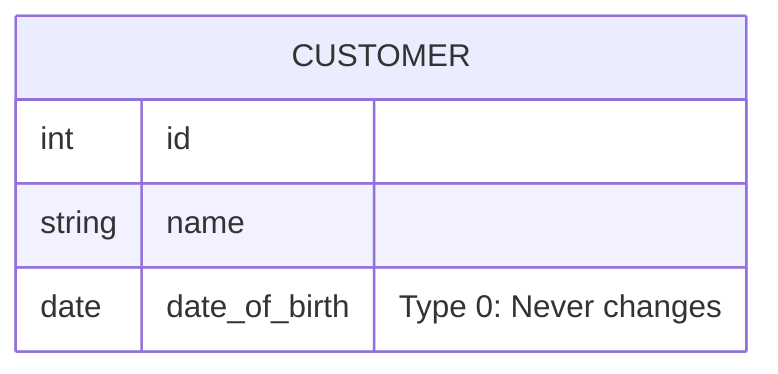

**Type 1: Overwrite**

Changes overwrite old values, and there is no history kept

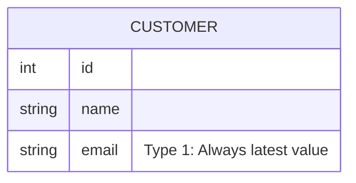

**Type 2: Add New Row**

New row is added for each change, keeping full history. Start and end dates track consistency

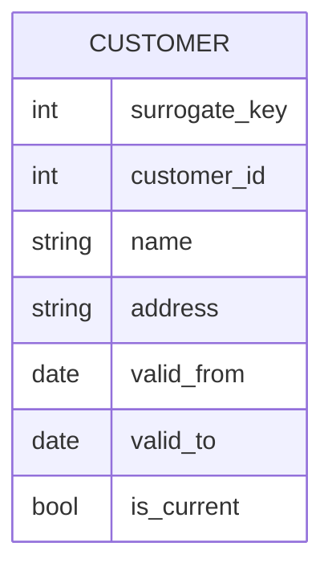

**Type 3: Add New Attribute**

One or more additional columns retain limited history (e.g., previous value)

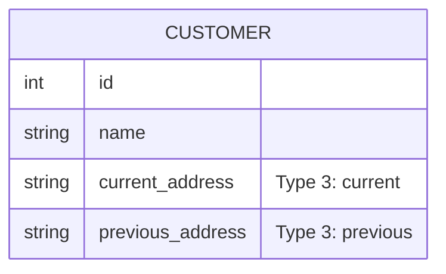

**Type 4: Add History Table**

Separate history table is created to maintain full change history, keeping the current state in the main dimension

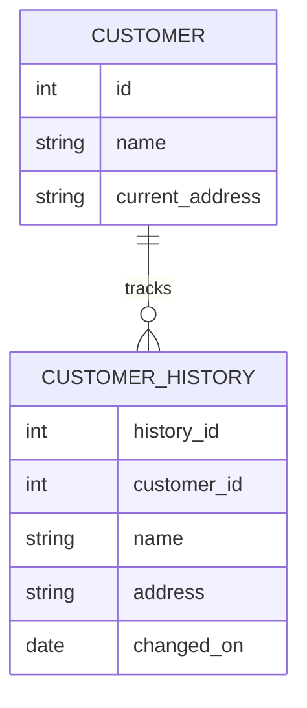

**Type 5: Add Mini-Dimension**

Mini-dimension stores rapidly changing attributes separately, referenced by the main dimension

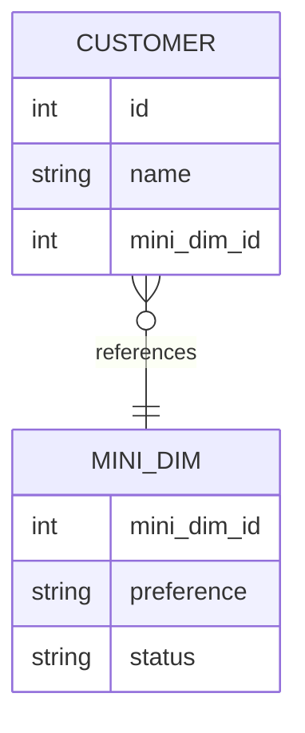

**Type 6: Combined Approach**

Combines Types 1, 2, and 3. Maintains both current values (Type 1) and full history (Type 2) and a previous attribute (Type 3)

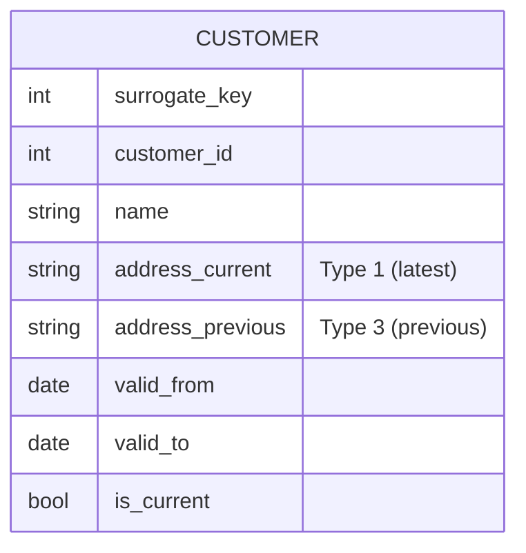

**Type 7: Hybrid Approach**

Flexible hybrid approach, often combining multiple SCD strategies for different columns depending on business requirements

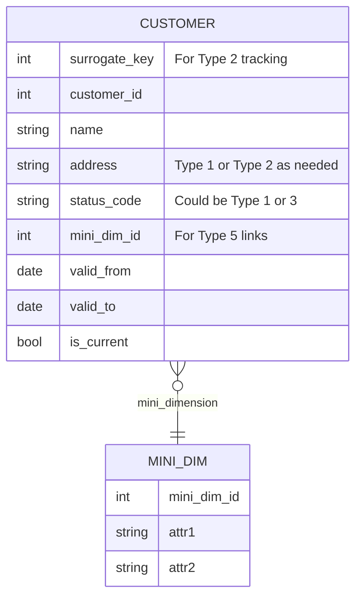

### Change Handling Method
**Type 0: Retain Original**

No update

**Type 1: Overwrite**

Overwrite existing values

**Type 2: Add New Row**

Add new record per change

**Type 3: Add New Attribute**

Add new column to track previous value

**Type 4: Add History Table**

Use separate history table for old data

**Type 5: Add Mini-Dimension**

Extract frequently changing attributes into separate mini-dim table

**Type 6: Combined Approach**

Current and historical columns plus version column

**Type 7: Hybrid Approach**

Flexible, combines multiple change management techniques

### Historical Data Tracking
**Type 0: Retain Original**

No

**Type 1: Overwrite**

No

**Type 2: Add New Row**

Yes

**Type 3: Add New Attribute**

Limited (only one previous value)

**Type 4: Add History Table**

Yes

**Type 5: Add Mini-Dimension**

Partial history through mini-dims

**Type 6: Combined Approach**

Yes

**Type 7: Hybrid Approach**

Yes

### Storage Impact
**Type 0: Retain Original**

Minimal

**Type 1: Overwrite**

Minimal

**Type 2: Add New Row**

High (multiple rows per entity)

**Type 3: Add New Attribute**

Moderate (additional columns)

**Type 4: Add History Table**

Moderate to High (two tables)

**Type 5: Add Mini-Dimension**

Moderate (extra mini-dim tables)

**Type 6: Combined Approach**

High (due to multiple approaches combined)

**Type 7: Hybrid Approach**

Variable, depends on component types used

### Query Complexity
**Type 0: Retain Original**

Very simple

**Type 1: Overwrite**

Simple

**Type 2: Add New Row**

More complex due to multiple rows

**Type 3: Add New Attribute**

Simple for limited history

**Type 4: Add History Table**

Moderate due to joins with history table

**Type 5: Add Mini-Dimension**

Moderate (joins with mini-dim)

**Type 6: Combined Approach**

Moderate to complex

**Type 7: Hybrid Approach**

Complex, depending on combination used

### Pros
**Type 0: Retain Original**

Simple; fast queries

**Type 1: Overwrite**

Easy implementation, fast update

**Type 2: Add New Row**

Full historical data tracking

**Type 3: Add New Attribute**

Easy access to current and prior value

**Type 4: Add History Table**

Clear separation of current and historical data

**Type 5: Add Mini-Dimension**

Improves query performance for frequent small changes

**Type 6: Combined Approach**

Flexible; combines best of types 1, 2, 3

**Type 7: Hybrid Approach**

Highly adaptable to complex scenarios

### Cons
**Type 0: Retain Original**

No history, no ability to analyze change

**Type 1: Overwrite**

History lost

**Type 2: Add New Row**

Adds storage; may impact performance

**Type 3: Add New Attribute**

Only tracks limited history, not scalable

**Type 4: Add History Table**

Extra complexity with multiple tables

**Type 5: Add Mini-Dimension**

Additional ETL and dimensional complexity

**Type 6: Combined Approach**

Complexity; maintenance overhead

**Type 7: Hybrid Approach**

High complexity; requires sophisticated design

### Implementation Complexity
**Type 0: Retain Original**

Low

**Type 1: Overwrite**

Low

**Type 2: Add New Row**

Moderate to high

**Type 3: Add New Attribute**

Low to moderate

**Type 4: Add History Table**

Moderate to high

**Type 5: Add Mini-Dimension**

Moderate to high

**Type 6: Combined Approach**

High

**Type 7: Hybrid Approach**

Very high

### Impact on Performance
**Type 0: Retain Original**

Minimal

**Type 1: Overwrite**

Minimal

**Type 2: Add New Row**

Can degrade with large historical data

**Type 3: Add New Attribute**

Moderate

**Type 4: Add History Table**

Moderate

**Type 5: Add Mini-Dimension**

Moderate

**Type 6: Combined Approach**

Can be performance intensive

**Type 7: Hybrid Approach**

Depends on implemented hybrid techniques

### Dimension Table Action
**Type 0: Retain Original**

No change to attribute value

**Type 1: Overwrite**

Overwrite attribute value

**Type 2: Add New Row**

Add new dimension row for profile with new attribute value

**Type 3: Add New Attribute**

Add new column to preserve attribute's current and prior values

**Type 4: Add History Table**

Add mini-dimension table containing rapidly changing attributes

**Type 5: Add Mini-Dimension**

Add type 4 mini-dimension, along with overwritten type 1 mini-dimension key in base dimension

**Type 6: Combined Approach**

Add type 1 overwritten attributes to type 2 dimension row, and overwrite all prior dimension rows

**Type 7: Hybrid Approach**

Add type 2 dimension row with new attribute value, plus view limited to current rows and/or attribute values

### Impact on Fact Analysis
**Type 0: Retain Original**

Facts associated with attribute's original value

**Type 1: Overwrite**

Facts associated with attribute's current value

**Type 2: Add New Row**

Facts associated with attribute value in effect when fact occurred

**Type 3: Add New Attribute**

Facts associated with both current and prior attribute alternative values

**Type 4: Add History Table**

Facts associated with rapidly changing attributes in effect when fact occurred

**Type 5: Add Mini-Dimension**

Facts associated with rapidly changing attributes in effect when fact occurred, plus current rapidly changing attribute values

**Type 6: Combined Approach**

Facts associated with attribute value in effect when fact occurred, plus current values

**Type 7: Hybrid Approach**

Facts associated with attribute value in effect when fact occurred, plus current values

### Use Cases
**Type 0: Retain Original**

Static attributes like SSN, zip codes

**Type 1: Overwrite**

Correcting typos, non-critical updates e.g. email, phone

**Type 2: Add New Row**

Track full history of customer address, employee job changes

**Type 3: Add New Attribute**

Track current and previous salary, status

**Type 4: Add History Table**

Maintain full historical pricing, employment data

**Type 5: Add Mini-Dimension**

Track attributes like customer segmentation that change frequently

**Type 6: Combined Approach**

Employee role and department tracking with full change history

**Type 7: Hybrid Approach**

Complex enterprise needs, combining multiple SCD styles
      </TabItem>
      <TabItem value="schemas" label="Schemas">

      ## Schema Types

      | Aspect | Physical Schema | Logical Schema | Evolving Schema | Contractual Schema (API) | Metadata Schema |
| --- | --- | --- | --- | --- | --- |
| Definition | Describes how data is physically stored and arranged (files, indices, partitions) on storage media or DBMS | Defines the logical (human-readable) structure: tables, fields, relationships, constraints | Captures the actual schema changes (add/remove fields) over time, typically in dynamic or pipeline-driven systems | Schema defining fields and their validation between systems via an API contract (e.g., JSON, GraphQL) | Schema that describes the data about data, such as lineage, column descriptions, and governance |
| Level of Abstraction | Lowest: hardware, file system, storage block level | Higher: data model, independent of storage | Variable: follows either physical or logical but adapts to change | Variable: can be logical or physical depending on API implementation | Varies: may refer to logical, physical, or conceptual layers |
| Focus | Performance, storage efficiency, physical locations | Data organization, integrity, relationships, constraints | Handling schema drift, flexibility for changes | Interface definition, data validation, compatibility | Data governance, lineage, quality, observability |
| Typical Stakeholders | DBAs, infrastructure engineers | Data modelers, analysts, architects | Data engineers, analytics teams | Backend engineers, API consumers/producers | Data governance, compliance, data stewards |
| Benefits | Maximizes storage & query performance; supports tuning, scaling | Ensures consistency, maintainability, integrity of business logic | Enables rapid evolution, tracks change, minimizes disruption | Allows machine interoperability, enforces standards, prevents breakage | Aids data discovery, quality, lineage, and regulatory compliance |
| Limitations | Complex to change, tightly-coupled to hardware/DBMS | May hide physical inefficiencies, less relevant for storage choices | Risk of data loss or incompatibility if not managed well | Tight coupling can hinder API flexibility, requires documentation | Can become outdated or incomplete without good processes |
| Use Cases | DBMS optimization, partitions, indexes, backup/recovery strategies | ER diagrams, database normalization, data modeling | ELT pipelines, analytics, SaaS product changes | API design, system integration, microservices communication | Data catalogs, pipeline documentation, lineage tracking |
| Examples | Parquet files with partitioning; index files for tables; disk layouts | Star schema; ERD; relational database definitions | Adding new analytics events; updating field names in ELT | REST/GraphQL/OpenAPI schema definitions; JSON schema | dbt sources.yml; OpenMetadata; catalog records; lineage graphs |

      ## Star vs. Snowflake vs. Galaxy Schema

      ### Structure
**Star Schema**

Central fact table linked to denormalized dimension tables

**Snowflake Schema**

Fact table linked to normalized dimension tables, split hierarchically

**Galaxy Schema**

Multiple fact tables sharing dimension tables, can be a mix of star and snowflake

### Visualization
**Star Schema**

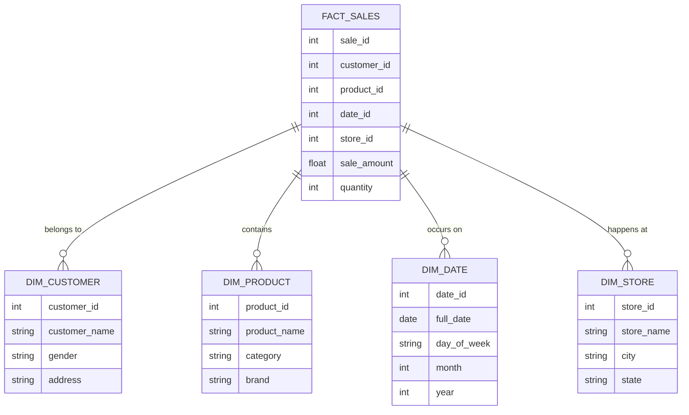

**Snowflake Schema**

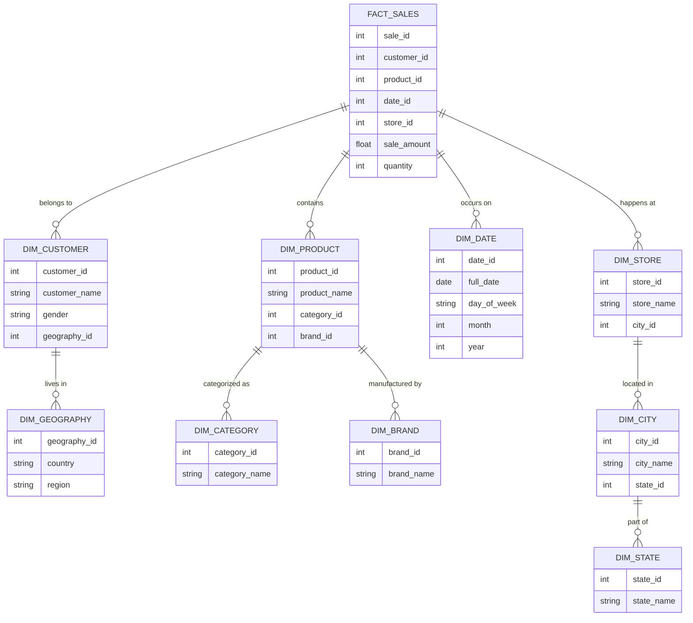

**Galaxy Schema**

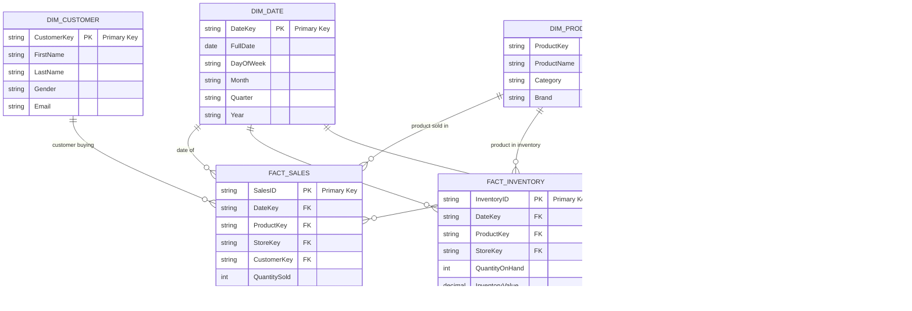

### Data Normalization
**Star Schema**

Dimension tables are denormalized (flat structure, redundancy present)

**Snowflake Schema**

Dimension tables are normalized (data split into sub-tables, minimal redundancy)

**Galaxy Schema**

Typically involves normalized or partially normalized dimension tables to reduce data redundancy. Dimensions are often conformed (shared across fact tables). Normalization level can vary depending on design goals

### Query Performance
**Star Schema**

Faster query execution due to fewer joins

**Snowflake Schema**

Slower query execution due to multiple joins required

**Galaxy Schema**

Performance can vary; may benefit from fewer joins but could be impacted by complexity

### Query Complexity
**Star Schema**

Simpler queries, fewer joins, easy to write and understand

**Snowflake Schema**

More complex queries, requires deeper understanding and multiple joins

**Galaxy Schema**

Queries can be complex due to multiple fact tables and shared dimensions; requires good understanding of schema

### Storage Requirements
**Star Schema**

Higher storage use due to redundant and denormalized data

**Snowflake Schema**

More storage efficient; reduced duplication through normalization

**Galaxy Schema**

Storage efficiency varies; can be optimized through shared dimensions but may still have redundancy depending on design

### Data Redundancy
**Star Schema**

Higher - dimensions repeat attribute values in multiple rows

**Snowflake Schema**

Lower - most redundant data is eliminated

**Galaxy Schema**

Varies - some redundancy may remain depending on design

### Space Usage
**Star Schema**

More storage space required for large datasets

**Snowflake Schema**

Less storage space through normalization

**Galaxy Schema**

Varies - can be optimized but may still require significant space depending on data volume and design

### Foreign Keys
**Star Schema**

Fewer foreign keys (simple design)

**Snowflake Schema**

More foreign keys due to multiple related tables

**Galaxy Schema**

Multiple foreign keys due to shared dimensions; complexity depends on design

### Data Integrity
**Star Schema**

Lower: Denormalization risks inconsistency due to data being updated in many places

**Snowflake Schema**

Higher: Normalization enforces referential integrity and consistency

**Galaxy Schema**

Varies - can be managed but may require more effort to maintain consistency

### Updates and Modifications
**Star Schema**

Harder to update - redundant data increases risk of inconsistent modifications

**Snowflake Schema**

Easier for updates - changes in an attribute only affect one table

**Galaxy Schema**

Varies - updates may be easier due to shared dimensions but can be complex depending on relationships

### Dimension Table Structure
**Star Schema**

Flat structure - each dimension is a single table, no sub-tables

**Snowflake Schema**

Multi-layered - each dimension may be decomposed into sub-dimensions

**Galaxy Schema**

Varies - dimensions can be flat or multi-layered depending on design

### BI & Reporting Suitability
**Star Schema**

Best for BI tools, dashboards, and quick ad hoc queries

**Snowflake Schema**

Better for complex analytical queries, detailed reporting, and multidimensional analysis

**Galaxy Schema**

Suitable for complex reporting needs involving multiple fact tables; requires good understanding of schema

### Maintainability
**Star Schema**

Easier to maintain, intuitive design

**Snowflake Schema**

More difficult to maintain, complex design

**Galaxy Schema**

Varies - can be complex to maintain due to multiple fact tables and shared dimensions

### Design Complexity
**Star Schema**

Easier and faster to design and implement

**Snowflake Schema**

Requires careful design due to hierarchical splitting

**Galaxy Schema**

Varies - can be complex to design depending on relationships and shared dimensions

### Scalability
**Star Schema**

Scalable for typical analytic workloads, though can suffer performance issues at extreme scale due to redundancy

**Snowflake Schema**

Good scalability, especially for complex and large-scale data with multiple hierarchies

**Galaxy Schema**

Scalability varies; can handle complex data but may require careful design to avoid performance bottlenecks

### ETL/ELT Complexity
**Star Schema**

Simpler ETL/ELT pipelines - fewer tables to populate and maintain

**Snowflake Schema**

More complex ETL/ELT - hierarchical normalization requires careful loading and management

**Galaxy Schema**

ETL/ELT complexity varies; may require more sophisticated pipelines to manage multiple fact tables and shared dimensions

### Drawbacks
**Star Schema**

Data redundancy, storage waste, potential for inconsistencies, not suited for high-cardinality or complex hierarchies

**Snowflake Schema**

Query slowness for basic analytics, complexity in query construction and ETL, harder for non-technical users to understand and navigate

**Galaxy Schema**

Complexity in design and maintenance, potential performance issues if not well-optimized

### Use Cases
**Star Schema**

Retail sales analysis with simple product/geography/time/customer dimensions

**Snowflake Schema**

Data warehouses with complex product/customer/location hierarchies, and systems requiring fine-grained data integrity

**Galaxy Schema**

Enterprise data warehouses with multiple business processes, complex reporting needs, and shared dimensions across fact tables
      </TabItem>
    </Tabs>

  </TabItem>
  <TabItem value="data-architecture-patterns" label="Architecture Patterns">
    ## Lambda vs. Kappa

    ### Processing Model
**Lambda**

Combines batch processing and real-time stream processing in separate layers

**Kappa**

Uses a single, unified stream processing pipeline for both real-time and reprocessing

### Visualization
**Lambda**

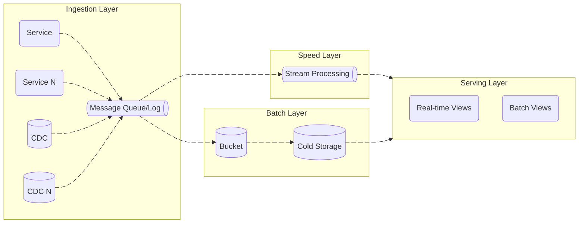

**Kappa**

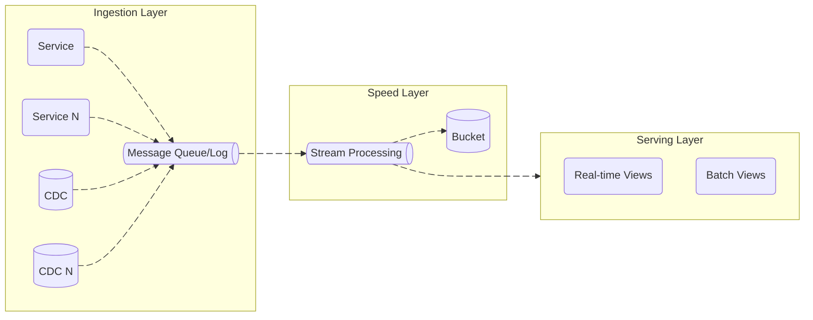

### Processing Layers
**Lambda**

Three layers: Batch Layer (large-scale processing), Speed Layer (real-time), Serving Layer (query)

**Kappa**

Single pipeline for all data, eliminating the batch layer

### Complexity
**Lambda**

High complexity; requires maintaining and synchronizing two separate codebases and pipelines

**Kappa**

Simpler architecture; only one processing pipeline to maintain

### Latency
**Lambda**

Batch layer processing introduces higher latency; speed layer offers low latency for real-time data

**Kappa**

Low latency overall due to continuous stream processing

### Fault Tolerance
**Lambda**

Fault tolerant: batch layer can recompute results if speed layer fails or produces errors

**Kappa**

Fault tolerant depending on stream processing reliability; relies on log replay for reprocessing errors

### Data Reprocessing Capability
**Lambda**

Batch layer enables accurate reprocessing of historical data to fix errors or recompute results

**Kappa**

Reprocessing done via replaying events from the log through the stream processor

### Accuracy
**Lambda**

High accuracy due to batch layer with complete data; speed layer may produce approximate results

**Kappa**

Consistent real-time results but may lack batch-layer level accuracy for complex computations

### Scalability
**Lambda**

Scales horizontally but more complex scaling due to separate batch and speed layers

**Kappa**

Easier to scale stream processing horizontally; simpler operational model

### Historical Data Handling
**Lambda**

Excellent, supports deep historical batch analytics and corrections

**Kappa**

Less suited for complex historical data analysis, designed mainly for streaming real-time data

### Implementation Complexity
**Lambda**

High development and maintenance effort due to dual pipelines and serving layer integration

**Kappa**

Lower implementation and maintenance overhead

### Consistency Between Layers
**Lambda**

Requires careful coordination to keep batch and speed outputs consistent

**Kappa**

Single pipeline avoids consistency issues inherent in Lambda dual-layer design

### Real-Time Analytics
**Lambda**

Provides real-time insights via speed layer but with possible eventual consistency lag

**Kappa**

Provides immediate real-time analytics with no separate batch delay

### Support for Complex Analytics
**Lambda**

Good support since batch layer handles heavy, complex queries and aggregations

**Kappa**

Limited complex analytics, as everything must be handled in stream processing

### Reprocessing Complexity
**Lambda**

Batch layer reprocessing is separate and managed independently

**Kappa**

Reprocessing simply involves re-consuming the event stream, simplifying error correction

### Data Duplication Risk
**Lambda**

Potential for duplication or mismatch between batch and speed layer results if not carefully managed

**Kappa**

Minimal duplication risk since there is only one data processing pipeline

### Use Cases
**Lambda**

Suitable for systems needing both comprehensive historical analysis and real-time insights

**Kappa**

Best for real-time focused applications with simpler operational needs (e.g., IoT, user activity tracking)

### Examples
**Lambda**

Recommendation engines, financial modeling, large-scale analytics

**Kappa**

Real-time monitoring, IoT analytics, clickstream processing, social media analytics

  </TabItem>
  <TabItem value="testing" label="Testing">
    ### Data Quality Testing
**Purpose**

Validate accuracy, completeness, consistency, validity, timeliness, and uniqueness of data

**Scope**

Data at rest (tables, datasets) and in-motion (streams)

**When Performed**

Often ongoing, triggered by data load or refresh

**Key Techniques**

Profiling, validation rules, anomaly detection, null checks, deduplication

**Considerations**

Identifying subtle quality issues, evolving data schemas

**Relevance**

Crucial for trustworthy analytics; foundation to all downstream processes

**Quality Checks**

- **Descriptive Checks:** Validating data entries represent real-world values (e.g., valid email format, phone numbers)
- **Structural Checks:** Ensuring data conforms to schema (all required fields present, data types correct)
- **Integrity Checks:** Validating relationships between datasets (e.g., foreign keys match primary keys)
- **Accuracy Checks:** Comparing data against trusted source systems
- **Timeliness Checks:** Confirming data freshness and updates within defined periods
- **Null or Missing Values:** Identifying nulls where data is mandatory
- **Duplicate Data:** Detecting duplicated records that could cause inconsistencies
- **Range and Distribution Checks:** Confirming numeric data falls within expected ranges or distributions
- **Consistency Checks:** Ensuring data consistency across systems and datasets
- **Format Validation:** Checking that data values meet predefined formats or patterns

### Data Integrity Testing
**Purpose**

Ensure accuracy, completeness, retrievable, verifiable, truthfulness, consistency, and reliability of data throughout its lifecycle

**Scope**

Data storage, processing, transmission, and updates

**When Performed**

Routine and triggered by data changes, migrations

**Key Techniques**

Validation rules, checksums, version control, continuous monitoring, domain and entity integrity tests

**Considerations**

Managing volume & complexity, real-time validation, compliance, security

**Relevance**

Critical to maintain trustworthiness of data; prevents corruption and errors across all data states and systems

**Quality Checks**

- **Accuracy:** Data matches real-world truth
- **Reliability:** Repeatable results in different conditions
- **Completeness:** No missing data required to maintain integrity
- **Referential Integrity:** Relationships between tables/systems hold true (e.g., foreign keys)
- **Repeatability:** Consistent test outcomes over time
- **Scalability:** Tests effective under large datasets
- **Validation Against Requirements:** Checking adherence to data constraints, ranges, and allowed values
- Automated anomaly detection to spot unusual data patterns
- Testing in isolated, production-like environments to avoid disruption
- Monitoring error resolution and anomaly frequency metrics

### Integration Testing
**Purpose**

Verify interactions and data flow between integrated components or systems

**Scope**

Endpoints, APIs, data sources, ETL components

**When Performed**

After component/unit testing, pre-system integration

**Key Techniques**

API calls, contract validation, mock testing

**Considerations**

Managing dependencies, environment setup, flaky tests

**Relevance**

Ensure data flows cleanly between systems without loss or corruption

**Quality Checks**

- Testing interactions between microservices, databases, and APIs
- Verifying data formats and response correctness during data exchanges
- Using mocks/stubs to simulate unavailable services
- Automated API testing with tools like REST-assured or Postman
- Continuous integration (CI) pipeline integration to run tests upon changes
- Validation of data transformations during integration
- Monitoring logs and failures with detailed reporting
- Ensuring correct error handling in data communication
- Approaches include top-down, bottom-up, and big-bang integration testing

### Performance Testing
**Purpose**

Assess system responsiveness, throughput, stability under load

**Scope**

Entire pipeline throughput, resource usage, latency

**When Performed**

Pre-release or after significant changes

**Key Techniques**

Load testing, stress testing, volume testing

**Considerations**

Simulating realistic load, environment parity

**Relevance**

Essential to meet SLAs for batch and streaming jobs, avoid bottlenecks

**Quality Checks**

- **Load Testing:** Measuring system behavior under expected data volumes
- **Stress Testing:** Testing beyond normal capacity limits
- **Soak Testing:** Running systems under load over extended time to find memory leaks
- **Spike Testing:** Sudden large surges of data volume
- Measuring response times, throughput, latency, and resource utilization
- Validating batch and streaming pipeline processing times
- Ensuring system remains responsive with increasing data sizes
- Starting performance tests early in development to catch issues quickly
- Time frames vary: from minutes for load/stress/spike tests, hours for soak tests

### Regression Testing
**Purpose**

Ensure new code/changes do not break existing data workflows or features

**Scope**

Entire data pipeline or specific modules

**When Performed**

After any change or update

**Key Techniques**

Automated retesting, test case prioritization

**Considerations**

Test suite maintenance, execution time

**Relevance**

Maintain pipeline stability; detect silent errors after changes

**Quality Checks**

- Re-running previously passed tests on updated data pipelines/systems
- Validating functional and non-functional features remain stable
- Automated re-execution of test scripts upon schema or code changes
- Checking data accuracy, completeness, and transformations remain correct
- Detecting "immutable changes" where data changes should not occur
- Maintaining a regression test suite for quick verification with new code deploys

### End-to-End Testing
**Purpose**

Validate complete workflows from ingestion through transformations to consumption

**Scope**

Across all pipeline stages and downstream applications

**When Performed**

Before major releases or deployment

**Key Techniques**

Full process simulation, real user scenario emulation

**Considerations**

High complexity, environment parity

**Relevance**

Confirm entire data lifecycle works as expected from source to consumer

**Quality Checks**

- Verifying data ingestion, processing, storage, and output in one flow
- Testing from data source event to final display or report generation
- Ensuring downstream integrations (notification, payments, reports) work
- Covering functional and non-functional aspects like usability and security
- Performing both automated and manual E2E tests on realistic data
- Monitoring for broken workflows or data errors affecting user journeys
- Employing tools like Cypress, Selenium, Playwright for automation

### Functional Testing
**Purpose**

Validates specific functions or business rules within data transformations

**Scope**

Specific ETL jobs, SQL functions, or data logic blocks

**When Performed**

During development and after changes

**Key Techniques**

Unit tests, SQL assertions, black-box testing

**Considerations**

Test data setup, mock dependencies

**Relevance**

Validate correctness of data transformations and business logic

**Quality Checks**

- Testing data processing logic against defined specifications
- Validating outputs based on expected input data
- Checking edge cases and error handling paths
- Verifying correctness of data transformations
- Focus on "what" the system does, not "how" internally
- Manual and automated tests to validate individual features

### Compliance Testing
**Purpose**

Verify data adherence to legal, regulatory, and internal policies

**Scope**

Data privacy, retention, access controls, audit trails

**When Performed**

Scheduled or triggered by regulation changes

**Key Techniques**

Policy validation, audit log review

**Considerations**

Dynamic rules, audits, cross-system consistency

**Relevance**

Ensure data governance and regulatory compliance requirements are met

**Quality Checks**

- Validating data privacy laws adherence (e.g., GDPR, HIPAA)
- Checking data encryption is applied where required
- Ensuring retention and deletion policies are enforced
- Auditing data access controls and audit trails
- Verifying reporting meets regulatory requirements
- Penetration testing and security compliance checks often integrated
- Documenting compliance evidence and configurations

### Contract Testing
**Purpose**

Verify that communication contracts/interfaces between services remain consistent

**Scope**

API schemas, data contracts, message formats

**When Performed**

Before and during integration releases

**Key Techniques**

Schema validation, consumer-driven contract testing

**Considerations**

Coordinating consumer/provider contracts

**Relevance**

Prevent integration breakage due to incompatible schema changes

**Quality Checks**

- Checking APIs adhere to agreed contracts (request and response formats)
- Verification of data types, mandatory fields, and error codes
- Ensuring backward compatibility of APIs
- Using consumer-driven contract testing frameworks
- Automated tests executed in CI pipelines
- Preventing integration failures due to contract violations

### Data Processes Testing
**Purpose**

Validate ETL/ELT logic, correctness of data transformation and processing

**Scope**

Extract, Transform, Load stages individually and combined

**When Performed**

During development, scheduled after pipeline changes

**Key Techniques**

Unit tests, integration tests, system-wide data validation

**Considerations**

Complex dependencies, state handling

**Relevance**

Ensure processing steps handle data correctly and produce expected results

**Quality Checks**

- Validating ETL/ELT logic correctness
- Ensuring data filtering, mapping, aggregation perform as expected
- Checking handling of nulls, missing data
- Verifying business rules implementations
- Testing intermediate outputs for correctness
- Automating process-level unit tests and scenario tests

### Pipeline Testing
**Purpose**

End-to-end and targeted tests validating pipeline orchestration, error handling, and data flow

**Scope**

Orchestrator workflows, triggers, retries, alerts

**When Performed**

Continuous, after pipeline deployments or fixes

**Key Techniques**

Workflow simulations, failure scenario testing

**Considerations**

Environment parity, handling intermittent failures

**Relevance**

Verify pipeline robustness, alerting, and data delivery completeness

**Quality Checks**

- Testing pipeline orchestration logic and scheduling
- Validation of data flow correctness through all stages
- End-to-end latency and throughput monitoring
- Fault tolerance and error recovery testing
- Automated tests triggered by pipeline runs
- Integration with monitoring/alerting systems
- Versioning and rollback testing for pipelines
  </TabItem>
  <TabItem value="infrastructure-as-code" label="Infrastructure as Code">
    <Tabs queryString="secondary">
      <TabItem value="imperative-declarative" label="Imperative/Declarative" attributes={{className:"tabs_vertical"}}>
        Infrastructure as Code (IaC) provisions and manages computing infrastructure using code instead of manual processes. It reduces time-consuming errors, especially at scale, by defining desired states and automating deployment. This frees developers to focus on applications, while organizations gain cost control, risk reduction, and faster responses to opportunities.

        | Aspect | Imperative Programming | Declarative Programming |
| --- | --- | --- |
| **Definition** | Specifies *how* to perform tasks step-by-step through explicit instructions | Specifies *what* the desired outcome or goal is, without detailing how to achieve it |
| **Programming Approach** | The developer writes detailed instructions explicitly controlling each step to change the program state | Describes the desired end state; the system figures out the instructions to reach that state automatically |
| **Control Flow** | Explicit; the developer manages the exact order of operations and flow | Implicit; controlled by the system or runtime |
| **State Management** | Explicit and manual; the developer must maintain and update system state | Abstracted away and handled automatically by the system |
| **Level of Abstraction** | Lower-level, deals with detailed procedural steps and direct system operations | Higher-level, more abstract, focuses on logic and outcomes |
| **Error Handling** | Must be explicitly handled by the programmer; easier to introduce state inconsistency or errors | Often more robust due to abstraction; the system validates state before applying changes |
| **Flexibility/Control** | More control over performance and optimization by managing each operation exactly | Less fine-grained control over execution details, focus is on describing end results |
| **Maintainability** | Can become complex and harder to maintain with scaling due to detailed step management | Typically easier to maintain and extend as logic is expressed declaratively |
| **Adaptability to State** | Rigid; instructions may fail if the initial state differs from assumptions | Adaptive; compares current state with desired state and adjusts actions dynamically |
| **Performance** | Potentially faster for low-level tasks when optimized by expert programmers | May add overhead from abstraction or compilation; optimized by underlying engine |
| **Error-Prone** | More prone to errors due to manual state & control flow management | Generally less error-prone since system manages steps and state consistency |
| **Debugging** | Easier for step-by-step tracing but can get complicated in large codebases | Debugging declarative code may be harder due to abstraction, requires understanding system internals |
| **Tools** | `Chef` and `Puppet` | `Terraform` |
| **Use Cases** | Writing detailed data processing pipelines, manual orchestration of ETL steps, data cleaning scripts | Defining database schemas, data transformations (`dbt` models), infrastructure as code (`Terraform`), SQL queries |
| **Example: Creating Table (SQL)** | Write explicit commands to create table, add columns, alter structure; may fail if structure exists | Define the desired table structure and let the system handle creation or alteration dynamically |
| **Example Analogy** | Giving step-by-step instructions on how to make the sandwich starting from scratch | Showing a picture of the final sandwich and having a competent chef make it |
      </TabItem>
      <TabItem value="idempotency" label="Idempotency">
        Idempotency means an operation can be applied multiple times without changing the result beyond the initial application.

        ### Importance

        - Prevents duplicate data processing and corruption during retries
        - Simplifies error handling by making retries safe
        - Ensures consistent and deterministic pipeline outputs
        - Enables scalable, concurrent processing without complex locking
        - Facilitates easier debugging and auditing
        - Meets strict regulatory compliance for transactional data

        ### Guidelines

        - **Use Idempotency Keys**:
          - Assign unique identifiers to each operation or data item
          - Use composite keys (e.g., source + timestamp) to detect duplicates
          - Store these keys to recognize repeated operation attempts and avoid reprocessing
        - **Employ Atomic Transactions**:
          - Group operations into atomic units that either complete fully or rollback entirely
          - Use transactional ACID-compliant storage systems where possible
        - **Deduplication Techniques**:
          - Implement deduplication at multiple levels (data ingestion, processing, storage)
          - Utilize probabilistic data structures (Bloom filters) and sliding window algorithms for efficient duplicate detection
        - **Checkpointing and State Management**:
          - Maintain and persist checkpoints/states for recovery and partial processing resumption
          - Enable pipeline to restart safely from the last consistent state after failures
        - **Use Contextual Uniqueness**:
          - Incorporate business logic attributes in idempotency checks to catch logical duplicates
        - **Concurrency Control**:
          - Design systems that handle concurrent writes gracefully using idempotency
          - Leverage modern concurrency control patterns like non-blocking concurrency
        - **Choose Idempotent Storage Backends**:
          - Leverage storage systems that support conditional updates or compare-and-swap semantics (e.g., Delta Lake, Apache Hudi, distributed NoSQL with ACID features)

        ### Testing and Validation

        ### Validation Techniques

        - **Testing Methodologies**
          - **Repeated Execution Testing**: Re-run operations multiple times and verify the same state
          - **Fault Injection Testing**: Simulate failures (network, crashes) to observe idempotent behavior
          - **Concurrent Operation Testing**: Run identical operations simultaneously to test race conditions
          - **State Transition Validation**: Confirm system transitions remain consistent regardless of operation frequency
          - **Time-Window Testing**: Retry operations across time spans to ensure idempotency holds over time
        - **Validation Techniques**
          - **Range Checking**: Validate data values fall within acceptable limits
          - **Type Checking**: Verify data types conform to expectations
          - **Format Checking**: Ensure compliance with required data formats (e.g., emails, phone numbers)
          - **Consistency Checks**: Confirm relational integrity across fields and datasets
        - **Automated Testing**
          - Property-based testing to generate varied and edge-case scenarios
          - Chaos engineering tools to introduce faults in production-like environments
          - Integration and regression tests to maintain idempotency guarantees as systems evolve
          - Performance monitoring to assess idempotency overhead
      </TabItem>
    </Tabs>

  </TabItem>
  <TabItem value="security" label="Security">
    <Tabs queryString="secondary">
      <TabItem value="security-overview" label="Overview" attributes={{className: 'tabs_vertical'}}>
        | Aspect | Authentication | Authorization | Encryption | Tokenization | Data Masking | Data Obfuscation |
| --- | --- | --- | --- | --- | --- | --- |
| Definition | Verifying identity of a user or system | Granting or denying access rights to resources | Transforming data into unreadable format to protect it | Replacing sensitive data with non-sensitive tokens | Replacing sensitive data with fictitious but realistic data | Hiding data through transformation to prevent understanding |
| Purpose | Confirming who is accessing the system | Controlling what authenticated users can do/access | Protecting data confidentiality during storage/transit | Safeguarding sensitive data by replacing it with tokens | Protecting sensitive info while keeping data useful | Preventing data exposure while often preserving format |
| Scope | Identity level (user, device, service) | Permission level (file, operation, service) | Data at rest, in transit | Specific sensitive data fields/elements | Databases, tables, fields, datasets for testing/sharing | Various data forms, often to resist reverse engineering |
| Reversibility | N/A (identity verification) | N/A (access control) | Reversible if decryption key is held | Usually reversible via token vault, some are irreversible | Usually irreversible; aim is to prevent data recovery | Usually irreversible or complex to reverse |
| Security Focus | Identity assurance | Access control enforcement | Confidentiality, data leakage prevention | Strong data security with minimal data exposure | Privacy compliance, risk reduction | Anti-reverse engineering, protecting intellectual property |
| Data Format Preservation | N/A | N/A | Does not preserve original data format visibly | Can preserve format (format-preserving tokenization) | Preserves data usability and format | Often preserves structure/format for usability |
| Performance Impact | Low to medium, depends on method | Low to medium, depends on complexity of policies | Can be high, especially with strong encryption and large data | Medium, due to token vault and lookups | Low to medium, depending on masking method (static/dynamic) | Low to medium, depends on obfuscation technique |
| Complexity | Can be complex (multi-factor, adaptive) | Can be complex with fine-grained policies and delegation | Complex key management and cryptographic implementation | Complex token vault/database management | Intermediate; requires design of masking policies | Intermediate; requires custom transformation/logics |
| Regulatory Compliance | Supports compliance by preventing unauthorized access | Supports compliance by enforcing access control | Strong support for data privacy and protection laws | Helps meet PCI DSS, GDPR by masking real data | Ensures compliance with GDPR, HIPAA, CCPA in testing/sharing | Assists compliance by protecting sensitive info exposure |
| Key Limitation | Doesn't control resource access beyond identity verification | Authz policies can be bypassed if authN is weak | Key management critical; if keys lost, data unrecoverable | Reliance on token vault security; complexity | May reduce realism or break referential integrity | Can be reverse-engineered if weak transformations used |
| Use Cases | Logins, multi-factor auth, biometric verification | Role-based access control, attribute-based access control | Securing emails, files, network traffic, databases | Payment card processing, PII protection, API token usage | Test/dev environments, analytics with safe data, compliance | Protecting source code, data export, secure telemetry |
| Example Techniques | Passwords, biometrics, OTP, SSO | RBAC, ABAC, ACLs, policy engines | AES, RSA, TLS/SSL, hashing | Format-preserving tokenization, stateless/stateful tokens | Substitution, shuffling, scrambling, nulling, encryption-based masking | Character substitution, ciphering, noise addition |
      </TabItem>
      <TabItem value="authentication" label="Authentication">

        ## Evolution of Authentication Methods

        ```mermaid
            graph TB

            subgraph auth [WWW-Authentication]
              direction LR

              authUser(User) e1@--> |username + password| authServer(Server)
            end

            auth e2@--> |inability to control the login lifecycle| session

            subgraph session [Session-Cookie]
              direction LR

              sessionUser(User) e3@--> |cookie| sessionServer(Server)
              sessionServer e4@--> sessionDb[(DB)]
              sessionDb e5@--> |session ID| sessionUser
            end

            session e6@--> |no mobile support| token

            subgraph token [Token-Based]
              direction LR

              tokenUser(User) e7@--> |token| tokenServer(Server)
              tokenServer e8@--> |validate token| tokenValidator(Token Validation Service)
            end

            token e9@--> |reduce token validation| jwt

            subgraph jwt [JWT]
              direction LR

              jwtToken(Token: header.payload.signature)
            end

            jwt e10@--> |cross-site login| sso

            subgraph sso [SSO]
              direction LR

              ssoUser(User) e11@--> ssoDomain1(a.com)
              ssoUser e12@--> ssoDomain2(b.com)
              ssoUser e13@--> ssoDomain3(c.com<br/>CAS - Central Authentication Service)
              ssoDomain1 e14@--> ssoDomain3
              ssoDomain2 e15@--> ssoDomain3
            end

            sso e16@--> |3rd party access| oauth

            subgraph oauth [OAuth 2.0]
                direction LR

                oauthUser(OAuth 2.0) e17@--> |browser & server| code(Authentication Code)
                oauthUser e18@--> |server only| credentials(User Credentials)
                oauthUser e19@--> |implicit grant| native(Native App)
            end

            e1@{ animate: true }
            e2@{ animate: true }
            e3@{ animate: true }
            e4@{ animate: true }
            e5@{ animate: true }
            e6@{ animate: true }
            e7@{ animate: true }
            e8@{ animate: true }
            e9@{ animate: true }
            e10@{ animate: true }
            e11@{ animate: true }
            e12@{ animate: true }
            e13@{ animate: true }
            e14@{ animate: true }
            e15@{ animate: true }
            e16@{ animate: true }
            e17@{ animate: true }
            e18@{ animate: true }
            e19@{ animate: true }
        ```

        ## Credentials (Base64)

        ```mermaid
          sequenceDiagram
          autonumber

          participant Client
          box Server
            participant Server
            participant Database
          end

          note left of Client: Form with username and password

          Client->>Server: HTTPS Connection <br/> Credentials Encryption with SSL
          Server->>Server: Decrypts with SSL cert private key
          Server->>Database: Username lookup & hashed password verification
          Database->>Server: User record with hashed password
          Server->>Client: Authentication Status
        ```

        ## JSON Web Token (JWT)

        ### Visualization

        ```mermaid
          sequenceDiagram
          autonumber

          participant User
          participant Server

          box Signing Algorithm
              participant JWT Provider
              participant JWT Consumer
          end

          User->>Server: Login <br/> username & password
          Server->>Server: Validate credentials
          Server->>JWT Provider: Create & Sign JWT with secret

          alt Public Key
              JWT Provider->>JWT Provider: Sign JWT with private key
              JWT Provider->>JWT Consumer: Signed JWT + Public Key
              JWT Consumer->>JWT Consumer: Verify with public key (RS256, ES256)
          end

          alt Symmetric Key
              JWT Provider->>JWT Provider: Sign JWT with public key
              JWT Provider->>JWT Consumer: Signed JWT
              JWT Provider-->JWT Consumer: Shared public key
              JWT Consumer->>JWT Consumer: Verify with public key (HS256, HMAC)
          end

          JWT Provider->>Server: Signed JWT
          Server->>User: Authorization Bearer JWT Token
          User->>User: Store JWT locally
          User->>Server: /resource/book<br/>Authorization Bearer JWT Token
          Server->>Server: Validate signature
          Server->>User: OK - access granted
        ```

        ### Specs

        - **JWT Structure**
          - Content
            - Header

              ```json
              {
                "alg": "HS256",
                "type": "JWT"
              }
              ```

            - Data

              ```json
              {
                "user_id": 1234
              }
              ```

            - Signature: `HMACSHA256("base64(header).base64(data)", secret)`
          - Encode each part using Base64: `base64(header)`, `base64(data)`, `base64(signature)`
          - Concatenate each part using dot (`.`): `base64(header).base64(data).base64(signature)`

        ## Oauth 2.0

        ### Visualization

        ```mermaid
          sequenceDiagram
          autonumber

          participant User
          participant Web App
          participant Auth0 Tenant (Identity Provider)
          participant Server

          User->>Web App: Click login link
          Web App->>Auth0 Tenant (Identity Provider): Authorization Code Request to `/authorize`
          Auth0 Tenant (Identity Provider)->>Web App: Redirect to `login/authorization` prompt
          User->>Auth0 Tenant (Identity Provider): Authenticate & Consent
          Auth0 Tenant (Identity Provider)->>Web App: Authorization Code
          Web App->>Auth0 Tenant (Identity Provider): Authorization Code for Application Credentials
          Auth0 Tenant (Identity Provider)->>Auth0 Tenant (Identity Provider): Validate Authorization Code & Application Credentials
          Auth0 Tenant (Identity Provider)->>Web App: ID Token & Access Token
          Web App->>Server: Request user data with Access Token
          Server->>Web App: Response
        ```

        ### Specs

        - **Open Authorization (OAuth)**: Protocol for sharing user authorization across systems
          - **OAuth 1.0**: Protocol designed only for web browser only
          - **OAuth 2.0**: Protocol for cross-platform use (web, mobile, desktop, API)
        - **Involved Parties**
          - **User (Resource Owner)**: Authorizes flows across systems
          - **Identity Provider (IdP)**: Stores user identity, validates credentials, and shares authorization with other services
          - **Server**: Service user accesses for authorization
        - **Flow Types**
          - **Authorization code**: Client gets a code from server, exchanges for access token
          - **Client credentials**: Client directly authenticates for access to its resources
          - **Implicit code**: Deprecated due to security risks
          - **Resource owner password**: User's credentials exchanged for access token, not recommended for security reasons

        ## SSH Keys

        ```mermaid
          sequenceDiagram
          autonumber

          participant Client
          participant Server

          note left of Client: Host key: public/private userkey
          Client->>Server: Authenticator userkey <br/> public key
          note right of Server: Public userkey & client host keys

          note right of Server: Host key: public/private userkey
          Server->>Client: Authenticator hostkey <br/> server authentication
          note left of Client: Public host keys
        ```

        ## SSL Certificates

        ```mermaid
          sequenceDiagram
          autonumber

          participant Client
          participant Server

          Client->>Server: https://google.com
          Server->>Client: SSL Certificate

          Client->>Client: Validity Expiry Check
          Client->>Client: Issue Authority (CA) Check
          Client->>Client: Domain Name Match Check

          Client->>Server: Random Encrypted Key
          Server->>Server: Decrypts with SSL cert private key

          Server->>Client: Secured Connection
        ```

        ## 2FA (Two-Factor Authentication)

        ### Visualization

        ```mermaid
          sequenceDiagram
          autonumber

          participant User
          participant Authentication Service
          participant Database
          participant Authenticator Client

          alt Stage 1: User enables 2SA Service
            User->>Authentication Service: Request a secret key
            Authentication Service->>Authentication Service: Generate secret key
            Authentication Service->>Database: Store secret key
            Authentication Service->>User: URI in a form of a QR code<br/>otpauth://topt/issuer:user?secret=secretkey<br/>⇣<br/>otpauth://topt/google:Joe?secret=E884S34
            User->>Authenticator Client: Scan QR code
            User->>User: Store secret key in Authenticator
          end

          alt Stage 2: User uses 2SA Service for authentication
            Authenticator Client->>Authenticator Client: every 30 seconds refreshes secret key (6-digit number)<br/>using TOPT (Time-based One-Time Password) algorithm<br/>⇣<br/>secret key + timestamp = 6-digit number
            Authenticator Client->>User: Enter generated password
            User->>Authentication Service: Send password to server
            Authentication Service->>User: Comparison result of client-side password and server-side password
            Authentication Service->>Database: Read secret key<br/>generates password using the same TOTP algorithm<br/>as authenticator client<br/>⇣<br/>secret key + timestamp = 6-digit number
          end
        ```

        ### Specs

        - **Safety**
          - Secret key transmission via `HTTPS`
          - Encryption of secret keys in client and database
        - **Security**
          - Password (6-digit number) has 1 million combinations
          - Changes every 30 seconds, making it hard to guess
        - **2FA Code Types**
          - SMS code, scratch card, mobile app
          - Hardware token: U2F FIDO key, MFA token, digital ID
          - Biometric system: finger/hand print, iris scan, behavior/movement tracking

        ## 2SA (Two-Step Authentication)

        ```mermaid
              sequenceDiagram
              autonumber

              participant User
              participant Server
              participant Access Granted

              User->>Server: username,password &<br/>2SV (Step Verification) token/cookie

              alt Validate username & password
                Server->>User: no - auth failed
                Server->>Server: yes
              end

              alt 2SV Valid
                Server->>Access Granted: yes
                Server->>Server: no
              end

              Server->>Server: Prompt for OTP (One-Time Password)
              alt OTP
                note over Server: Single Factor, 2SV<br/>SMS, email
                note over Server: Two Factor, 2SV<br/>Google Auth, SmartCard
              end

              alt 2SV code valid
                Server->>User: no - password compromised
                Server->>Server: yes
              end

              alt User trust this device
                Server->>User: yes - store 2SV cookie
                Server->>Access Granted: no
              end
        ```
      </TabItem>
      <TabItem value="authorization" label="Authorization">
        ### Concept
**Role-Based Access Control (RBAC)**

Assigns permissions to users based on their roles within an organization

**Attribute-Based Access Control (ABAC)**

Grants access based on attributes of the user, resource, environment, and context

**Access Control List (ACL)**

A list of specific rules defining who can access an object and what actions allowed

### Main Focus
**Role-Based Access Control (RBAC)**

Roles and their associated permissions

**Attribute-Based Access Control (ABAC)**

Attributes and policies combining them

**Access Control List (ACL)**

Explicit rules tied to individual resources

### Key Components
**Role-Based Access Control (RBAC)**

Users, Roles, Permissions, Sessions

**Attribute-Based Access Control (ABAC)**

Subjects (users), Objects (resources), Actions, Environment, Policies

**Access Control List (ACL)**

Resources, Access Control Entries (ACEs) specifying users/groups and their permissions

### Visualization
**Role-Based Access Control (RBAC)**

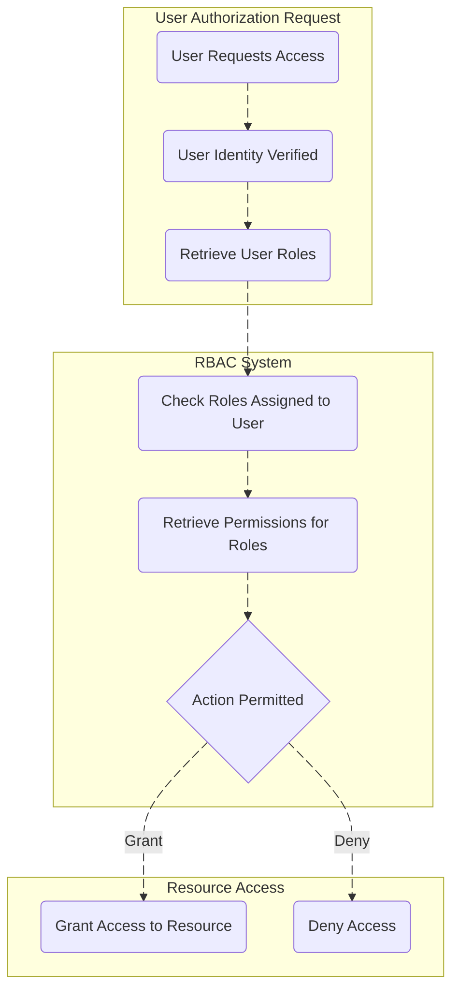

**Attribute-Based Access Control (ABAC)**

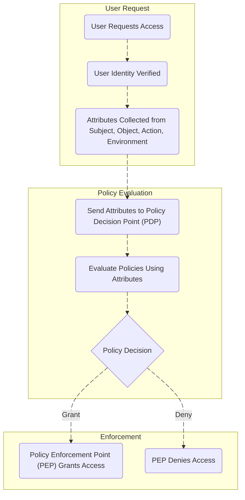

**Access Control List (ACL)**

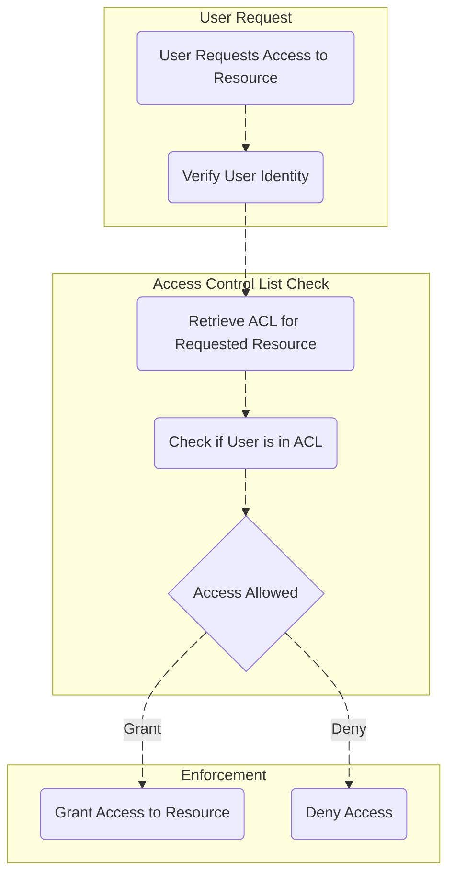

### Access Control Model
**Role-Based Access Control (RBAC)**

Role-centric, static binding of permissions

**Attribute-Based Access Control (ABAC)**

Policy-centric, dynamic evaluation of attributes at request time

**Access Control List (ACL)**

Rule-centric, access defined by explicit rules for users or groups per resource

### Flexibility
**Role-Based Access Control (RBAC)**

Moderate. Roles predefined; less adaptable to context changes

**Attribute-Based Access Control (ABAC)**

High. Can consider dynamic and contextual information (time, location, device, etc.)

**Access Control List (ACL)**

Low to moderate. Rules usually static and manually maintained

### Granularity
**Role-Based Access Control (RBAC)**

Coarse to moderate, depends on number and granularity of roles

**Attribute-Based Access Control (ABAC)**

Fine-grained; policies can combine multiple attributes for precise decisions

**Access Control List (ACL)**

Fine-grained at resource level, specifying detailed permissions per user/object

### Scalability
**Role-Based Access Control (RBAC)**

Scales well with a manageable number of roles; risk of role explosion if too many roles created

**Attribute-Based Access Control (ABAC)**

Can become complex and computationally heavy with many attributes and policies

**Access Control List (ACL)**

Can be complex to manage at scale if many resources and users require rules

### Administration
**Role-Based Access Control (RBAC)**

Centralized administration through role assignments; easier for compliance audits

**Attribute-Based Access Control (ABAC)**

Complex policy administration requiring careful attribute and policy design

**Access Control List (ACL)**

Decentralized - resource owners or admins define ACLs; can be cumbersome

### Policy Evaluation
**Role-Based Access Control (RBAC)**

At user-login or session creation, roles assigned then used throughout session

**Attribute-Based Access Control (ABAC)**

Real-time evaluation of attributes at each access request

**Access Control List (ACL)**

Each access request evaluated against ordered ACL rules sequentially

### Security Strength
**Role-Based Access Control (RBAC)**

Good for static deterministic control but vulnerable if roles have excessive privileges

**Attribute-Based Access Control (ABAC)**

Potentially stronger due to fine-grained, context-aware policies

**Access Control List (ACL)**

Strong when rules are well managed; can be prone to errors if rules overlap

### Policy Complexity
**Role-Based Access Control (RBAC)**

Simpler conceptually and easier to implement for basic needs

**Attribute-Based Access Control (ABAC)**

More complex, requiring detailed attribute and policy management

**Access Control List (ACL)**

Simple for small sets of resources but can become complex

### Typical Policy Components
**Role-Based Access Control (RBAC)**

Roles, permissions, users, sessions

**Attribute-Based Access Control (ABAC)**

Attributes (user, resource, environment), policies, rules combining attributes

**Access Control List (ACL)**

Access Control Entries (ACEs) specifying users/groups and their permissions

### Errors and Conflicts
**Role-Based Access Control (RBAC)**

Role explosion can create overlap or excessive permissions

**Attribute-Based Access Control (ABAC)**

Policy conflicts can be complex to detect and resolve

**Access Control List (ACL)**

Rule ordering is critical; earlier rules take precedence, leading to conflicts if mismanaged

### Management Overhead
**Role-Based Access Control (RBAC)**

Moderate; fewer roles means simpler management but can grow with complexity of roles

**Attribute-Based Access Control (ABAC)**

Higher due to attribute and policy complexity

**Access Control List (ACL)**

High if many resources/users require individualized ACLs

### User Control
**Role-Based Access Control (RBAC)**

No direct control by end users; all managed by administrators

**Attribute-Based Access Control (ABAC)**

No direct user control; policy-driven access

**Access Control List (ACL)**

Owners may control ACLs on their resources (discretionary control)

### Compliance and Auditing
**Role-Based Access Control (RBAC)**

Easier to audit due to defined roles and permissions

**Attribute-Based Access Control (ABAC)**

More complex auditing due to dynamic policies but more precise logging possible

**Access Control List (ACL)**

Auditable if ACLs are properly logged and maintained

### Hybrid Use
**Role-Based Access Control (RBAC)**

Often combined with ABAC for context-aware refinements

**Attribute-Based Access Control (ABAC)**

Can include role as an attribute or integrate with RBAC

**Access Control List (ACL)**

ACLs often used alongside RBAC or ABAC for network or low-level access control layers

### Example Permissions
**Role-Based Access Control (RBAC)**

"HR Manager" role can approve leave requests and view payroll data

**Attribute-Based Access Control (ABAC)**

User accessing resource only during business hours and from corporate device

**Access Control List (ACL)**

IP-based allow/deny rules on network devices or file read/write permissions per user

### Use Cases
**Role-Based Access Control (RBAC)**

Enterprises with clearly defined job functions and structured hierarchies

**Attribute-Based Access Control (ABAC)**

Environments needing fine-grained, dynamic, context-aware access decisions

**Access Control List (ACL)**

Network devices (routers, firewalls), file systems, and simple resource-based control

### Common Implementations
**Role-Based Access Control (RBAC)**

Microsoft Active Directory, Oracle RBAC, databases, enterprise IT systems

**Attribute-Based Access Control (ABAC)**

Healthcare, finance, government systems with strict compliance needs

**Access Control List (ACL)**

Router/firewall rules, Windows/Linux file system permissions, some databases
      </TabItem>
    </Tabs>

  </TabItem>
  <TabItem value="data-mesh" label="Data Mesh">
    <Tabs queryString="secondary">
      <TabItem value="overview" label="Overview" attributes={{ className: 'tabs_vertical' }}>
        Data mesh is a decentralized data architecture where teams own and manage their data. It assigns ownership to business domains (e.g., finance, marketing, sales), providing a self-serve platform and federated governance. This enables autonomous development of tailored data services while ensuring a unified data experience across the organization.

        | Aspect | Domain Ownership | Data as a Product | Self-Serve Data Platform | Federated Governance |
| --- | --- | --- | --- | --- |
| Strategic Domain Driven Design | Domain Bounded Context | Product Thinking | Domain-Agnostic | Context-Mapping |
| Socio-technical Perspective | Domain Teams | Data Product by Domain Team | Data Platform Team | Guild |
| Technology | Operational & Analytical Data | Interoperability Interfaces | Self-Serve Data Platform | Data Governance & Automation |

        ## Core Principles

        - **Domain-oriented** decentralized ownership: Business domains (e.g., customer service, marketing) own and manage their analytical and operational data services, tailoring data models to their needs
        - **Data as a product**: domain teams treat other domains as consumers, providing high-quality, secure, and up-to-date data
        - **Self-service data infrastructure as a platform**: dedicated team provides tools for domains to autonomously consume, develop, deploy, and manage interoperable data products
        - **Federated computational governance**: centralized governance authority with embedded governance in each domain's processes, enabling autonomy while ensuring compliance

        ## Data Mesh Architecture

        ```mermaid
        flowchart LR
          subgraph FederatedGovernnce [Federated Governance]
            direction TB
            interoperability(Interoperability Policy)
            documentation(Documentation Policy)
            security(Security Policy)
            privacy(Privacy Policy)
            compliance(Compliance Policy)
          end

          governanceGroup[[Governance Group]] e1@-->|supports| FederatedGovernnce

          subgraph selfServeDataPlatform [Self-Serve Data Platform]
            direction TB
            storageAndQueryEngine(Storage & Query Engine)
            dataProductCatalog(Data Product Catalog)
            dataContractManagement(Data Contract Management)
            monitoring(Monitoring)
            policyAutomation(Policy Automation)
          end

          dataPlatformTeam[[Data Platform Team]] e2@-->|supports| selfServeDataPlatform

          subgraph training [Training]
            direction TB
            consulting(Consulting)
            examples(Examples)
            bestPractices(Best Practices)
          end

          enablingTeam1[[Enabling Team]] e3@-->|supports| training

          subgraph domain1
          end

          subgraph domain2
            direction LR
            dataContract2(Data Contract)
            dataProduct2(Data Product)
            analytics2(Analytics)
            operationalData2(Operational Data)

            analytics2 e4@-->|analyze| dataProduct2
            operationalData2 e5@-->|ingest| dataProduct2
            dataProduct2 e6@-->|publish| dataContract2
          end

          domain1 e7@-->|use| dataContract2

          domainTeam2[[Domain Team 2]] e8@---->|supports| domain2
          dataProduct2 e9@--->|use| dataProduct3

          subgraph domain3
            direction TB
            dataProduct3(Data Product)
          end

          e1@{ animate: true }
          e2@{ animate: true }
          e3@{ animate: true }
          e4@{ animate: true }
          e5@{ animate: true }
          e6@{ animate: true }
          e7@{ animate: true }
          e8@{ animate: true }
          e9@{ animate: true }
        ```

        ## Data Product

        ```mermaid
        flowchart TB
          subgraph DataProduct [Data Product]
            direction TB
            ownership(Ownership & Lifecycle)
            transformation(Transformation Code)
            tests(Tests)
            documentation(Documentation)
            dataStorage[(Data Storage)]
            costManagement(Cost Management)
            policies(Policies as Code)
            cicd(CI/CD Pipeline)
            observability(Observability)
          end

          discoveryPort(Discovery Port<br/>Metadata) e1@--> DataProduct

          inputPortOps(Input Port<br/>Operational Systems) e2@--> DataProduct
          inputPortData(Input Port<br/>Other Data Products over Data Contract) e3@--> DataProduct

          DataProduct e4@--> outputPort1(Output Port<br/>Data Model & Technology)
          DataProduct e5@--> outputPort2(Output Port<br/>Data Model & Technology)

          e1@{ animate: true }
          e2@{ animate: true }
          e3@{ animate: true }
          e4@{ animate: true }
          e5@{ animate: true }
        ```

        ## High-level Platform Design and Governance

        

        ## Example

        
      </TabItem>
      <TabItem value="governance-topologies" label="Governance Topologies">
        ### Description
**Fine-grained Fully Federated Mesh**

Pure data mesh model with many small, independent deployable components, peer-to-peer data distribution, logically centralized governance metadata

**Fine-grained Fully and Fully Governed Mesh**

Adds a central data distribution layer to fine-grained federated mesh for stronger governance and centralized data distribution

**Hybrid Federated Mesh**

Combines federation and centralization. Central platform hosts/maintains data products; domain autonomy mainly in data consumption

**Value Chain-Aligned Mesh**

Domains aligned along business value chains, working in close groups with autonomy but sharing central standards for cross-domain data

**Coarse-grained Aligned Mesh**

Large, coarse-grained domains, often as a result of mergers; domains contain many applications, organic growth leads to complexity

**Coarse-grained and Governed Mesh**

Similar to coarse-grained aligned mesh but with stronger governance features like addressing time-variant and non-volatile data concerns

### Visualization
**Fine-grained Fully Federated Mesh**


**Fine-grained Fully and Fully Governed Mesh**


**Hybrid Federated Mesh**


**Value Chain-Aligned Mesh**


**Coarse-grained Aligned Mesh**


**Coarse-grained and Governed Mesh**


### Granularity
**Fine-grained Fully Federated Mesh**

Fine-grained data products, many small independent units

**Fine-grained Fully and Fully Governed Mesh**

Fine-grained data products with centralized distribution layer

**Hybrid Federated Mesh**

Hybrid: fine to moderate granularity; central platform more involved

**Value Chain-Aligned Mesh**

Fine to moderate granularity aligned by value chains

**Coarse-grained Aligned Mesh**

Coarse-grained domains containing many applications

**Coarse-grained and Governed Mesh**

Coarse-grained domains with governed attributes

### Governance Approach
**Fine-grained Fully Federated Mesh**

Federated with logically centralized metadata governance but mostly domain autonomy

**Fine-grained Fully and Fully Governed Mesh**

Fully governed with central control over distribution and conformance

**Hybrid Federated Mesh**

Governed but with domain autonomy in consumption; central platform manages creation/maintenance

**Value Chain-Aligned Mesh**

Central standards for cross-domain data; requires architectural guidance

**Coarse-grained Aligned Mesh**

Strong governance policies necessary due to complexity

**Coarse-grained and Governed Mesh**

Fully governed with relaxed controls in large domains

### Data Distribution
**Fine-grained Fully Federated Mesh**

Peer-to-peer between domains; domains share data directly

**Fine-grained Fully and Fully Governed Mesh**

Centralized data distribution via shared storage layer (domain-specific containers)

**Hybrid Federated Mesh**

Domains create/manage data via central platform; consumes data autonomously

**Value Chain-Aligned Mesh**

Aligned along value chains; domains share as needed with governance

**Coarse-grained Aligned Mesh**

Centralized/shared to manage complexity across coarse domains

**Coarse-grained and Governed Mesh**

Centralized/shared with governance controls for data quality

### Ownership
**Fine-grained Fully Federated Mesh**

Domain owns, manages, shares data independently

**Fine-grained Fully and Fully Governed Mesh**

Clear boundaries with domain ownership but central distribution

**Hybrid Federated Mesh**

Domain teams or platform team may own/manage data products depending on capability

**Value Chain-Aligned Mesh**

Domains collaborate with autonomy within their value chain

**Coarse-grained Aligned Mesh**

Domain ownership but domains large and complex

**Coarse-grained and Governed Mesh**

Domains own data but comply with governance for consistency

### Complexity / Management
**Fine-grained Fully Federated Mesh**

High complexity managing many small data products; needs conformance agreement across domains

**Fine-grained Fully and Fully Governed Mesh**

Higher complexity with governance and central controls; may slow time-to-market

**Hybrid Federated Mesh**

Moderate complexity; need supporting platform and governance team to manage hybrid roles

**Value Chain-Aligned Mesh**

Requires architectural coordination to define boundaries and standards clearly

**Coarse-grained Aligned Mesh**

High complexity due to coarse domains and multiple applications

**Coarse-grained and Governed Mesh**

High complexity with additional governance overhead

### Scalability
**Fine-grained Fully Federated Mesh**

Scales well horizontally but can be costly and resource-intensive due to duplication

**Fine-grained Fully and Fully Governed Mesh**

Scales with strong conformance but may have coupling delays and cost overheads centralized

**Hybrid Federated Mesh**

Scales with centralized platform efficiency and local domain agility

**Value Chain-Aligned Mesh**

Scales by value chains enabling domain group specialization

**Coarse-grained Aligned Mesh**

Suited to large enterprises with many legacy systems and apps

**Coarse-grained and Governed Mesh**

Similar to coarse-grained aligned but with governance improves scale consistency

### Network / Infrastructure Impact
**Fine-grained Fully Federated Mesh**

Potential for heavy network utilization and infrastructure duplication

**Fine-grained Fully and Fully Governed Mesh**

More efficient central infrastructure with shared storage and compute pools

**Hybrid Federated Mesh**

Some reduction in duplication with central platform; moderate overhead

**Value Chain-Aligned Mesh**

Balanced infrastructure demands due to group alignment

**Coarse-grained Aligned Mesh**

Infrastructure complexity due to large domain size and app count

**Coarse-grained and Governed Mesh**

Higher infrastructure cost but managed for compliance and quality

### Challenges & Risks
**Fine-grained Fully Federated Mesh**

Requires consensus on standards; potential data gravity vs decentralization conflict; costly infrastructure

**Fine-grained Fully and Fully Governed Mesh**

Longer time to market, potential domain coupling; challenge in multi-cloud seamless governance

**Hybrid Federated Mesh**

Management overhead with mixed governance; complex rules for data distribution

**Value Chain-Aligned Mesh**

Need strong architectural guidance; boundaries may be fluid and require attention

**Coarse-grained Aligned Mesh**

Data alignment issues with domain boundaries; capability duplication

**Coarse-grained and Governed Mesh**

Balancing autonomy with strong governance may slow flexibility

### Governed Data Characteristics
**Fine-grained Fully Federated Mesh**

Metadata governance centralized, data governance mostly at domain level

**Fine-grained Fully and Fully Governed Mesh**

Stronger data quality, compliance, and governance enforced centrally

**Hybrid Federated Mesh**

Governance mixed: central for product creation, federated for consumption

**Value Chain-Aligned Mesh**

Governance focuses on cross-domain data product standards

**Coarse-grained Aligned Mesh**

Governance policies critical due to scale and complexity

**Coarse-grained and Governed Mesh**

Governance addresses time-variant, compliance, and quality controls

### Use Cases
**Fine-grained Fully Federated Mesh**

Cloud-native, multi-cloud companies with many skilled engineers and high autonomy

**Fine-grained Fully and Fully Governed Mesh**

Financial institutions, governments valuing compliance over agility

**Hybrid Federated Mesh**

Organizations with legacy systems or lacking fully skilled teams; partial mesh

**Value Chain-Aligned Mesh**

Organizations needing stream-alignment or hyper-specialized domain cooperation (e.g., supply chain)

**Coarse-grained Aligned Mesh**

Large enterprises with complex merged systems & applications

**Coarse-grained and Governed Mesh**

Large enterprises needing governance and compliance in complex domains
      </TabItem>
    </Tabs>

  </TabItem>
</Tabs>
