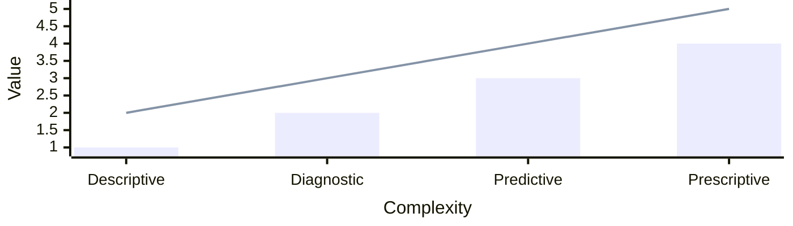

import TabItem from "@theme/TabItem";
import Tabs from "@theme/Tabs";

<Tabs queryString="primary">
  <TabItem value="analytic-types" label="Analytic Types">
    **Visualization**



| Aspect | Descriptive | Diagnostic | Predictive | Prescriptive |
| --- | --- | --- | --- | --- |
| **Definition** | Analyzes historical data to summarize and describe what happened | Investigates and explains why something happened | Uses historical data and models to predict future outcomes | Recommends actions based on predictions to optimize results |
| **Primary Question Answered** | What happened? | Why did it happen? | What is likely to happen? | What should be done? |
| **Purpose** | To provide insights into past and current states of data by summarizing and visualizing | To find the root causes or reasons behind past events or trends | To forecast future trends, behaviors, or events | To suggest optimal decisions or actions to achieve desired outcomes |
| **Data Used** | Historical and current data | Historical data, plus additional investigation data sources | Historical data combined with external variables | Data from descriptive, diagnostic, and predictive analytics |
| **Techniques & Methods** | Statistical summaries, reporting, dashboards, data visualization | Data mining, drill-down, correlation analysis, root cause analysis | Statistical modeling, machine learning, forecasting algorithms | Optimization algorithms, simulation, decision analysis |
| **Outcome** | Summarized reports, KPIs, dashboards, trends, patterns | Identified causes, explanations for anomalies or trends | Probability estimates, risk assessment, forecasts | Actionable recommendations, decision rules, best practice guidelines |
| **Decision Support Level** | Informational; offers context for decisions | Analytical; explains problems to support decision-making | Predictive; supports proactive strategies | Prescriptive; direct decision-making guidance |
| **Complexity Level** | Low to Moderate | Moderate | High | Very High |
| **Tools & Technologies** | BI tools, Excel, dashboards (Tableau, Power BI) | Statistical tools, SQL, data mining software | Machine learning libraries (Scikit-learn, TensorFlow), advanced statistical software | Optimization software, AI decision engines |
| **Time Orientation** | Past and Present | Past | Future | Future |
| **Role in Analytics Process** | Foundational, initial step for understanding data | Diagnostic step to explore underlying causes | Predictive step to anticipate future outcomes | Prescriptive step to optimize future decisions |
| **Limitations** | Does not explain cause or predict future | Cannot predict future; focuses on past explanations | Predictions are probabilistic and uncertain | Requires accurate predictions; complexity may limit implementation |
| **Benefit to Business** | Provides clarity and understanding of historical trends | Enables identification and correction of problems | Enables proactive planning and risk management | Drives optimized and data-informed decision-making |
| **Use Cases** | Sales reports showing monthly revenue trends | Diagnosing a drop in sales after a marketing campaign | Forecasting future sales or customer churn | Recommending inventory levels or marketing strategies |

  </TabItem>
  <TabItem value="data-concepts" label="Data Concepts">
    <Tabs queryString="secondary">
      <TabItem value="data-collection" label="Data Collection" attributes={{className: 'tabs_vertical'}}>
| Aspect | Primary | Secondary |
| --- | --- | --- |
| **Definition** | Data collected directly from the original source for a specific research purpose | Data already collected and readily available from other sources |
| **Purpose** | To address specific research questions and gain unique insights | To gain background information, validate primary data, or answer research questions that can be met with existing data |
| **Source** | First-hand sources (e.g., individuals, experiments) | Second-hand sources (e.g., government publications, academic journals, company reports, websites) |
| **Control** | High control over data collection process, methodology, and quality | No control over data collection process, methodology, or quality |
| **Cost** | Generally higher, due to resources needed for collection (e.g., surveys, interviews, experiments) | Generally lower, as data is already available and often free or inexpensive to access |
| **Time** | More time-consuming, involving planning, execution, and analysis of new data | Less time-consuming, as data can be accessed relatively quickly |
| **Specificity** | Highly specific to the research question; tailor-made data | May not perfectly align with the specific research question; might require adaptation or filtering |
| **Accuracy & Reliability** | Can be highly accurate and reliable if collected properly; direct verification possible | Varies depending on the source; reliability and accuracy need careful evaluation |
| **Availability** | Always available if resources permit new collection | Readily available, but might be outdated or incomplete |
| **Advantages** | High relevance and specificity; Greater control over data quality; Proprietary insights (competitive advantage); Up-to-date information | Cost-effective and time-saving; Easy access to large datasets; Can provide broader context; Useful for trend analysis and comparison |
| **Disadvantages** | High cost and time commitment; Requires significant effort and resources; Potential for bias in data collection; Limited scope (due to resource constraints) | Data may be outdated or irrelevant; Quality and accuracy can vary; Lack of control over collection methods; Data might be generalized, not specific enough; No unique insights (publicly available) |
| **Examples** | Surveys, interviews, focus groups, experiments, observations, direct measurements, statistical methods, Delphi tecnique | Government census data, academic research papers, industry reports, company sales records, public databases |
      </TabItem>
      <TabItem value="data-cleanup" label="Data Cleanup">
| Technique | Description | Purpose | Typical Methods/Approaches | Key Considerations |
| --- | --- | --- | --- | --- |
| **Removing Duplicates** | Identifying and removing repeated rows that represent the same records | Reduce bias from repeated data; ensure uniqueness | Exact matching, fuzzy matching | Avoid removing true unique data; consider near-duplicates |
| **Spell Checking** | Detecting and correcting typos and misspelled words | Improve accuracy in categorical/text data | Dictionary lookup, spell-check libraries | Domain-specific dictionaries improve accuracy |
| **Finding and Replacing Text** | Searching for specific values or patterns and replacing them | Correct errors or standardize terms | Regex, exact match replacement | Check for unintended replacements |
| **Changing the Case of Text** | Standardizing capitalization to upper, lower, or title case | Ensure consistency in text values | Convert to upper/lower/title case | Confirm if case sensitivity matters in analysis |
| **Removing Spaces and Nonprinting Characters** | Trimming leading/trailing spaces and removing invisible characters | Prevent parsing errors and incorrect matching | Strip spaces, remove non-printables via regex | Can affect text matching; do not remove meaningful spaces |
| **Fixing Numbers and Number Signs** | Correcting numeric values and standardizing number formats | Ensure numeric data consistency for calculations | Remove thousands separators, convert strings to numbers | Monitor locale-specific formats like commas/dots |
| **Fixing Dates and Times** | Correcting and standardizing date/time formats | Enable chronological analysis and sorting | Parse dates, convert formats, separate date/time | Handle timezone and format variations carefully |
| **Merging and Splitting Columns** | Combining multiple columns or splitting columns into multiple fields | Normalize data structure and improve usability | Concatenate strings, split by delimiters | Maintain data integrity during merges/splits |
| **Transforming and Rearranging Columns and Rows** | Changing the shape or order of data | Prepare data for specific analysis needs | Pivoting, melting, sorting, reordering | Ensure no data loss during transformations |
| **Reconciling Table Data by Joining or Matching** | Combining related data from multiple tables or datasets | Create comprehensive dataset for analysis | SQL JOINs, merge operations, fuzzy matching | Verify join keys; beware of data duplication or loss |
| **Handling Missing Data** | Identifying and addressing incomplete or absent values | Ensure data integrity; prevent biased analysis | Imputation (mean, median, mode, regression), deletion (row-wise, column-wise) | Consider impact of imputation method; understand missing data mechanisms |
| **Finding Outliers** | Detecting data points that significantly deviate from the majority of the data | Prevent skewed analysis; identify errors or anomalies | Statistical methods (Z-score, IQR), visualization (box plots, scatter plots), machine learning (clustering) | Distinguish between true anomalies and data entry errors; consider domain knowledge |
| **Data Transformation** | Converting data from one format or structure to another | Normalize data; prepare for analysis; improve model performance | Scaling (min-max, standardization), log transformation, one-hot encoding, binning | Choose appropriate transformation based on data distribution and analysis goals; avoid information loss |

        - **Data Quality Assessment**:
            - **Missing values detection**: Identifying records or fields with null, empty, or undefined values
            - **Duplicate identification**: Finding records that appear multiple times in the dataset
            - **Outlier detection**: Identifying data points that deviate significantly from other observations
            - **Data type validation**: Verifying that data matches expected types (string, numeric, date, etc.)
            - **Range checking**: Ensuring data values fall within acceptable boundaries
            - **Format consistency verification**: Checking that data follows consistent formatting patterns
            - **Completeness assessment**: Evaluating the proportion of missing vs available data
        - **Missing Data Handling**:
            - **Listwise deletion**: Removing entire records that contain any missing values
            - **Pairwise deletion**: Using available data for each specific analysis while ignoring missing values
            - **Mean imputation**: Replacing missing values with the arithmetic mean of available values
            - **Median imputation**: Replacing missing values with the median of available values
            - **Mode imputation**: Replacing missing values with the most frequent category
            - **Forward fill imputation**: Propagating last known value forward to fill gaps
            - **Backward fill imputation**: Using next known value to fill gaps backward
            - **Linear interpolation**: Estimating missing values using linear trends between known points
            - **Polynomial interpolation**: Using polynomial curves to estimate missing values
            - **K-nearest neighbors imputation**: Using similar records to estimate missing values
            - **Multiple imputation**: Creating multiple datasets with different imputed values
            - **Hot-deck imputation**: Using values from similar records in the same dataset
            - **Cold-deck imputation**: Using values from external sources or different datasets
            - **Regression imputation**: Predicting missing values using regression models
            - **Stochastic regression imputation**: Adding random error to regression predictions
            - **Indicator method for missing values**: Creating binary flags for missing value locations
        - **Duplicate Management**:
            - **Exact duplicate removal**: Eliminating records that are identical in all fields
            - **Fuzzy duplicate detection**: Finding records that are similar but not exactly identical
            - **Semantic duplicate identification**: Detecting duplicates based on meaning rather than exact text
            - **Cross-record comparison**: Comparing multiple fields across records to find duplicates
            - **Record linkage**: Matching records across different datasets
            - **Entity resolution**: Determining when different records refer to the same entity
            - **Deduplication algorithms**: Automated processes for identifying and removing duplicates
        - **Outlier Treatment**:
            - **Z-score method**: Identifying outliers using standard deviation from mean
            - **Modified Z-score**: Robust outlier detection using median absolute deviation
            - **Interquartile range method**: Using box plot statistics to identify outliers
            - **Isolation forest**: Tree-based algorithm for anomaly detection
            - **Local outlier factor**: Density-based outlier detection algorithm
            - **One-class SVM**: Support vector machine for novelty detection
            - **Winsorization**: Replacing extreme values with less extreme percentiles
            - **Trimming**: Removing extreme values entirely
            - **Capping**: Setting maximum/minimum thresholds for values
            - **Log transformation for skewed data**: Using logarithms to normalize skewed distributions
        - **Data Type Correction**:
            - **String to numeric conversion**: Converting text representations to numerical values
            - **Date parsing and standardization**: Converting various date formats to consistent datetime objects
            - **Boolean value normalization**: Standardizing true/false representations across formats
            - **Categorical encoding preparation**: Preparing categorical data for encoding schemes
            - **Data type coercion**: Forcing data into correct types with error handling
            - **Format standardization**: Ensuring consistent formatting across similar data types
        - **Text Data Cleaning**:
            - **Case normalization**: Converting text to consistent case (upper/lower/title)
            - **Whitespace removal**: Eliminating extra spaces, tabs, and line breaks
            - **Punctuation handling**: Managing punctuation marks appropriately
            - **Special character removal**: Filtering out non-alphanumeric characters
            - **HTML tag stripping**: Removing HTML/XML markup from text
            - **URL extraction**: Identifying and extracting web addresses
            - **Email extraction**: Finding and validating email addresses
            - **Phone number standardization**: Converting phone numbers to consistent formats
            - **Stop word removal**: Eliminating common words without semantic value
            - **Stemming**: Reducing words to their root forms
            - **Lemmatization**: Converting words to their dictionary base forms
            - **Tokenization**: Breaking text into individual words or units
            - **Spell checking**: Identifying and correcting spelling errors
            - **Language detection**: Identifying the language of text content
        - **Categorical Data Cleaning**:
            - **Category consolidation**: Merging similar or synonymous categories
            - **Rare category handling**: Grouping infrequent categories into "Other"
            - **Typo correction**: Fixing spelling errors in category labels
            - **Standardized naming conventions**: Applying consistent naming rules
            - **Hierarchical categorization**: Creating multi-level category structures
            - **One-hot encoding preparation**: Preparing data for one-hot encoding
            - **Label encoding preparation**: Preparing data for label encoding
            - **Frequency encoding preparation**: Preparing data for frequency-based encoding
            - **Target encoding preparation**: Preparing data for target-based encoding
        - **Numerical Data Cleaning**:
            - **Scaling and normalization**: Adjusting data to consistent scales
            - **Standardization (z-score)**: Converting to mean=0, std=1 distribution
            - **Min-max scaling**: Scaling to fixed range [0,1] or [-1,1]
            - **Robust scaling**: Using median and IQR for scaling
            - **Power transformation**: Using power functions to stabilize variance
            - **Log transformation**: Applying logarithm to reduce skewness
            - **Square root transformation**: Using square root to moderate large values
            - **Box-Cox transformation**: Family of power transformations for normality
            - **Yeo-Johnson transformation**: Extension of Box-Cox for negative values
            - **Quantile transformation**: Mapping to uniform or normal distribution
        - **>Data Structure Cleaning**:
            - **Column renaming**: Standardizing column names for consistency
            - **Index resetting**: Converting meaningful indices to regular columns
            - **Multi-index flattening**: Converting hierarchical indices to flat structure
            - **Pivot table reshaping**: Converting long format to wide format tables
            - **Melt operations**: Converting wide format to long format
            - **Wide to long conversion**: Pivoting data from columns to rows
            - **Long to wide conversion**: Pivoting data from rows to columns
            - **Stack/unstack operations**: Pivoting multi-level data structures
        - **Anomaly Detection**:
            - **Statistical anomaly detection**: Using statistical methods to identify unusual patterns
            - **Machine learning-based anomaly detection**: Using ML algorithms for pattern-based detection
            - **Time series anomaly detection**: Specialized methods for temporal data anomalies
            - **Contextual anomaly detection**: Considering context for anomaly identification
            - **Collective anomaly detection**: Finding groups of anomalous points
            - **Point anomaly detection**: Identifying individual anomalous data points
        - **Data Validation**:
            - **Schema validation**: Ensuring data conforms to predefined structure
            - **Business rule validation**: Applying domain-specific business logic
            - **Cross-field validation**: Checking relationships between multiple fields
            - **Referential integrity checking**: Ensuring references between datasets are valid
            - **Constraint validation**: Applying predefined limits and rules
            - **Data quality rules enforcement**: Automated application of quality standards
        - **Feature Engineering Preparation**:
            - **Feature scaling**: Preparing features for consistent scaling
            - **Feature encoding**: Converting categorical features to numerical
            - **Feature selection**: Choosing relevant features for modeling
            - **Dimensionality reduction**: Reducing feature space complexity
            - **Feature extraction**: Creating new features from existing data
            - **Feature construction**: Building composite features from raw data
            - **Domain-specific feature creation**: Creating features based on domain expertise
        - **Time Series Specific Cleaning**:
            - **Time zone standardization**: Converting all timestamps to consistent time zone
            - **Timestamp alignment**: Ensuring consistent time intervals
            - **Frequency consistency**: Standardizing observation frequencies
            - **Missing time period handling**: Managing gaps in temporal sequences
            - **Seasonal decomposition**: Separating trend, seasonal, and residual components
            - **Trend removal**: Eliminating long-term trends from data
            - **Detrending**: Removing trend components for analysis
            - **Differencing**: Computing differences between consecutive observations
            - **Seasonal adjustment**: Removing seasonal patterns from data
        - **Geospatial Data Cleaning**:
            - **Coordinate system standardization**: Converting coordinates to consistent reference systems
            - **Invalid coordinate removal**: Filtering out impossible or corrupted coordinates
            - **Boundary validation**: Ensuring coordinates fall within valid geographic boundaries
            - **Distance-based outlier detection**: Identifying spatially isolated or impossible points
            - **Spatial join validation**: Ensuring spatial relationships are logically consistent
            - **Geometry simplification**: Reducing complexity of spatial shapes
            - **Topology error correction**: Fixing geometric relationship errors
        - **Data Integration Cleaning**:
            - **Schema matching**: Aligning schemas across different data sources (Data warehouse loading, system integration)
            - **Entity resolution across datasets**: Matching entities across multiple data sources (Master data management, customer 360)
            - **Conflict resolution**: Managing conflicting information from multiple sources (Data fusion, truth discovery)
            - **Data fusion**: Combining information from multiple sources (Information enrichment, completeness)
            - **Record linkage**: Matching records across different datasets (Data integration, deduplication)
            - **Data harmonization**: Standardizing data from different sources (Cross-system consistency, unified view)
            - **Standardization across sources**: Applying consistent formats across integrated data
        - **Quality Assurance**:
            - **Data profiling**: Analyzing data structure and content patterns
            - **Data lineage tracking**: Monitoring data transformation history
            - **Quality metric calculation**: Computing quantitative quality measures
            - **Cleaning process documentation**: Recording all cleaning operations performed
            - **Validation testing**: Testing cleaning processes for effectiveness
            - **Quality gate implementation**: Automated quality checkpoints in pipelines
        - **Error Correction**:
            - **Typo correction**: Fixing spelling and typing errors
            - **Format error fixing**: Correcting malformed data formats
            - **Inconsistency resolution**: Fixing contradictory information
            - **Standardization errors correction**: Fixing non-standard data representations
            - **Validation error handling**: Managing data that fails validation rules
            - **Parsing error correction**: Fixing data that cannot be parsed correctly
        - **Data Sampling for Cleaning**:
            - **Random sampling**: Selecting random subsets for cleaning operations (Large dataset handling, exploratory cleaning)
            - **Stratified sampling**: Maintaining category proportions in samples (Representative cleaning, bias prevention)
            - **Cluster sampling**: Sampling groups rather than individuals (Hierarchical data, grouped cleaning)
            - **Systematic sampling**: Selecting every nth element (Regular pattern cleaning, efficiency)
            - **Reservoir sampling**: Maintaining random samples of fixed size (Streaming data, memory constraints)
            - **Bootstrap sampling**: Sampling with replacement for validation
        - **Advanced Imputation Techniques**:
            - **Expectation-Maximization (EM) algorithm**: Iterative method for maximum likelihood estimation
            - **Matrix completion methods**: Completing missing values in matrix structures
            - **Deep learning-based imputation**: Using neural networks for missing value prediction
            - **Autoencoder imputation**: Using autoencoders to learn data representations
            - **Generative adversarial imputation**: Using GANs for realistic value generation
            - **Variational autoencoder imputation**: Using VAEs for probabilistic imputation
            - **Bayesian principal component analysis**: Probabilistic dimensionality reduction for imputation
            - **Tensor decomposition methods**: Multi-dimensional array completion methods
            - **Collaborative filtering imputation**: Using user/item similarities for imputation
            - **Pattern-based imputation**: Using learned patterns for value prediction
        - **Data Quality Enhancement**:
            - **Data enrichment from external sources**: Adding information from external datasets
            - **Knowledge graph integration**: Incorporating structured knowledge relationships
            - **Semantic data integration**: Using meaning rather than structure for integration
            - **Ontology-based cleaning**: Using domain ontologies for data correction
            - **Rule-based data repair**: Applying logical rules for error correction
            - **Constraint-based data repairing**: Using constraints to guide repair actions
            - **Data fusion from multiple sources**: Combining multiple data sources intelligently
            - **Ensemble cleaning methods**: Combining multiple cleaning approaches
            - **Crowdsourced data cleaning**: Using human intelligence for data correction
            - **Human-in-the-loop cleaning**: Combining automation with human oversight
        - **Statistical Cleaning Methods**:
            - **Robust statistical estimators**: Using outlier-resistant statistical measures
            - **M-estimators for outliers**: Maximum likelihood type estimators for robustness
            - **Huber regression cleaning**: Robust regression for outlier handling
            - **Quantile regression cleaning**: Estimating conditional quantiles for robustness
            - **Robust covariance estimation**: Outlier-resistant covariance matrix calculation
            - **Mahalanobis distance cleaning**: Using statistical distance for outlier detection
            - **Cook's distance analysis**: Measuring influence of individual observations
            - **Leverage point detection**: Identifying observations with high leverage
            - **Influence function analysis**: Studying the impact of individual observations
            - **Breakdown point optimization**: Maximizing resistance to outliers
        - **Machine Learning-Based Cleaning**:
            - **Supervised anomaly detection**: Using labeled data for anomaly identification
            - **Unsupervised outlier detection**: Finding anomalies without labeled data
            - **Semi-supervised learning for cleaning**: Using partial labels for data cleaning
            - **Active learning for data labeling**: Intelligently selecting data for labeling
            - **Transfer learning for domain adaptation**: Adapting models across different domains
            - **Few-shot learning for rare cases**: Learning from limited examples
            - **Self-supervised cleaning methods**: Learning representations without labels
            - **Meta-learning for cleaning strategies**: Learning to learn cleaning approaches
            - **Ensemble methods for data cleaning**: Combining multiple ML models for cleaning
            - **AutoML for cleaning pipeline optimization**: Automated optimization of cleaning workflows
        - **Domain-Specific Cleaning**:
            - **Healthcare data standardization (HL7, FHIR)**: Applying healthcare-specific standards
            - **Financial data validation (SWIFT, FIX)**: Using financial industry protocols
            - **Genomic data cleaning (FASTA, FASTQ)**: Specialized cleaning for genetic sequences
            - **Sensor data calibration**: Correcting sensor readings and measurements
            - **IoT data stream cleaning**: Managing continuous sensor data streams
            - **Log data parsing and cleaning**: Extracting structured data from log files
            - **Social media data sanitization**: Cleaning user-generated content
            - **Web scraping data cleaning**: Processing and validating scraped content
            - **API response normalization**: Standardizing API data formats
            - **Database migration cleaning**: Managing data during system migrations
        - **Temporal Data Cleaning**:
            - **Time series decomposition**: Breaking down time series into components
            - **Seasonal and trend adjustment**: Removing seasonal and trend patterns
            - **Calendar effect removal**: Accounting for calendar-related variations
            - **Holiday adjustment**: Managing holiday-related data anomalies
            - **Working day adjustment**: Accounting for business day patterns
            - **Outlier detection in time series**: Finding anomalous points in temporal data
            - **Missing value imputation in time series**: Filling gaps in temporal sequences
            - **Frequency conversion handling**: Managing different time granularities
            - **Timestamp synchronization**: Aligning timestamps across sources
            - **Temporal consistency validation**: Ensuring logical temporal relationships
        - **Multivariate Cleaning**:
            - **Correlation-based outlier detection**: Using variable relationships for outlier identification
            - **Principal component analysis for cleaning**: Using PCA for dimensionality and outlier detection
            - **Factor analysis for dimensionality**: Reducing dimensions while preserving relationships
            - **Canonical correlation analysis**: Studying relationships between variable sets
            - **Multivariate imputation methods**: Handling missing data across multiple variables
            - **Copula-based modeling**: Modeling complex multivariate dependencies
            - **Structural equation modeling**: Testing theoretical relationships between variables
            - **Graphical model cleaning**: Using graph structures for data validation
            - **Network-based anomaly detection**: Finding anomalies in network structures
            - **Cluster analysis for grouping**: Grouping similar records for batch cleaning
        - **Streaming Data Cleaning**:
            - **Online outlier detection**: Detecting outliers in continuous data streams
            - **Incremental data cleaning**: Processing data as it arrives
            - **Real-time anomaly detection**: Immediate identification of unusual patterns
            - **Sliding window techniques**: Using moving time windows for analysis
            - **Adaptive cleaning thresholds**: Adjusting cleaning parameters dynamically
            - **Concept drift detection**: Identifying changes in data patterns over time
            - **Incremental learning for cleaning**: Learning cleaning rules from ongoing data
            - **Stream processing frameworks**: Using specialized tools for data streams
            - **Real-time quality monitoring**: Continuous assessment of data quality
            - **Adaptive sampling for streams**: Intelligently sampling streaming data
        - **Big Data Cleaning**:
            - **Distributed data cleaning**: Cleaning across multiple computing nodes
            - **MapReduce cleaning algorithms**: Using MapReduce paradigm for cleaning
            - **Spark-based cleaning pipelines**: Using Apache Spark for large-scale cleaning
            - **Hadoop data quality tools**: Specialized tools for Hadoop environments
            - **Sampling for large datasets**: Using samples for efficient large data cleaning
            - **Approximate cleaning methods**: Trading accuracy for computational efficiency
            - **Parallel cleaning algorithms**: Algorithms designed for parallel execution
            - **Cloud-based cleaning services**: Using cloud platforms for cleaning operations
            - **Scalable outlier detection**: Outlier detection methods for massive datasets
            - **Distributed deduplication**: Removing duplicates across distributed systems
        - **Privacy-Preserving Cleaning**:
            - **Differential privacy cleaning**: Adding noise for privacy protection during cleaning
            - **k-anonymity implementation**: Ensuring sufficient group sizes for anonymity
            - **l-diversity enforcement**: Maintaining diversity within anonymized groups
            - **t-closeness application**: Preserving value distributions in anonymized data
            - **Data masking techniques**: Hiding sensitive information while preserving structure
            - **Pseudonymization methods**: Replacing identifiers with pseudonyms
            - **Secure multiparty cleaning**: Cleaning data across multiple parties securely
            - **Homomorphic encryption cleaning**: Computing on encrypted data
            - **Federated data cleaning**: Cleaning distributed data without centralization
            - **Privacy budget management**: Tracking privacy loss in repeated analyses
        - **Error Pattern Analysis**:
            - **Root cause analysis for data errors**: Identifying underlying causes of data problems
            - **Error pattern mining**: Discovering common error patterns
            - **Frequent error pattern detection**: Finding most common error types
            - **Association rule mining for errors**: Finding relationships between error types
            - **Sequential pattern mining**: Discovering error sequences over time
            - **Graph-based error propagation**: Modeling how errors spread through data
            - **Error clustering analysis**: Grouping similar errors for batch processing
            - **Anomaly pattern recognition**: Identifying patterns in anomalous data
            - **Predictive error modeling**: Forecasting future error occurrences
            - **Error prevention strategies**: Developing methods to prevent errors
        - **Data Standardization**:
            - **Industry standard compliance**: Following industry-specific data standards
            - **ISO data quality standards**: Implementing ISO-defined quality measures
            - **Regulatory compliance cleaning**: Meeting regulatory data requirements
            - **GDPR data cleaning requirements**: Privacy regulation compliance
            - **HIPAA compliance for healthcare**: Healthcare data regulation compliance
            - **SOX compliance for financial data**: Financial reporting regulation compliance
            - **Basel accord compliance**: Banking regulation compliance
            - **Industry-specific data models**: Using standard data models for domains
            - **Standard data exchange formats**: Using common formats for data sharing
            - **Metadata standardization**: Consistent metadata across systems
      </TabItem>
      <TabItem value="data-exploration" label="Data Exploration">
| Technique | Description | Strengths | Limitations | Use Case |
| --- | --- | --- | --- | --- |
| **Exploration Process Overview** | Involves discerning patterns, identifying anomalies, examining underlying structures, and testing hypotheses. Achieved via descriptive statistics, visual methods, and algorithms | Provides foundation and roadmap for subsequent analysis, feature engineering, and modeling | Can be time-consuming; requires iterative refinement and expert interpretation | Develops comprehensive understanding of dataset quality, characteristics, and relationships before formal analysis or modeling |
| **Descriptive Statistics** | Summarizes dataset statistics including central tendency, dispersion, and shape | Simple to compute; foundational knowledge; quick anomaly detection | Limited to numerical summaries; no direct relational insights | Provides initial insights and data quality assessment; identifies trends and distribution |
| **Data Visualization** | Graphical representations such as histograms, box plots, scatter plots, heatmaps | Intuitive pattern recognition; effective for communicating insights | Can be subjective; depends on appropriate chart choice and scale | Visual detection of patterns, anomalies, clusters, and correlations |
| **Correlation Analysis** | Quantifies strength and direction of relationships between variables | Provides quantitative relationship measure; aids feature selection | Only detects linear or monotonic relationships; sensitive to outliers | Identifies key variable interactions for predictive modeling and hypothesis testing |
| **Cluster Analysis** | Groups similar data points using algorithms to identify natural groupings | Useful for pattern recognition in complex data without labels | Requires parameter tuning; sensitive to noise and outliers | Unsupervised discovery of segments or patterns for targeted analysis |
| **Outlier Detection** | Detects data points significantly deviating from the norm | Enhances data quality and model robustness by handling anomalies | Risk of discarding valid rare events; subjective definitions | Identifies anomalies, data errors, or rare but important events |
| **Dimensionality Reduction** | Reduces number of variables while preserving data variance (e.g., PCA) | Reveals hidden structure; improves computational efficiency | Potential loss of interpretability and information | Simplifies datasets for visualization and modeling; reduces collinearity |
| **Exploratory Data Analysis (EDA)** | Combines statistics and visuals to formulate hypotheses and validate assumptions | Holistic insight, early pattern detection, directs analysis flow | Requires expertise; can be time-intensive | Understands data structure, relationships, and prepares for modeling |
| **Hypothesis Testing** | Formal statistical tests to assess data assumptions and variable effects | Rigorous evidence for inference and decision-making | Dependent on data assumptions; sample size sensitive | Validates or rejects assumptions guiding further work |
| **Feature Engineering** | Creating/modifying dataset features based on exploration insights | Customizes models to domain/context-specific data traits | Requires domain knowledge and iterative experimentation | Improves predictive power of machine learning models |
| **Interactive Data Exploration** | Use of GUIs and interactive platforms to dynamically explore data | Engages stakeholders; speeds understanding through visuals | May be limited by dataset size or software capabilities | Facilitates collaborative, rapid, and user-friendly analysis |
      </TabItem>
      <TabItem value="data-visualization" label="Data Visualization">
        ```mermaid
        ---
        config:
          layout: dagre
        ---
        graph LR
          start(( )) e1@--> comparison(Comparison)
          start e2@--> distribution(Distribution)
          start e3@--> relationship(Relationship)
          start e4@--> composition(Composition)

          comparison e5@--> amongItems(Among Items)
          amongItems e6@-->|2 variables per item| widthChart[[Variable Width Column Chart]]
          amongItems e7@--> oneVariablePerItem(1 variable per item)
          oneVariablePerItem e8@-->|many categories| tableWithCharts[[Table with Embedded Charts]]
          oneVariablePerItem e9@--> |few categories| barChartHorizontal[[Bar Chart Vertical/Horizontal]]
          comparison e10@--> overTime(Over Time)
          overTime e11@--> |cyclical data| circularAreaChart[[Circular Area Chart]]
          overTime e12@--> |non-cyclical data| lineChart[[Line Chart]]
          overTime e13@--> |single or few categories| barChartVertical[[Bar Chart Vertical]]
          overTime e14@--> |many categories| overTimeLineChart[[Line Chart]]

          distribution e15@--> singleVariable(Single Variable)
          singleVariable e16@--> |Few Data Points| barHistogram[[Bar Histogram]]
          singleVariable e17@--> |Many Data Points| lineHistogram[[Line Histogram]]
          distribution e18@--> |Two Variables| twoVariables[[Scatter Plot]]

          relationship e19@--> |2 variables| scatter[[Scatter Plot]]
          relationship e20@--> |3 or more variables| bubble[[Bubble Chart]]

          composition e21@--> changingOverTime(Changing Over Time)
          changingOverTime e22@--> fewPeriods(Few Periods)
          changingOverTime e23@--> manyPeriods(Many Periods)
          manyPeriods e24@--> |only relative difference matter| stackedArea100Bar[[Stacked 100% Area Chart]]
          manyPeriods e25@--> |relative & absolute difference matter| stackedAreaChart[[Stacked Area Chart]]
          fewPeriods e26@--> |only relative difference matter| stacked100Bar[[Stacked 100% Bar Chart]]
          fewPeriods e27@--> |relative & absolute difference matter| stackedBar[[Stacked Bar Chart]]
          changingOverTime e28@--> |only relative difference matter| stacked100Area[[Stacked 100% Area Chart]]
          changingOverTime e29@--> |relative & absolute difference matter| stackedArea[[Stacked Area Chart]]
          composition e30@--> static(Static)
          static e31@--> |simple share of total| pieDonut[[Pie/Donut Chart]]
          static e32@--> |accumulation/subtraction to total| waterfall[[Waterfall Chart]]
          static e33@--> |components of components| subComponents[[Stacked 100% Bar Chart with Subcomponents]]
          static e34@--> |accumulation to total and absolute difference matters| treemap[[Treemap]]

          e1@{ animate: true }
          e2@{ animate: true }
          e3@{ animate: true }
          e4@{ animate: true }
          e5@{ animate: true }
          e6@{ animate: true }
          e7@{ animate: true }
          e8@{ animate: true }
          e9@{ animate: true }
          e10@{ animate: true }
          e11@{ animate: true }
          e12@{ animate: true }
          e13@{ animate: true }
          e14@{ animate: true }
          e15@{ animate: true }
          e16@{ animate: true }
          e17@{ animate: true }
          e18@{ animate: true }
          e19@{ animate: true }
          e20@{ animate: true }
          e21@{ animate: true }
          e22@{ animate: true }
          e23@{ animate: true }
          e24@{ animate: true }
          e25@{ animate: true }
          e26@{ animate: true }
          e27@{ animate: true }
          e28@{ animate: true }
          e29@{ animate: true }
          e30@{ animate: true }
          e31@{ animate: true }
          e32@{ animate: true }
          e33@{ animate: true }
          e34@{ animate: true }
        ```

| Type | Visualization | Description | Purpose | Use Cases |
| --- | --- | --- | --- | --- |
| Bar Chart |  | Rectangular bars representing categorical data | Compare values across categories | Ranking products, survey results, categories comparison |
| Line Chart |  | Points connected by lines showing trends | Show trends over time or continuous data | Stock prices, sales trends |
| Area Chart |  | Like line chart with area filled beneath | Emphasize magnitude over time | Cumulative sales, traffic volume |
| Pie/Donut Chart |  | Circular chart divided into slices | Show parts of a whole as percentages | Market share, budget allocation |
| Scatter Plot |  | Dots representing relationship between two variables | Identify correlation, clusters, or outliers | Scientific measurements, survey data analysis |
| Bubble Chart |  | Scatter plot with bubble size as third dimension | Visualize 3 numeric variables | Sales volume, market data |
| Histogram |  | Bar chart showing frequency distribution | Visualize distribution of numerical data | Test scores, ages, response times |
| Box-and-Whisker Plot |  | Displays distribution through quartiles and outliers | Summarize statistical distribution | Exam scores, stock performance |
| Heatmap |  | Color-coded matrix of data intensity or value | Show data density or magnitude | Website clicks, population density |
| Treemap |  | Nested rectangles representing hierarchical data | Visualize part-to-whole and hierarchy | Financial portfolios, file system sizes |
| Parallel Coordinates |  | Lines connect values across multiple axes | Explore multivariate data | Customer segmentation, risk analysis |
| Choropleth Map |  | Geographic map with regions colored by data values | Show spatial distribution | Election results, demographics |
| Radar Chart (Spider Chart) |  | Variables plotted on axes radiating from center | Compare multivariate data | Performance metrics, skill assessments |
| Funnel Chart |  | Funnel-shaped chart showing progressive reduction | Show stages in a process | Sales pipeline, conversion rates |
| Waterfall Chart |  | Visualizes incremental additions and subtractions | Show how values build to a total | Financial statements, budget changes |
| Gantt Chart |  | Bar chart showing project schedule and tasks | Manage project timelines | Project planning, resource allocation |
| Bullet Graph |  | Bar with markers to compare performance against goal | Measure progress against a target | KPIs, performance dashboards |
| Dot Plot |  | Dots representing data points aligned along axis | Compare distribution or frequency | Population by region, survey results |
| Lollipop Chart |  | Bar chart with a dot at the end of the bar | Highlight individual values with focus | Survey responses, rankings |
| Pictogram |  | Uses icons or images to represent data counts | Visual and engaging counts | Population figures, votes |
      </TabItem>
      <TabItem value="descriptive-analysis" label="Descriptive Analysis">
| Technique Category | Technique | Description | Calculation/Formula | Sensitivity to Outliers | Suitable Data Types | Usage |
| --- | --- | --- | --- | --- | --- | --- |
| **Dispersion** | **Range** | Difference between the largest and smallest values in the data | $\text{Range} = \text{Max} - \text{Min}$ | Highly sensitive to outliers | Numerical, continuous | Provides overall spread but impacted by extremes; best with small samples |
| **Dispersion** | **Variance** | Average of squared deviations from the mean | $\text{Variance} = \frac{1}{n-1} \sum (x_i - \bar{x})^2$ | Less sensitive, but influenced by outliers due to squaring | Numerical, continuous | Measures spread around mean in squared units; less intuitive than SD |
| **Dispersion** | **Standard Deviation** | Square root of variance; average distance from the mean | $\text{SD} = \sqrt{\text{Variance}}$ | Influenced by outliers but in same units as data | Numerical, continuous | Most common dispersion measure; interpretable; paired with mean for normal distributions |
| **Dispersion** | **Interquartile Range (IQR)** | Range of middle 50% of data, between 25th (Q1) and 75th percentile (Q3) | $\text{IQR} = Q3 - Q1$ | Robust to outliers | Numerical, continuous | Useful for skewed data or data with outliers; summarizes spread of central data |
| **Central Tendency** | **Mean** | Arithmetic average of all data points | $\bar{x} = \frac{1}{n} \sum x_i$ | Highly sensitive to outliers | Numerical, continuous | Best for symmetric distributions; common measure of central location |
| **Central Tendency** | **Median** | Middle value when data are ordered | Middle ranked value | Resistant to outliers | Numerical, ordinal | Good for skewed data; represents 50th percentile |
| **Central Tendency** | **Mode** | Most frequently occurring value | Most common value | Not sensitive to outliers | Nominal, categorical | Useful for categorical data or multimodal distributions |
| **Central Tendency** | **Average (General)** | Typically used synonymously with Mean, can refer to any measure of central tendency | Typically mean | Depends on measure used | Variable | General term; clarify exact measure in use |
| **Distribution Shape** | **Skewness** | Measure of asymmetry in data distribution | Depends on third standardized moment | Sensitive to outliers | Numerical, continuous | Positive skew = right tail longer; negative skew = left tail longer |
| **Distribution Shape** | **Kurtosis** | Measure of tail heaviness or peakedness of distribution | Depends on fourth standardized moment | Sensitive to extreme values | Numerical, continuous | High kurtosis = heavy tails/more outliers; low kurtosis = light tails |
      </TabItem>
      <TabItem value="statistical-analysis" label="Statistical Analysis">
| Technique | Description | Main Purpose | Typical Applications | Data Type | Key Characteristics | Complexity Level |
| --- | --- | --- | --- | --- | --- | --- |
| **Descriptive Statistics** | Summarizes and organizes data to present main features | Data summarization and visualization | Reporting central tendency and variability; Initial data exploration | Quantitative | Mean, median, mode, variance, standard deviation, frequency distribution | Low |
| **Inferential Statistics** | Makes inferences about populations based on samples | Hypothesis testing and drawing conclusions about larger groups | Testing hypotheses, confidence intervals, determining significance | Quantitative | t-tests, chi-square tests, p-values, confidence intervals | Medium |
| **Regression Analysis** | Models relationships between dependent and independent variables | Predicting outcomes and estimating relationships | Sales forecasting, risk assessment, causal inference | Quantitative | Linear, multiple, logistic regression | Medium |
| **Analysis of Variance (ANOVA)** | Compares means across multiple groups | Determines if means differ significantly | Clinical trials, marketing experiments | Quantitative | F-test to analyze variances | Medium |
| **Time Series Analysis** | Analyzes data points collected or indexed in time order | Modeling trends, seasonality, and forecasting | Financial forecasting, demand planning, weather prediction | Quantitative (time-indexed) | ARIMA, smoothing methods, trend analysis | Medium to High |
| **Factor Analysis** | Reduces many variables into fewer factors | Identifying latent variables and simplifying data | Market research, psychology, social sciences | Quantitative | Principal component analysis (PCA), eigenvalues | High |
| **Cluster Analysis** | Groups similar data points into clusters | Data segmentation and pattern discovery | Customer segmentation, image processing, anomaly detection | Quantitative & Qualitative | k-means, hierarchical clustering | Medium to High |
| **Cohort Analysis** | Breaks data into groups sharing characteristics over time | Track behavior and changes over time in groups | Customer retention analysis, user activity patterns | Quantitative & Qualitative | Group-based tracking | Medium |
| **Monte Carlo Simulation** | Uses random sampling to estimate probable outcomes | Risk analysis and uncertainty modeling | Financial risk, supply chain uncertainty | Quantitative | Stochastic modeling | High |
| **Hypothesis Testing** | Tests assumptions about datasets using statistical tests | Decision making about population parameters | Scientific research, quality control | Quantitative | Null hypothesis, alternative hypothesis, test statistics | Medium |
| **Sentiment Analysis** | Analyzes text data for sentiment and opinion | Understanding qualitative feedback | Social media analysis, customer feedback | Qualitative/Text | Natural language processing (NLP) | Medium to High |
      </TabItem>
    </Tabs>

  </TabItem>
</Tabs>
