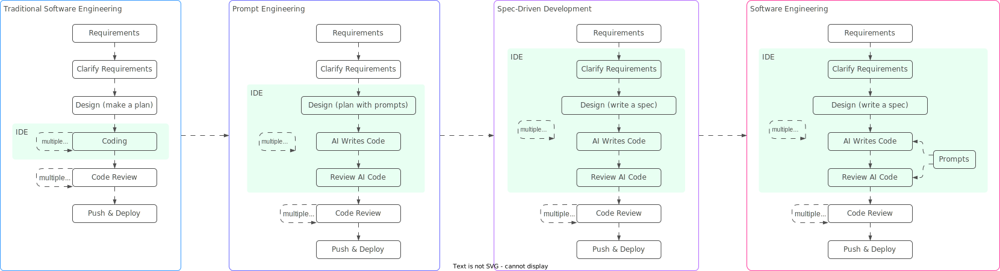

import TabItem from "@theme/TabItem";
import Tabs from "@theme/Tabs";

<Tabs queryString="primary">
    <TabItem value="glosary" label="Glosary">

        - **Prompt Engineering**: process of carefully designing and optimizing instructions (prompts) to elicit the best possible output from generative AI models, especially Large Language Models (LLMs). By providing clear, specific, and well-structured prompts, you can guide the AI to generate relevant, accurate, and high-quality responses
        - **Prompt**: input you provide to a generative AI model to request a specific output. It can be a simple question, a set of instructions, or even a creative writing example
        - **Large Language Model (LLM)**: AI model designed to understand and generate human-like text. LLMs are trained on vast amounts of data and can perform tasks like translation, summarization, and even creative writing
        - **Prompt Template**: a pre-defined structure or format for a prompt that can be customized with specific details or variables to generate dynamic prompts
        - **Prompt Tuning**: process of fine-tuning pre-trained LLMs by adapting them to specific tasks or domains through prompt engineering, rather than traditional fine-tuning methods
        - **Prompt Injection**: a security vulnerability where an attacker manipulates the input prompt to influence the AI model's behavior in unintended ways, potentially leading to unauthorized actions or disclosures
        - **Prompt Leakage**: situation where sensitive information from the prompt is inadvertently included in the generated output, posing privacy or security risks
        - **Prompt Bias**: tendency of an AI model to generate responses that reflect the biases present in its training data, leading to unfair or inaccurate outcomes
        - **Prompt Hallucination**: when an AI model generates information that is not supported by the input prompt or its training data, leading to false or misleading outputs
        - **Prompt Testing**: process of evaluating and validating prompts to ensure they produce the desired output, meet quality standards, and comply with ethical and regulatory requirements
        - **Prompt Optimization**: continuous process of refining prompts to improve their performance, based on feedback, testing results, and changes in the AI model or its training data
        - **Context Window**: max number of tokens the model can process at once, including input and output. Often a model-specific architectural limit

    </TabItem>
    <TabItem value="llm-settings" label="LLM Settings">
        <table class="text_vertical">
            <thead>
                <tr>
                <th>Category</th>
                <th>Setting Parameter</th>
                <th>Description</th>
                <th>Low Value Use Cases</th>
                <th>High Value Use Cases</th>
                </tr>
            </thead>
            <tbody>
                <tr>
                    <td rowspan="3"><b>Sampling</b></td>
                    <td><b>Temperature</b></td>
                    <td>controls the randomness or "creativity" of the output. Higher values lead to more diverse and imaginative responses, while lower values make the output more deterministic and focused</td>
                    <td>factual Q&A, summarization</td>
                    <td>story generation, poetry, brainstorming</td>
                </tr>
                <tr>
                    <td><b>Top-P (Nucleus Sampling)</b></td>
                    <td>selects tokens from the smallest possible set whose cumulative probability exceeds the `top_p` threshold. Works in conjunction with temperature to control diversity</td>
                    <td>precise answers</td>
                    <td>varied and imaginative text</td>
                </tr>
                <tr>
                    <td><b>Top-K Sampling</b></td>
                    <td>limits the token selection to the top `k` most probable tokens at each step. The model will only consider words within this `k` set. Often used in conjunction with Top-P</td>
                    <td>limits token selection to the top `k` options for more focused output</td>
                    <td>expands token options for greater diversity and creativity, but may include less relevant choices</td>
                </tr>
                <tr>
                    <td><b>Advanced Sampling</b></td>
                    <td><b>Logit Bias</b></td>
                    <td>allows you to modify the probability of specific tokens appearing or not appearing in the generated output. You can increase or decrease the likelihood of certain words</td>
                    <td>reduces the likelihood of tokens with negative bias, prompting the model to avoid specific words</td>
                    <td>increases the likelihood of tokens with positive bias, encouraging the model to include specific words or phrases</td>
                </tr>
                    <tr>
                    <td rowspan="3"><b>Output Control</b></td>
                    <td><b>Max Length / Max Tokens</b></td>
                    <td>sets the maximum number of tokens the model will generate in its response. This includes both the input prompt and the generated output in some APIs</td>
                    <td>summarization, quick answers: concise, cost-effective responses, cutting off if necessary</td>
                    <td>essay generation, code generation, detailed explanations: more detailed responses, but manage to avoid irrelevance and high costs</td>
                </tr>
                <tr>
                    <td><b>Stop Sequences</b></td>
                    <td>string or list of strings that, when encountered in the generated output, will stop the model from generating further tokens</td>
                    <td>stops generating text at specified sequences, ensuring structured outputs and preventing run-ons</td>
                    <td>continues generating until reaching max tokens or an end-of-text token</td>
                </tr>
                <tr>
                    <td><b>N (Number of Completions)</b></td>
                    <td>specifies how many independent completions (responses) the model should generate for a single prompt</td>
                    <td>produces one response, typical for direct answers</td>
                    <td>creates several distinct responses for selection or variation, potentially increasing cost</td>
                </tr>
                <tr>
                    <td><b>Repetition Control</b></td>
                    <td><b>Frequency Penalty</b></td>
                    <td>applies a penalty to new tokens based on how many times that token has already appeared in the text (prompt + generated response)</td>
                    <td>allows repetition with less penalty, increasing the likelihood of repeated words or phrases</td>
                    <td>imposes a higher penalty on repetition, promoting new vocabulary and discouraging repeated tokens</td>
                </tr>
                <tr>
                    <td><b>Repetition Control</b></td>
                    <td><b>Presence Penalty</b></td>
                    <td>imposes a uniform penalty on new tokens that have appeared in the text at least once, regardless of their frequency</td>
                    <td>reduces penalties on previously mentioned tokens to maintain focus on a specific topic</td>
                    <td>increases penalties on previously used tokens to encourage diverse and distinct ideas</td>
                </tr>
                <tr>
                    <td><b>Reproducibility</b></td>
                    <td><b>Seed</b></td>
                    <td>setting a seed makes the model's output deterministic for a given set of parameters</td>
                    <td>guarantees consistent results for repeated calls with the same prompt and settings, aiding debugging and reproducibility</td>
                    <td>each call with the same prompt and settings yields a different output, while still adhering to other parameters</td>
                </tr>
                <tr>
                    <td><b>Input Processing</b></td>
                    <td><b>Context Window (Max Context Length)</b></td>
                    <td>maximum number of tokens (input prompt + generated output) that the model can process and consider at one time. This is often a model-specific architectural limit</td>
                    <td>short prompts limit the model's memory of prior conversation, causing context loss in longer interactions</td>
                    <td>long conversations and large document analysis allow the model to maintain context, enhancing coherence and relevance in extended interactions</td>
                </tr>
                <tr>
                    <td><b>Model Selection</b></td>
                    <td><b>Model Name/ID</b></td>
                    <td>specifies the particular LLM variant or version to be used. Different models have varying capabilities, sizes, and training data</td>
                    <td>smaller models may produce lower quality, less nuanced responses and have limited capabilities</td>
                    <td>larger models generally provide higher quality, more nuanced responses, but may incur higher costs and slower inference</td>
                </tr>
                <tr>
                    <td><b>Generation Strategy</b></td>
                    <td><b>Decoding Type</b></td>
                    <td>refers to the algorithm used to select the next token. Common types include greedy decoding, beam search, and sampling (which involves temperature, top-p, top-k)</td>
                    <td>Greedy" selection yields deterministic but potentially less creative output by always choosing the highest probabilit</td>
                    <td>Sampling" adds variability, while "beam search" explores multiple sequences to identify more globally optimal output</td>
                </tr>
            </tbody>
        </table>
    </TabItem>
    <TabItem value="structure" label="Structure">
        <table class="text_vertical">
            <thead>
                <tr>
                    <th>Aspect</th>
                    <th>Definition</th>
                    <th>Example</th>
                </tr>
            </thead>
            <tbody>
                <tr>
                    <td><b>Task Context</b></td>
                    <td>briefly describe the overall task or objective to provide context for the model</td>
                    <td>You will be acting as an AI career coach named Joe created by the company AdAstra Careers. Your goal is to give career advice to users. You will be replying to users who are on the AdAstra site and who will be confused if you don't respond in the character of Joe</td>
                </tr>
                <tr>
                    <td><b>Tone Context</b></td>
                    <td>specify the desired tone or style (e.g., formal, casual, technical, humorous)</td>
                    <td>You should maintain a friendly customer service tone</td>
                </tr>
                <tr>
                    <td><b>Background data, documents, and images</b></td>
                    <td>provide any relevant background information, documents, or images that can help the model understand the context</td>
                    <td>Here is the career guidance document you should reference when answering the user: `<guide>{{DOCUMENT}}</guide>`</td>
                </tr>
                <tr>
                    <td><b>Detailed task description & rules</b></td>
                    <td>outline the specific requirements, constraints, and rules for the task</td>
                    <td>
                        Here are some important rules for the interaction:
                        - Always stay in character, as Joe, an AI from AdAstra careers
                        - If you are unsure how to respond, say "Sorry, I didn't understand that.
                        Could you repeat the question?"
                        - If someone asks something irrelevant, say, "Sorry, I am Joe and I give career advice. Do you have a career question today I can help you with?"
                    </td>
                </tr>
                <tr>
                    <td><b>Examples</b></td>
                    <td>include examples that illustrate the desired output or behavior</td>
                    <td>
                        Here is an example of how to respond in a standard interaction:
                        `<example>
                        User: Hi, how were you created and what do you do?
                        Joe: Hello! My name is Joe, and I was created by AdAstra Careers to give career advice. What can I help you with today?
                        </example>`
                    </td>
                </tr>
                <tr>
                    <td><b>Conversation history</b></td>
                    <td>provide context from previous interactions that may be relevant to the current task</td>
                    <td>Here is the conversation history (between the user and you) prior to the question. It could be empty if there is no history: `<history> {{HISTORY}} </history>` Here is the user's question: `<question> {{QUESTION}} </question>`</td>
                </tr>
                <tr>
                    <td><b>Immediate task description or request</b></td>
                    <td>clearly state the task or question at hand</td>
                    <td>How do you respond to the user's question?</td>
                </tr>
                <tr>
                    <td><b>Thinking step by step / take a deep breath</b></td>
                    <td>encourage a methodical approach to problem-solving</td>
                    <td>Think about your answer first before you respond</td>
                </tr>
                <tr>
                    <td><b>Output formatting</b></td>
                    <td>specify any required formatting for the response</td>
                    <td>Put your response in `<response></response>` tags</td>
                </tr>
                <tr>
                    <td><b>Prefilled response (if any)</b></td>
                    <td>include any pre-existing responses that may be relevant</td>
                    <td>`<response>`</td>
                </tr>
            </tbody>
        </table>

    </TabItem>
    <TabItem value="techniques" label="Techniques">
        <table class="text_vertical">
            <thead>
                <tr>
                    <th>Technique</th>
                    <th>Definition</th>
                    <th>Explanation</th>
                    <th>Example</th>
                </tr>
            </thead>
            <tbody>
                <tr>
                    <td><b>Zero-Shot Prompting</b></td>
                    <td>Perform tasks without examples</td>
                    <td>AI leverages pre-trained knowledge to handle new tasks without specific examples</td>
                    <td>Classify this text as positive or negative sentiment</td>
                </tr>
                <tr>
                    <td><b>One-Shot Prompting</b></td>
                    <td>Learn from single example</td>
                    <td>Provide one example to guide AI's understanding of the desired task format</td>
                    <td>Translate 'hello' to French: 'bonjour'</td>
                </tr>
                <tr>
                    <td><b>Few-Shot Learning</b></td>
                    <td>Learn from multiple examples</td>
                    <td>Supply 2-5 examples to demonstrate task patterns and expected outputs</td>
                    <td>1+1=2, 2+2=4, 3+3=6. What is 4+4?</td>
                    </tr>
                    <tr>
                    <td><b>Chain of Thought (CoT)</b></td>
                    <td>Step-by-step reasoning</td>
                    <td>Guide AI to break down complex problems into logical intermediate steps</td>
                    <td>If I have 3 apples and buy 2 more, then give away 1, how many do I have left? Let's think step by step..</td>
                </tr>
                <tr>
                    <td><b>Zero-Shot Chain of Thought (CoT)</b></td>
                    <td>CoT without examples</td>
                    <td>Use simple instruction like "Let's think step by step" to trigger reasoning</td>
                    <td>Calculate 15*7. Let's think step by step:</td>
                </tr>
                <tr>
                    <td><b>Multimodal Chain of Thought (CoT)</b></td>
                    <td>CoT with multiple data types</td>
                    <td>Combine text, images, and other modalities in reasoning process</td>
                    <td>Analyze this image and describe the step-by-step process shown</td>
                </tr>
                <tr>
                    <td><b>Auto Chain of Thought (CoT)</b></td>
                    <td>Automated CoT generation</td>
                    <td>Automatically generate reasoning chains through clustering and pattern recognition</td>
                    <td>AI generates its own step-by-step reasoning paths</td>
                </tr>
                <tr>
                    <td><b>Constrained Generation</b></td>
                    <td>Limit output format</td>
                    <td>Restrict AI responses to specific formats, lengths, or structures</td>
                    <td>List exactly 5 items in bullet points, no more than 10 words each</td>
                </tr>
                <tr>
                    <td><b>Contextual Prompts (RAG)</b></td>
                    <td>Use external context</td>
                    <td>Incorporate relevant external information to ground responses</td>
                    <td>Based on the provided company policy document, answer..</td>
                </tr>
                <tr>
                    <td><b>Effectiveness Evaluation</b></td>
                    <td>Measure prompt quality</td>
                    <td>Assess how well prompts achieve desired outcomes using specific metrics</td>
                    <td>Compare response quality across different prompt variations</td>
                </tr>
                <tr>
                    <td><b>Ethical Considerations</b></td>
                    <td>Ensure responsible AI use</td>
                    <td>Design prompts that avoid bias, misinformation, and harmful content</td>
                    <td>Include fairness constraints and content safety guidelines</td>
                </tr>
                <tr>
                    <td><b>Handling Ambiguity</b></td>
                    <td>Clarify unclear requests</td>
                    <td>Add specific constraints and context to reduce interpretation ambiguity</td>
                    <td>Summarize in exactly 3 bullet points under 50 words total</td>
                </tr>
                <tr>
                    <td><b>Instruction Engineering</b></td>
                    <td>Craft clear directives</td>
                    <td>Write precise, unambiguous instructions for desired AI behavior</td>
                    <td>You are a technical writer. Explain quantum computing in simple terms</td>
                </tr>
                <tr>
                    <td><b>Length Management</b></td>
                    <td>Control response size</td>
                    <td>Specify exact length requirements or use tokens to manage output</td>
                    <td>Provide a response between 100-200 words</td>
                </tr>
                <tr>
                    <td><b>Meta-Prompting</b></td>
                    <td>Use AI to improve prompts</td>
                    <td>Employ one AI model to generate or optimize prompts for another</td>
                    <td>Improve this prompt to get better results: [original prompt]</td>
                </tr>
                <tr>
                    <td><b>Multilingual Prompting</b></td>
                    <td>Handle multiple languages</td>
                    <td>Specify target language and cultural context for responses</td>
                    <td>Respond in Spanish using formal tone and Mexican cultural references</td>
                </tr>
                <tr>
                    <td><b>Negative Prompting</b></td>
                    <td>Specify what to avoid</td>
                    <td>Explicitly state what the AI should not include in responses</td>
                    <td>Explain quantum physics without using mathematics or formulas</td>
                </tr>
                <tr>
                    <td><b>Prompt Chaining</b></td>
                    <td>Link multiple prompts</td>
                    <td>Connect outputs of one prompt as inputs to subsequent prompts</td>
                    <td>Step 1: Analyze requirements. Step 2: Generate code based on analysis</td>
                </tr>
                <tr>
                    <td><b>Prompt Formatting</b></td>
                    <td>Structure prompt layout</td>
                    <td>Use markdown, sections, and clear organization for better parsing</td>
                    <td>Format response as: ## Summary\n## Key Points\n## Conclusion</td>
                </tr>
                <tr>
                    <td><b>Prompt Optimization</b></td>
                    <td>Refine prompts iteratively</td>
                    <td>Systematically improve prompts through testing and feedback loops</td>
                    <td>A/B test different prompt versions and measure performance</td>
                </tr>
                <tr>
                    <td><b>Prompt Security</b></td>
                    <td>Prevent injection attacks</td>
                    <td>Design prompts resistant to malicious input manipulation</td>
                    <td>Validate and sanitize user inputs before processing</td>
                </tr>
                <tr>
                    <td><b>Prompt Templates</b></td>
                    <td>Reusable prompt structures</td>
                    <td>Create parameterized templates for consistent, repeatable prompting</td>
                    <td>Generate [type] about [topic] for [audience] in [style]</td>
                </tr>
                <tr>
                    <td><b>ReAct (Reason + Act)</b></td>
                    <td>Combine reasoning and actions</td>
                    <td>Alternate between thinking through problems and taking actions</td>
                    <td>Thought: I need to search for information. Action: Search [query]</td>
                </tr>
                <tr>
                    <td><b>Rephrase and Respond (RaR)</b></td>
                    <td>Clarify before answering</td>
                    <td>Ask AI to rephrase questions for better understanding before responding</td>
                    <td>First rephrase this question, then provide your answer</td>
                </tr>
                <tr>
                    <td><b>Role Prompting</b></td>
                    <td>Assign specific personas</td>
                    <td>Instruct AI to respond as particular characters or professionals</td>
                    <td>You are a senior software architect with 20 years experience</td>
                </tr>
                <tr>
                    <td><b>Style Prompting</b></td>
                    <td>Control output style</td>
                    <td>Guide the AI in adopting specific tones, formats, or structures</td>
                    <td>Respond in a formal tone, using bullet points for clarity</td>
                </tr>
                <tr>
                    <td><b>Explicit Instructions Prompting</b></td>
                    <td>Define clear, direct instructions</td>
                    <td>Provide explicit, unambiguous instructions for the AI to follow</td>
                    <td>"Summarize the following text in exactly three bullet points."</td>
                </tr>
                <tr>
                    <td><b>Output Priming</b></td>
                    <td>Set expectations for output</td>
                    <td>Guide the AI on the desired format, style, or content of its responses</td>
                    <td>Respond with a summary in bullet points, no more than 10 words each</td>
                </tr>
                <tr>
                    <td><b>Rephrase & Respond (RaR)</b></td>
                    <td>Clarify before answering</td>
                    <td>Ask AI to rephrase questions for better understanding before responding</td>
                    <td>First rephrase this question, then provide your answer</td>
                </tr>
                <tr>
                    <td><b>Self-Consistency</b></td>
                    <td>Generate multiple solutions</td>
                    <td>Create several reasoning paths and select most consistent answer</td>
                    <td>Generate 5 different solutions and choose the most frequent</td>
                </tr>
                <tr>
                    <td><b>Self-Critique & Refinement</b></td>
                    <td>AI evaluates own output</td>
                    <td>Have AI review and improve its own responses iteratively</td>
                    <td>Review your answer and identify any weaknesses or improvements</td>
                </tr>
                <tr>
                    <td><b>Step-Back Prompting</b></td>
                    <td>Consider broader context</td>
                    <td>First ask about general principles before specific applications</td>
                    <td>What are the general principles of good UX design? Now apply them to..</td>
                </tr>
                <tr>
                    <td><b>System Prompting</b></td>
                    <td>Set behavioral guidelines</td>
                    <td>Define overarching rules and context for all interactions</td>
                    <td>You are a helpful assistant that always responds truthfully and safely</td>
                </tr>
                <tr>
                    <td><b>Task Decomposition</b></td>
                    <td>Break complex tasks down</td>
                    <td>Divide large problems into smaller, manageable sub-tasks</td>
                    <td>Break this project into 5 specific, actionable steps</td>
                </tr>
                <tr>
                    <td><b>Task-Specific Prompts</b></td>
                    <td>Tailor to particular tasks</td>
                    <td>Customize prompts for specific use cases or domains</td>
                    <td>Write a product description for an e-commerce website</td>
                </tr>
                <tr>
                    <td><b>Tree of Thoughts (ToT)</b></td>
                    <td>Explore multiple reasoning branches</td>
                    <td>Create tree structure of thoughts with evaluation and backtracking</td>
                    <td>Explore 3 different approaches to solve this problem, evaluate each</td>
                </tr>
            </tbody>
        </table>
    </TabItem>
    <TabItem value="context-engineering" label="Context Engineering">
        <table class="text_vertical">
            <thead>
                <tr>
                    <th>Aspect</th>
                    <th>Prompt Engineering</th>
                    <th>Context Engineering</th>
                </tr>
            </thead>
            <tbody>
                <tr>
                    <td><b>Visualization</b></td>
                    <td>
                        ```mermaid
                        graph LR
                            A(User) e1@--> B(Prompt)
                            B e2@--> C(AI Model)
                            C e3@--> D(Response)

                            e1@{ animate: true }
                            e2@{ animate: true }
                            e3@{ animate: true }
                        ```
                    </td>
                    <td>
                        ```mermaid
                        graph BT
                            subgraph "Context Sources"
                                A(Memory<br/>Modules)
                                B(Conversation<br/>History)
                                C(System<br/>Prompts)
                                D(External<br/>Tools)
                                E(Knowledge<br/>Base)
                                F(User<br/>Profile)
                            end

                            I(User) e1@--> L(Prompt)
                            L e2@--> H(AI Model)
                            G(Context<br/>Manager) e3@----> H
                            H e4@--> J(Response)

                            A e5@--> G
                            B e6@--> G
                            C e7@--> G
                            D e8@--> G
                            E e9@--> G
                            F e10@--> G

                            K(Feedback<br/>Loop) e11@--> A
                            K e12@--> B
                            K e13@--> C

                            e1@{ animate: true }
                            e2@{ animate: true }
                            e3@{ animate: true }
                            e4@{ animate: true }
                            e5@{ animate: true }
                            e6@{ animate: true }
                            e7@{ animate: true }
                            e8@{ animate: true }
                            e9@{ animate: true }
                            e10@{ animate: true }
                            e11@{ animate: true }
                            e12@{ animate: true }
                            e13@{ animate: true }
                        ```
                    </td>
                </tr>
                <tr>
                    <td><b>Definition</b></td>
                    <td>the process of designing and optimizing prompts to produce desired responses from AI models. It is a subset of Context Engineering</td>
                    <td>the practice of structuring and managing the information provided to AI models to enhance their understanding and performance on specific tasks</td>
                </tr>
                <tr>
                    <td><b>Focus</b></td>
                    <td>focuses on *what to say to the model* at a moment in time</td>
                    <td>focuses on *what the model knows* when you say it - and *why* it should care</td>
                </tr>
                <tr>
                    <td><b>Purpose</b></td>
                    <td>
                        get a specific response from a prompt. Usually one-off.
                        <ul>
                            <li>writing clever instructions in a prompt box</li>
                            <li>one-shot instructions: "You are X. Do Y like Z."</li>
                            <li>tweaking wording, format, and examples</li>
                        </ul>
                    </td>
                    <td>
                        make sure the model consistently performs well across sessions and tasks.
                        <ul>
                            <li>designing the entire mental world the model operates in</li>
                            <li>managing what, how, and when the model sees information</li>
                            <li>thinking in tokens, system prompts, memory, and tools</li>
                        </ul>
                    </td>
                </tr>
                <tr>
                    <td><b>Mindset</b></td>
                    <td>crafting clear instructions</td>
                    <td>designing the entire flow and architecture of a model's thought process</td>
                </tr>
                <tr>
                    <td><b>Scope</b></td>
                    <td>operates within a single input-output pair</td>
                    <td>handles everything the model sees - memory, history, tools, system prompts</td>
                </tr>
                <tr>
                    <td><b>Repeatability</b></td>
                    <td>can be hit-or-miss and often needs manual tweaks</td>
                    <td>designed for consistency and reuse across many users and tasks</td>
                </tr>
                <tr>
                    <td><b>Scalability</b></td>
                    <td>starts to fall apart when scaled - more users = more edge cases</td>
                    <td>built with scale in mind from the beginning</td>
                </tr>
                <tr>
                    <td><b>Precision</b></td>
                    <td>relies heavily on wordsmithing to get things "just right"</td>
                    <td>focuses on delivering the right inputs at the right time, reducing the burden on the prompt itself</td>
                </tr>
                <tr>
                    <td><b>Tools</b></td>
                    <td>prompt box</td>
                    <td>memory modules, RAG systems, API chaining, and more backend coordination</td>
                </tr>
                <tr>
                    <td><b>Debugging</b></td>
                    <td>mostly rewording and guessing what went wrong</td>
                    <td>involves inspecting the full context window, memory slots, and token flow</td>
                </tr>
                <tr>
                    <td><b>Use Cases</b></td>
                    <td>Copywriting variations; one-shot code generation</td>
                    <td>LLM Agents with memory; Customer support bots; Multi-turn flows</td>
                </tr>
            </tbody>
        </table>
    </TabItem>
    <TabItem value="development" label="Development">
        

        ## Spec-Driven Development

        - **Spec-Driven Development**: emerging methodology that centers on detailed, structured specifications as living, executable documents  describing software's what and why. AI-powered tools handle the how by translating intent into code, overcoming ad-hoc AI-assisted coding limits. Inspired by TDD and BDD, it adapts them for AI workflows, making specs the source of truth for implementation, validation, and iteration.

        ### Key Principles

        - **Specifications as Living Artifacts**: Specs are dynamic, version-controlled documents (e.g., Markdown) that evolve, serving as the "North Star" for AI agents and teams
        - **Separation of Intent and Implementation**: Focus on "what" (user needs, outcomes) in specs and "how" (architecture, stack) in plans
        - **Clarity and Unambiguity**: Use precise language, consistent terminology, and structures (e.g., structs, loops in plain English) to minimize AI misinterpretation
        - **Iterative Refinement with Checkpoints**: Validate outputs at each phase; developers critique and refine to spot gaps
        - **Incorporation of Constraints Early**: Bake in security, compliance, performance, and integrations from the start
        - **Human Oversight**: AI handles execution, but humans steer, review, and evaluate for reasonableness
        - **Raising Abstraction Levels**: Shift from imperative ("how") to declarative ("what") programming, echoing historical leaps like high-level languages

        ### Workflow

        <table class="text_vertical">
            <thead>
                <tr>
                    <th>Phase</th>
                    <th>Definition</th>
                    <th>Key Activities</th>
                    <th>Focus</th>
                    <th>Challenges</th>
                    <th>Outputs</th>
                </tr>
            </thead>
            <tbody>
                <tr>
                    <td><b>Specify</b></td>
                    <td>capture high-level intent focusing on user needs and outcomes. Avoid technical details</td>
                    <td>provide prompts on "what" and "why"; AI generates detailed spec; developer reviews and refines</td>
                    <td>what/why</td>
                    <td>ambiguity, scope creep, vague user needs</td>
                    <td>living spec document (e.g., Markdown with user stories, journeys, criteria)</td>
                </tr>
                <tr>
                    <td><b>Plan</b></td>
                    <td>add technical "how" elements like stack, architecture, constraints</td>
                    <td>share docs on standards, integrations; AI generates plans (possibly variations); review for alignment</td>
                    <td>how (high-level)</td>
                    <td>overlooking constraints</td>
                    <td>technical plan document, including alternatives and decisions</td>
                </tr>
                <tr>
                    <td><b>Tasks</b></td>
                    <td>break down into small, isolated, actionable steps</td>
                    <td>AI decomposes spec and plan; tasks mimic TDD for AI, ensuring testability</td>
                    <td>breakdown</td>
                    <td>task granularity</td>
                    <td>task list (e.g., Markdown checklist)</td>
                </tr>
                <tr>
                    <td><b>Implement</b></td>
                    <td>execute tasks with AI generating code</td>
                    <td>AI implements per task; run tests, linting; developer reviews changes incrementally</td>
                    <td>execution</td>
                    <td>context loss in AI</td>
                    <td>code, tests, validated builds</td>
                </tr>
                <tr>
                    <td><b>Review & Iterate</b></td>
                    <td>verify overall alignment; update spec for changes</td>
                    <td>test app; lint spec for clarity; regenerate as needed</td>
                    <td>validation</td>
                    <td>misalignment with original intent</td>
                    <td>refined artifacts; deployed features</td>
                </tr>
            </tbody>
        </table>
    </TabItem>

</Tabs>
